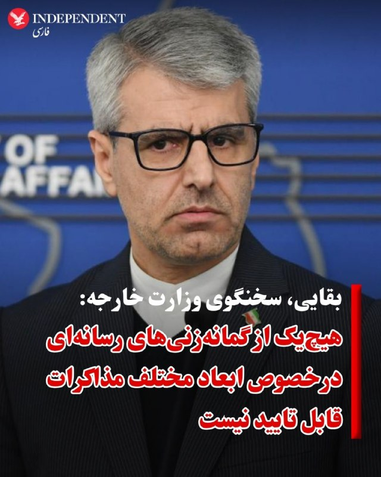
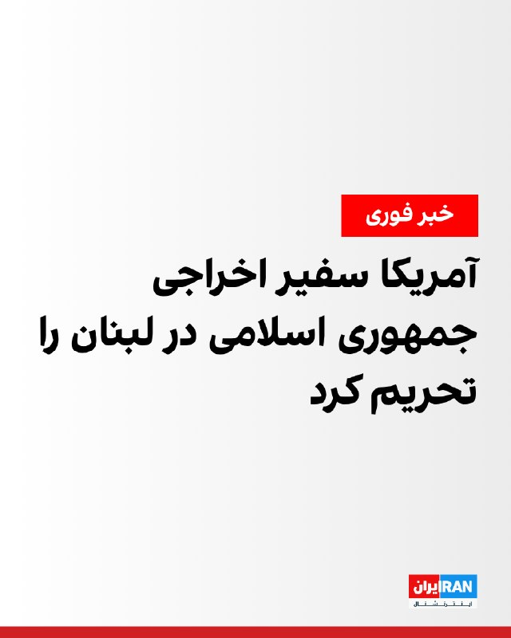

# خواننده تلگرام

<!-- TOP_NAV START -->

<a href="https://github.com/ProAlit/aio-downloader/blob/main/telegram/content/archive_1.md" style="display:inline-block; padding:6px 12px; margin:0 4px; background-color:#2ea44f; color:white; text-decoration:none; border-radius:4px; font-weight:bold;">صفحه بعد</a>

<!-- TOP_NAV END -->

<!-- MSG START -->

---
📅 بروزرسانی: 1405/02/31 21:13
---

## VahidOOnLine — post 241375

  

♦️سخنگوی وزارت خارجه جمهوری اسلامی شامگاه پنجشنبه ۳۱ اردیبهشت درباره «فضاسازی‌های رسانه‌ای درخصوص مذاکرات خاتمه جنگ» تاکید کرد: «هیچ‌یک از گمانه‌زنی‌هایی که در روزهای اخیر راجع به ابعاد مختلف مذاکرات مطرح شده قابل تایید نیست.»
  اسماعیل بقائی به ایرنا گفت: «در این مرحله تمرکز مذاکرات بر خاتمه جنگ در همه جبهه‌ها به شمول لبنان است و ادعاهایی که درباره مباحث هسته‌ای، از جمله موضوع مواد غنی شده یا بحث غنی‌سازی، در رسانه‌ها مطرح شده، صرفا گمانه‌زنی رسانه‌ای بوده و فاقد اعتبار است.»
بقائی تاکید کرد: «اطلاع رسانی دقیق راجع به جزئیات مذاکرات توسط مقام‌های رسمی صلاحیت‌دار و سخنگوی هیات مذاکره‌کننده صورت می‌گیرد.»
خبرگزاری رویترز روز پنجشنبه به نقل از دو مقام ارشد جمهوری اسلامی گزارش کرد که مجتبی خامنه‌ای، رهبر حکومت ایران دستور داده است که ذخایر اورانیوم با غنای بالا (نزدیک به اورانیوم مورد نیاز برای ساخت سلاح هسته‌ای) در خاک ایران باقی بماند.
‌🇸🇦 Indypersian

🤖 @VahidOOnLine

## VahidOOnLine — post 241374

  <a href="telegram/content/VahidOOnLine_241374_1779385438.mp4" target="_blank">🎬 Download video</a>

♦️دونالد ترامپ، رئیس‌جمهوری آمریکا، در پاسخ به سوالی درباره حضور در مراسم عروسی این آخر هفته پسرش، به شوخی گفت که به دلیل فشارهای رسانه‌ای در هر صورت بازنده است.

ترامپ با اشاره به مشغله‌های شدید خود گفت: «به پسرم گفتم الآن زمان‌بندی خوبی برای من نیست؛ موضوعی به نام ایران و مسائل دیگر را در دست دارم. این از آن مواردی است که اگر در عروسی شرکت کنم، توسط رسانه‌های اخبار جعلی سلاخی می‌شوم و اگر شرکت نکنم هم باز من را می‌کشند!»

او با بیان اینکه مراسم بسیار کوچک و خصوصی خواهد بود، تأکید کرد که با این حال تلاش می‌کند در آن شرکت کند.

دونالد ترامپ جوان، پسر ارشد رئیس‌جمهوری آمریکا قرار است آخر هفته با بتینا اندرسون ازدواج کند.
‌🇸🇦 Indypersian

🤖 @VahidOOnLine

## VahidOOnLine — post 241373

  <a href="telegram/content/VahidOOnLine_241373_1779385442.mp4" target="_blank">🎬 Download video</a>

مارکو روبیو، وزیر خارجه آمریکا، می‌گوید دونالد ترامپ از واکنش کشورهای عضو ناتو به جنگ آمریکا و اسرائیل علیه ایران «بسیار ناامید» شده است.
او با انتقاد از اسپانیا گفت مادرید اجازه استفاده آمریکا از پایگاه‌های نظامی خود را در جریان جنگ نداده و این موضوع باعث شده واشنگتن نقش ناتو را زیر سوال ببرد.
روبیو گفت: «اگر ناتو قرار است در بحران‌های خاورمیانه به آمریکا کمک کند، اما کشورهایی مثل اسپانیا همکاری نکنند، پس چرا عضو ناتو هستند؟»
‌🏁 🇬🇧 ManotoTV

🤖 @VahidOOnLine

## VahidOOnLine — post 241372

  <a href="telegram/content/VahidOOnLine_241372_1779385442.mp4" target="_blank">🎬 Download video</a>

دونالد ترامپ گفت آمریکا «کنترل کامل» تنگه هرمز را در اختیار دارد و محاصره دریایی اعمال‌شده علیه ایران «صددرصد مؤثر» بوده است.

ترامپ گفت: «هیچ‌کس نتوانسته عبور کند. این مثل یک دیوار فولادی است.»

رئیس‌جمهوری آمریکا همچنین گفت واشینگتن بخش عمده‌ای از توان دریایی، هوایی و موشکی جمهوری اسلامی را از بین برده و حدود «۸۵ درصد» ظرفیت موشکی ایران نابود شده است.

او افزود اکنون برای جمهوری اسلامی ساخت موشک و پهپاد «بسیار دشوار» شده و آمریکا به فناوری‌های پیشرفته پهپادی و ضدپهپادی دست یافته است.

ترامپ بار دیگر تأکید کرد آمریکا اجازه نخواهد داد ایران به سلاح هسته‌ای دست پیدا کند و گفت: «در هر صورت به نتیجه خواهیم رسید. آن‌ها سلاح هسته‌ای نخواهند داشت.»

او هشدار داد دستیابی ایران به سلاح هسته‌ای می‌تواند به «جنگ هسته‌ای در خاورمیانه» منجر شود؛ جنگی که به گفته او «به آمریکا و اروپا نیز خواهد رسید.»

ترامپ همچنین گفت آمریکا در حال مذاکره با جمهوری اسلامی است، اما اگر توافق حاصل نشود، واشینگتن «اقدام بسیار شدیدی» انجام خواهد داد.

او در پاسخ به پرسشی درباره سرنوشت اورانیوم غنی‌شده ایران نیز گفت آمریکا آن را «تحویل خواهد گرفت» و احتمالاً پس از به دست آوردن، نابود خواهد کرد.
‌🏁 🇬🇧 ManotoTV

🤖 @VahidOOnLine

## VahidOOnLine — post 241371

  

وزارت خزانه‌داری آمریکا اعلام کرد محمدرضا رئوف شیبانی، سفیر اخراجی جمهوری اسلامی در لبنان، را تحریم کرده است.

وزارت خارجه آمریکا نیز اعلام کرد ۹ نفر مرتبط با حزب‌الله را که حاکمیت لبنان را تضعیف می‌کنند، تحریم کرده است.
بر اساس این اعلام، این افراد در روند خلع سلاح حزب‌الله اخلال ایجاد کرده و در جهت پیشبرد برنامه‌های جمهوری اسلامی در لبنان فعالیت می‌کردند.
‌🏁 🇬🇧 IranintlTV

🤖 @VahidOOnLine

## FoxNewsTwitter — post 342065

  <a href="telegram/content/FoxNewsTwitter_342065_1779385445.mp4" target="_blank">🎬 Download video</a>

Fox News (Twitter/X)

"If you're a fraudster, do not walk away from this press conference, RUN."

Dr. Mehmet Oz delivers a blunt warning after officials announced 15 arrests tied to nearly $90 million in alleged COVID-era health care fraud:

"Because COVID caused a lack of oversight and because agencies like mine were gutted in their ability to provide program integrity, we have allowed this monstrous, outrageous increase in spending which does not benefit anybody to increase."

## iaghapour — post 2624

  

🔥 فروش ویژه کانفیگ‌های پرسرعت V2ray 🔥

🌍 دسترسی آزاد با ۹ سرور قدرتمند از بهترین لوکیشن‌ها

به پاس استقبال شما عزیزان، تعرفه‌ها را کاهش دادیم! ما به پایداری و کیفیت سرویس‌هایمان اطمینان داریم؛ بنابراین در صورت عدم رضایت، تا ۴۸ ساعت (در صورت مصرف کم) مبلغ پرداختی شما بدون قید و شرط عودت داده می‌شود. 🤝

📊 تعرفه‌های حجمی با تخفیف پلکانی:
⏱️ مدت زمان کانفیگ‌ها: 1 ماهه ولی به رایگان قابل تمدید.

🔹 ۱ گیگابایت: ۱۹۰ هزار تومان
🔸 ۲ گیگابایت: ۳۸۰ هزار تومان (گیگی ۱۹۰)
🔸 ۵ گیگابایت: ۹۰۰ هزار تومان (گیگی ۱۸۰)
🔸 ۱۰ گیگابایت: ۱,۶۵۰,۰۰۰ تومان (گیگی ۱۶۵)
🔸 ۱۵ گیگابایت: ۲,۲۵۰,۰۰۰ تومان (گیگی ۱۵۰)

💎 خریدهای عمده:
🔸بالای ۴۰ گیگ: هر گیگ ۱۴۰ هزار تومان
🔸 بالای ۱۰۰ گیگ: هر گیگ ۱۲۰ هزار تومان
🎯 بالای ۲۰۰ گیگ: هر گیگ فقط ۱۰۰ هزار تومان

📌 نکات مهم پیش از خرید:
⚙️ تمامی کانفیگ‌ها بصورت V2ray ارائه می‌شوند.
🛡 اکانت تست نداریم، اما گارانتی ۴۸ ساعته بازگشت وجه داریم.
👈🏻 فروش پنل اختصاصی نداریم.
💳 پرداخت‌ها از طریق ارزهای دیجیتال انجام می‌شود.

🎯 برای اعتمادسازی و دریافت کانفیگ به کانال ما بپیوندید:
🆔 @NetProPlus

## ManotoTV — post 105726

  <a href="telegram/content/ManotoTV_105726_1779385448.mp4" target="_blank">🎬 Download video</a>

مارکو روبیو، وزیر خارجه آمریکا، می‌گوید دونالد ترامپ از واکنش کشورهای عضو ناتو به جنگ آمریکا و اسرائیل علیه ایران «بسیار ناامید» شده است.
او با انتقاد از اسپانیا گفت مادرید اجازه استفاده آمریکا از پایگاه‌های نظامی خود را در جریان جنگ نداده و این موضوع باعث شده واشنگتن نقش ناتو را زیر سوال ببرد.
روبیو گفت: «اگر ناتو قرار است در بحران‌های خاورمیانه به آمریکا کمک کند، اما کشورهایی مثل اسپانیا همکاری نکنند، پس چرا عضو ناتو هستند؟»

## ManotoTV — post 105725

  <a href="telegram/content/ManotoTV_105725_1779385449.mp4" target="_blank">🎬 Download video</a>

دونالد ترامپ گفت آمریکا «کنترل کامل» تنگه هرمز را در اختیار دارد و محاصره دریایی اعمال‌شده علیه ایران «صددرصد مؤثر» بوده است.

ترامپ گفت: «هیچ‌کس نتوانسته عبور کند. این مثل یک دیوار فولادی است.»

رئیس‌جمهوری آمریکا همچنین گفت واشینگتن بخش عمده‌ای از توان دریایی، هوایی و موشکی جمهوری اسلامی را از بین برده و حدود «۸۵ درصد» ظرفیت موشکی ایران نابود شده است.

او افزود اکنون برای جمهوری اسلامی ساخت موشک و پهپاد «بسیار دشوار» شده و آمریکا به فناوری‌های پیشرفته پهپادی و ضدپهپادی دست یافته است.

ترامپ بار دیگر تأکید کرد آمریکا اجازه نخواهد داد ایران به سلاح هسته‌ای دست پیدا کند و گفت: «در هر صورت به نتیجه خواهیم رسید. آن‌ها سلاح هسته‌ای نخواهند داشت.»

او هشدار داد دستیابی ایران به سلاح هسته‌ای می‌تواند به «جنگ هسته‌ای در خاورمیانه» منجر شود؛ جنگی که به گفته او «به آمریکا و اروپا نیز خواهد رسید.»

ترامپ همچنین گفت آمریکا در حال مذاکره با جمهوری اسلامی است، اما اگر توافق حاصل نشود، واشینگتن «اقدام بسیار شدیدی» انجام خواهد داد.

او در پاسخ به پرسشی درباره سرنوشت اورانیوم غنی‌شده ایران نیز گفت آمریکا آن را «تحویل خواهد گرفت» و احتمالاً پس از به دست آوردن، نابود خواهد کرد.

## FarsiVOA — post 218305

مارکو روبیو، وزیر امور خارجه آمریکا، پیش از ترک آمریکا برای شرکت در اجلاس وزیران امور خارجه ناتو در سوئد، به پرسش‌های خبرنگاران پاسخ داد. صدای آمریکا بخش‌هایی از این گفت‌و‌گو را به صورت مستفیم و با ترجمه همزمان پژواک کیومرثی پخش کرد.

## FarsiVOA — post 218304

گفت‌وگو با محمد منظرپور، روزنامه‌نگار از واشنگتن، درباره گزارش‌های مربوط به دستور مجتبی خامنه‌ای برای نگه‌داشتن چهارصد کیلوگرم اورانیوم با غنای بالا در داخل ایران

## Persian_Trend_Official — post 14622

حدود 30 دقیقه دیگه لایو آغاز میشه

## IranianMinds — post 20504

  <a href="telegram/content/IranianMinds_20504_1779385450.mp4" target="_blank">🎬 Download video</a>

🔴 ترامپ:

«ما کنترل کامل تنگه هرمز را در دست داریم.»

@IranianMinds

## IranianMinds — post 20503

  <a href="telegram/content/IranianMinds_20503_1779385452.mp4" target="_blank">🎬 Download video</a>

🔴 ترامپ:

«ایران نمی‌تواند اورانیوم با غنی شده بالا داشته باشد. وقتی به دست ما برسد، احتمالاً آن را نابود می‌کنیم. ما آن را نمی‌خواهیم.»

@IranianMinds

## IranianMinds — post 20502

ثبت نام کن ۵۰۰ هزارتومان جایزه بگیر
نیازی هم به واریز نیست
تنها سایت مورد #تایید ما با بونوس های واقعی:

🌐 Winro.io

## IranianMinds — post 20501

  

⭕️ تا حالا بدون واریزی روی فوتبال ها شرط بستی؟!

🎉 500 هزارتومن بونوس رایگان فقط با ثبت نام بدون هیچگونه واریزی!

💳 شارژ سریع و امن با درگاه ریالی ، تتر یا ترون فقط با یک کلیک!

⌛ پشتیبانی 24 ساعته

💖تنها سایت مورد اعتماد ما با بونوس های کاملا واقعی و رویایی:

🌐 Winro.io

🌐 Winro.io
کانال بونوس های رایگان g31

📱 @winro_io

## manototv — post 105726

  <a href="telegram/content/manototv_105726_1779385456.mp4" target="_blank">🎬 Download video</a>

مارکو روبیو، وزیر خارجه آمریکا، می‌گوید دونالد ترامپ از واکنش کشورهای عضو ناتو به جنگ آمریکا و اسرائیل علیه ایران «بسیار ناامید» شده است.
او با انتقاد از اسپانیا گفت مادرید اجازه استفاده آمریکا از پایگاه‌های نظامی خود را در جریان جنگ نداده و این موضوع باعث شده واشنگتن نقش ناتو را زیر سوال ببرد.
روبیو گفت: «اگر ناتو قرار است در بحران‌های خاورمیانه به آمریکا کمک کند، اما کشورهایی مثل اسپانیا همکاری نکنند، پس چرا عضو ناتو هستند؟»

## alonews — post 121629

  <a href="telegram/content/alonews_121629_1779385456.mp4" target="_blank">🎬 Download video</a>

👈عضو کمیسیون امنیت ملی مجلس: احتمال عبور از آتش بس از سوی ایران وجود دارد!

✅ @AloNews خبر جنگ

## alonews — post 121628

  <a href="telegram/content/alonews_121628_1779385459.webm" target="_blank">🎬 Download video</a>

👈سخنگوی وزارت خارجه: در این مرحله تمرکز مذاکرات بر خاتمه جنگ در همه جبهه‌ها به شمول لبنان است و ادعاهایی که درباره مباحث هسته‌ای، از جمله موضوع مواد غنی شده یا بحث غنی‌سازی، در رسانه‌ها مطرح شده، صرفا گمانه‌زنی رسانه‌ای بوده و فاقد اعتبار است.

🔴هیچ‌یک از گمانه‌زنی‌هایی که در روزهای اخیر راجع به ابعاد مختلف مذاکرات مطرح شده قابل تایید نیست.

✅ @AloNews خبر جنگ

---
📅 بروزرسانی: 1405/02/31 21:03
---

## IranIntlTV — post 338275

  

وزارت خزانه‌داری آمریکا اعلام کرد محمدرضا رئوف شیبانی، سفیر اخراجی جمهوری اسلامی در لبنان، را تحریم کرده است.

وزارت خارجه آمریکا نیز اعلام کرد ۹ نفر مرتبط با حزب‌الله را که حاکمیت لبنان را تضعیف می‌کنند، تحریم کرده است.
بر اساس این اعلام، این افراد در روند خلع سلاح حزب‌الله اخلال ایجاد کرده و در جهت پیشبرد برنامه‌های جمهوری اسلامی در لبنان فعالیت می‌کردند.
https://iranintl.com/202605213671

## FarsiVOA — post 218303

گفت‌وگو با اردشیر زارع‌زاده، حقوقدان، درباره عملکرد و نتایج برنامه دولت کانادا برای برخورد با اعضای سپاه که در کانادا حضور دارند.

## FarsiVOA — post 218302

قوه قضاییه جمهوری اسلامی بازداشت رشید مظاهری، چهره شناخته شده فوتبال ایران، را تایید و او را به اتهاماتی از جمله «فعالیت تبلیغی برخلاف امنیت ملی» متهم کرد. رشید مظاهری، دروازه‌بان پیشین تیم ملی فوتبال ایران، پس از انتقاد علنی از علی خامنه‌ای و کشتار دی ۱۴۰۴ بازداشت شد.

## Persian_Trend_Official — post 14621

  <a href="telegram/content/Persian_Trend_Official_14621_1779384787.webm" target="_blank">🎬 Download video</a>

💢وزارت خارجه جمهوری اسلامی اعلام کرد ادعاهای مطرح‌شده درباره غنی‌سازی اورانیوم و سرنوشت مواد غنی‌شده، چیزی جز «گمانه‌زنی رسانه‌ای فاقد اعتبار» نیست.

🫆:Tony

📌 @persian_trend_official
پرشین ترند | متفاوت‌ترین کانال نظامی

## RadioFarda — post 157432

اسرائیل بیش از ۴۳۰ فعال بازداشت‌شده در کاروان دریایی کمک به غزه را اخراج کرد

🔸اسرائیل روز پنجشنبه ۳۱ اردیبهشت‌ماه از اخراج همۀ فعالان خارجی‌ای که با کاروان دریایی کمک برای غزه راهی این باریکه بودند، خبر داد.

🔸دوشنبه گذشته ۲۸ اردیبهشت‌ماه نیروهای اسرائیلی با ورود به شناورهایی که از مسیر قبرس در حال نزدیک‌شدن به آبهای ساحلی غزه بودند، بیش از ۴۳۰ فعال از گوشه‌وکنار جهان را بازداشت کردند.

🔸این نخستین‌باری نبود که اسرائیل فعالان سوار بر شناورهای کمک‌رسانی به غزه را بازداشت می‌کند، اما این‌بار فیلمی که ایتامار بن-گویر وزیر درست‌راستی و تندروی امنیت داخلی این کشور از صحنۀ بازداشت فعالان منتشر کرد، باعث اعتراضات گسترده جهانی و حتی در میان برخی سیاستمداران اسرائیلی شد.

🔸در این فیلم، ایتامار بن‌-گویر با یک پرچم بزرگ اسرائیل در دست، خطاب به فعالان تحت بازداشت، با لحنی طعنه‌آمیز می‌گوید «به اسرائیل خوش آمدید». این در حالی‌است که دستان افراد بازداشت‌شده از پشت بسته شده و پیشانی‌هایشان روی زمین است.

🔸روز چهارشنبه چندین کشور از جمله بریتانیا، فرانسه، ایتالیا، کانادا، استرالیا و حتی ایالات متحده برخورد با فعالان بازداشت‌شده و بخصوص رفتار ایتامار بن-گویر را غیر قابل قبول خواندند.

🔸 گزارش کامل را در وب‌سایت رادیوفردا بخوانید.

@RadioFarda

## BBCPersian — post 281719

  

🔻دونالد ترامپ، رئیس‌جمهور آمریکا، بار دیگر تاکید کرد که ذخایر اورانیوم غنی شده ایران را از این کشور خواهد گرفت.

آقای ترامپ روز پنجشنبه در کاخ سفید در پاسخ به سوال خبرنگاران درباره ذخایر اورانیوم غنی شده ایران گفت: «ما آن را به دست خواهیم آورد. به آن نیازی نداریم، ما آن را نمی‌خواهیم. حتی احتمالاً پس از اینکه به آن دست یافتیم، آن را نابود خواهیم کرد، اما اجازه نخواهیم داد که آنها به آن دست یابند.»

او همچنین بار دیگر گفت که در حال مذاکراه با ایران هستند و مهم‌ترین هدفش این است که ایران «سلاح هسته‌ای نداشته باشد.»

📸 Reuters

https://bbc.in/4fwMLUO
@BBCPersian

## BBCPersian — post 281718

تیم ملی فوتبال مردان ایران روز پنجشنبه برای شرکت در جام جهانی ۲۰۲۶ از سفارت کانادا در آنکارا درخواست ویزا کرد. تمام اعضای تیم برای ویزای کانادا درخواست دادند و تعدادی از بازیکنانی هم که تاکنون ویزای آمریکا نگرفته‌اند، از سفارت آمریکا در آنکارا درخواست ویزا…

## BBCPersian — post 281717

  <a href="telegram/content/BBCPersian_281717_1779384788.mp4" target="_blank">🎬 Download video</a>

تیم ملی فوتبال مردان ایران روز پنجشنبه برای شرکت در جام جهانی ۲۰۲۶ از سفارت کانادا در آنکارا درخواست ویزا کرد.

تمام اعضای تیم برای ویزای کانادا درخواست دادند و تعدادی از بازیکنانی هم که تاکنون ویزای آمریکا نگرفته‌اند، از سفارت آمریکا در آنکارا درخواست ویزا کردند.
جام جهانی امسال به میزبانی مشترک ایالات متحده آمریکا، کانادا و مکزیک برگزار می‌شود و ایران قرار است هر سه بازی مرحله گروهی خود را در آمریکا انجام دهد. در صورت صعود به مرحله حذفی، بازی‌های ایران در کانادا برگزار خواهد شد و تیم ایران نیاز به ویزای کانادا خواهد داشت.

ایران قرار است در ۱۱ خرداد (۲۵ ژوئن) با نیوزیلند و در ۳۱ خرداد (۲۱ ژوئن) با بلژیک در لس‌آنجلس روبرو شود و پنج روز بعد در سیاتل با مصر بازی کند.

بازیکنان تیم ایران در آنکارا در یک مرکز درخواست ویزا حضور پیدا کردند تا درخواست‌های ویزا برای سفارت کانادا ارسال شود.

## Hranews — post 113083

گزارشی از مطالبات معوقه کارکنان شرکت مخابرات ایران

❗️
❗️
❗️
❗️
❗️– انجمن صنفی مخابرات استان تهران از عدم پرداخت مابه‌التفاوت رفاهیات ماهیانه و سالیانه چهار سال گذشته کارکنان #شرکت_مخابرات ایران خبر داد و با نگارش نامه‌ای خطاب به مدیرعامل این مجموعه، خواستار پرداخت مطالبات آنها شد.

ادامه مطلب

↘️
@hranews_bot تماس ✉️ -  @Hranews  کانال هرانا 🆑

## manototv — post 105725

  <a href="telegram/content/manototv_105725_1779384790.mp4" target="_blank">🎬 Download video</a>

دونالد ترامپ گفت آمریکا «کنترل کامل» تنگه هرمز را در اختیار دارد و محاصره دریایی اعمال‌شده علیه ایران «صددرصد مؤثر» بوده است.

ترامپ گفت: «هیچ‌کس نتوانسته عبور کند. این مثل یک دیوار فولادی است.»

رئیس‌جمهوری آمریکا همچنین گفت واشینگتن بخش عمده‌ای از توان دریایی، هوایی و موشکی جمهوری اسلامی را از بین برده و حدود «۸۵ درصد» ظرفیت موشکی ایران نابود شده است.

او افزود اکنون برای جمهوری اسلامی ساخت موشک و پهپاد «بسیار دشوار» شده و آمریکا به فناوری‌های پیشرفته پهپادی و ضدپهپادی دست یافته است.

ترامپ بار دیگر تأکید کرد آمریکا اجازه نخواهد داد ایران به سلاح هسته‌ای دست پیدا کند و گفت: «در هر صورت به نتیجه خواهیم رسید. آن‌ها سلاح هسته‌ای نخواهند داشت.»

او هشدار داد دستیابی ایران به سلاح هسته‌ای می‌تواند به «جنگ هسته‌ای در خاورمیانه» منجر شود؛ جنگی که به گفته او «به آمریکا و اروپا نیز خواهد رسید.»

ترامپ همچنین گفت آمریکا در حال مذاکره با جمهوری اسلامی است، اما اگر توافق حاصل نشود، واشینگتن «اقدام بسیار شدیدی» انجام خواهد داد.

او در پاسخ به پرسشی درباره سرنوشت اورانیوم غنی‌شده ایران نیز گفت آمریکا آن را «تحویل خواهد گرفت» و احتمالاً پس از به دست آوردن، نابود خواهد کرد.

## alonews — post 121627

  <a href="telegram/content/alonews_121627_1779384791.webm" target="_blank">🎬 Download video</a>

👈دیجیتاتو: محمدرضا فرزانگان، اقتصاددان حوزه خاورمیانه در دانشگاه فیلیپس ماربورگ آلمان، گفته است حدود ۱۰ میلیون شغل در ایران به‌طور مستقیم یا غیرمستقیم به اقتصاد دیجیتال وابسته هستند.

🔴او به وال‌استریت ژورنال گفته محدودیت گسترده اینترنت باعث کاهش بهره‌وری، تضعیف اعتماد کسب‌وکارها و افزایش نابرابری می‌شود؛ زیرا در چنین شرایطی تنها کاربران ثروتمندتر یا افرادی که به ارتباطات بهتر دسترسی دارند، می‌توانند اتصال پایدار و قابل اتکا داشته باشند.

✅ @AloNews خبر جنگ

## alonews — post 121626

  <a href="telegram/content/alonews_121626_1779384791.webm" target="_blank">🎬 Download video</a>

👈سخنگوی وزارت خارجه: ادعاهای هسته‌ای در مذاکرات فاقد اعتبار است

✅ @AloNews خبر جنگ

---
📅 بروزرسانی: 1405/02/31 20:53
---

## VahidOOnLine — post 241370

  

♦️کمیسر عالی حقوق بشر سازمان ملل متحد روز پنج‌شنبه ۳۱ اردیبهشت با ابراز تاسف و محکومیت اعدام دو نفر دیگر در ایران، تهران را متهم کرد که از شرایط جنگی با آمریکا و اسرائیل به عنوان بهانه‌ای برای سرکوب بیشتر مخالفت‌های داخلی استفاده می‌کند.

دفتر ولکر تورک اعلام کرد: «از زمان آغاز تنش‌های نظامی، دست‌کم ۳۴ نفر به اتهامات سیاسی و امنیت ملی، از جمله در رابطه با اعتراضات ژانویه، اعدام شده‌اند. ابزارسازی مقامات ایران از مناقشه کنونی برای خفه کردن صدای معترضان غیرقابل قبول است.»

این موضع‌گیری پس از آن صورت گرفت که خبرگزاری میزان، رسانه قوه قضاییه جمهوری اسلامی، اعلام کرد رامین زله (بازداشت در مرداد ۱۴۰۳) و کریم معروف‌پور (بازداشت در فروردین ۱۴۰۰)، صبح پنج‌شنبه ۳۱ اردیبهشت ۱۴۰۵ به اتهام «تشکیل گروه با هدف برهم زدن امنیت کشور» اعدام شده‌اند.

گزارش سازمان عفو بین‌الملل نشان می‌دهد آمار اعدام‌ها در ایران طی سال گذشته دو برابر شده و دستگاه قضایی دست‌کم ۲,۱۵۹ نفر را اعدام کرده است.
‌🇸🇦 Indypersian

🤖 @VahidOOnLine

## VahidOOnLine — post 241369

  

♦️شهباز شریف، نخست‌وزیر پاکستان روز پنجشنبه ۳۱ اردیبهشت در مراسم هفتاد و پنجمین سالگرد آغاز روابط دیپلماتیک پاکستان و چین در اسلام‌آباد اعلام کرد که این کشور در حال ایفای نقشی کلیدی برای حل‌وفصل تنش‌ها میان ایران و آمریکا در منطقه است و چین نیز از این تلاش‌های میانجی‌گرانه پاکستان حمایت می‌کند.
محمد اسحاق دار، وزیر امور خارجه پاکستان نیز در پیامی تاکید کرد که کشورش به‌عنوان میانجی تمام تلاش خود را جهت دستیابی به توافق میان ایران و آمریکا انجام می‌دهد.
او در جدیدترین اظهار نظر خود در رابطه با تلاش‌های صورت گرفته برای از سرگیری مذاکرات آمریکا و ایران در یک بیانیه رسمی اعلام کرد: «ما تمام تلاش خود را می‌کنیم تا واشنگتن و تهران را به‌عنوان میانجی برای دستیابی به توافق صلح گرد هم آوریم.»
او تاکید کرد که اسلام‌آباد مصمم است به ایفای این نقش حساس ادامه دهد.
‌🇸🇦 Indypersian

🤖 @VahidOOnLine

## WithYashar — post 11860

  <a href="telegram/content/WithYashar_11860_1779384205.mp4" target="_blank">🎬 Download video</a>

سکانس هایی از فیلم کمدی تهران۵۷ و باز سازی عکس معروف ترامپ در تهران…😂
@withyashar

## DEJradio — post 4827

  <a href="telegram/content/DEJradio_4827_1779384208.webm" target="_blank">🎬 Download video</a>

🔺🎤 درخواست پشت پرده اعراب از واشنگتن؛ مذاکره یا خرید زمان؟

*گفت‌وگو با شهرام خلدی، پژوهشگر تاریخ خاورمیانه و روابط بین‌الملل

#کشورهای_عربی #مذاکرات
@DEJradio

## IranIntlTV — post 338274

  <a href="telegram/content/IranIntlTV_338274_1779384209.mp4" target="_blank">🎬 Download video</a>

یک نهاد مدنی ایرانی در آمریکا با ارسال نامه‌ای به فیفا درباره ممنوعیت احتمالی ورود پرچم شیروخورشید به ورزشگاه‌ها در جام جهانی هشدار داد.

این نهاد با استناد به قوانین آزادی بیان در آمریکا، چنین اقدامی را نقض حقوق مدنی دانسته است.

گفت‌وگو با منصور آریا، حقوقدان
@iranintltv

## FarsiVOA — post 218301

در گفت‌وگو با رسول نفیسی، جامعه‌شناس و تحلیلگر سیاسی، به پنهان‌بودن طولانی‌مدت رهبر جدید جمهوری اسلامی پرداختیم و بررسی کردیم چگونه مردمی که زیر فشار جنگ و بحران معیشتی زندگی می‌کنند، ناچارند نظاره‌گر تصمیم‌هایی باشند که رهبرانشان از مخفیگاه‌ برای آن‌ها می‌گیرند.

## FarsiVOA — post 218300

در گفت‌وگو با موسی شریفی، روزنامه نگار از ریاض، به انتقال کم‌سابقه پیام‌های واشنگتن و تهران از مسیر پاکستان پرداختیم و از نقش پررنگ رئیس ستاد ارتش پاکستان، تردیدهای حکومت ایران پس از فعال شدن پیمان دفاعی ریاض–اسلام‌آباد گفتیم.

## Persian_Trend_Official — post 14620

  <a href="telegram/content/Persian_Trend_Official_14620_1779384211.mp4" target="_blank">🎬 Download video</a>

💢ترامپ مدعی شد که وضعیت ایران خیلی زود حل خواهد شد

💢دونالد ترامپ، رئیس‌جمهور آمریکا، در جمع خبرنگاران در دفتر بیضی شکل ( در کاخ سفید) اظهار داشت:

🔹ایالات متحده با دریافت هزینه حمل و نقل توسط ایران در تنگه هرمز مخالف است.

🔹آمریکا قصد دارد اورانیوم ایران را خارج کرده و به احتمال زیاد آن را معدوم (نابود) کند.

🔹گروه ضربت نیروی دریایی آمریکا به رهبری ناو هواپیمابر یواس اس «نیمیتز» که وارد دریای کارائیب شده است، برای تهدید مقامات کوبا نیست.

🫆:Tony

📌 @persian_trend_official
پرشین ترند | متفاوت‌ترین کانال نظامی

## BBCPersian — post 281716

  <a href="https://t.me/bbcpersian/281716" target="_blank">📎 Download file</a>

در برنامه رادیویی جام‌جهان‌نمای امروز می‌شنوید:

سفر دوباره فرمانده ارتش پاکستان به ایران برای میانجیگری میان تهران و واشنگتن؛ در حالی که اسلام‌آباد تلاش می‌کند نقش واسطه را حفظ کند، دونالد ترامپ هشدار داده که پاسخ ایران باید به گفته او «صحیح» باشد. این پیام‌ها چه معنایی برای آینده مذاکرات دارد؟

در ادامه، اعلام محدوده نظارتی ایران بر تنگه هرمز؛ تهران می‌گوید تردد شناورها در این آبراه راهبردی تنها با هماهنگی و دریافت مجوز امکان‌پذیر است. آیا این تصمیم می‌تواند تنش‌ها را وارد مرحله تازه‌ای کند؟

در مقابل، مخالفت وزیر خارجه آمریکا با اخذ عوارض در تنگه هرمز؛ مارکو روبیو می‌گوید چنین اقدامی مسیر دیپلماسی را می‌بندد و بحران را تشدید می‌کند.

و اعدام دو زندانی دیگر در ایران به اتهام عضویت در "گروه‌های تجزیه‌طلب"؛ ادامه موج نگرانی‌های بین‌المللی درباره وضعیت حقوق بشر در ایران.

برنامه رادیویی جام جهان‌نما هر شب ساعت ۲۰ به وقت ایران، روی موج متوسط ۷۰۲ کیلوهرتز و موج کوتاه ۹۴۶۵ کیلوهرتز پخش می‌شود و تکرار آن را هم می‌توانید ساعت ۲۱:۳۰ روی موج متوسط ۷۰۲ کیلوهرتز و موج کوتاه ۵۳۹۵ کیلوهرتز گوش کنید.

## Dirty_Kids — post 389898

  <a href="telegram/content/Dirty_Kids_389898_1779384214.mp4" target="_blank">🎬 Download video</a>

این روزا انگلیس چقدر زیباست 😂😂😂😂 بریتانیای کبیر 🤣🤣🤣

@Dirty_Kids 👻

## Dirty_Kids — post 389897

  

در دیدار امروز فرمانده‌ی قرمساق ارتش روافض با پوزیده در بانکر،

این سمت چپی چاقاله جوری سیس عقاب گرفته انگار صاحب هفت هشتا اسکادران اف-۳۵ و اف-۱۶ست.

@Dirty_Kids 👻

## alonews — post 121625

  <a href="telegram/content/alonews_121625_1779384217.webm" target="_blank">🎬 Download video</a>

👈فیگارو: دولت فرانسه معتقد است که بحران موجود در خاورمیانه طولانی‌تر از آن چیزی خواهد بود که سایر کشورها تصور می‌کنند

✅ @AloNews خبر جنگ

---
📅 بروزرسانی: 1405/02/31 20:43
---

## VahidOOnLine — post 241368

♦️دونالد ترامپ، رئیس‌جمهوری آمریکا، روز پنجشنبه ۳۱ اردیبهشت در جریان گفتگو با خبرنگاران در دفتر بیضی کاخ سفید با تاکید بر اینکه واشنگتن تحت هیچ شرایطی اجازه دستیابی ایران به سلاح هسته‌ای را نخواهد داد، هشدار داد که چنین رویدادی جهان را به سمت یک فاجعه اتمی سوق می‌دهد.

او با انتقاد از پوشش رسانه‌ای مواضعش افزود: «مسئله اصلی، هسته‌ای شدن کشوری است که برخی آن را تا حدی دیوانه می‌دانند. اگر ایران به سلاح هسته‌ای برسد، یک جنگ هسته‌ای در خاورمیانه رخ خواهد داد که دامنه آن به اروپا و آمریکا نیز کشیده می‌شود.»

ترامپ با اشاره به مذاکرات جاری گفت: «ما در حال مذاکره هستیم و به هر طریقی اورانیوم با غنی‌سازی بالا را از ایران تحویل خواهیم گرفت. ما این اورانیوم را نمی‌خواهیم و احتمالا پس از تحویل، آن را نابود می‌کنیم، اما اجازه نمی‌دهیم دست آن‌ها باقی بماند.»

رئیس‌جمهوری آمریکا در پایان با حیاتی خواندن این موضوع تاکید کرد که جلوگیری از هسته‌ای شدن ایران، مهم‌ترین مسئله پیش‌روی دولت اوست و مانع وقوع آن خواهد شد.
‌🇸🇦 Indypersian

🤖 @VahidOOnLine

## VahidOOnLine — post 241367

  

دفتر کمیسر عالی حقوق بشر سازمان ملل اعلام کرد ولکر تورک، کمیسر عالی حقوق بشر این نهاد، اعدام دو نفر دیگر در ایران را محکوم کرد.
بر اساس گزارش این دفتر، تورک گفته مقام‌های جمهوری اسلامی از جنگ با آمریکا و اسرائیل به‌عنوان بهانه‌ای برای تشدید سرکوب داخلی استفاده می‌کنند.

خبرگزاری میزان، وابسته به قوه قضاییه جمهوری اسلامی، گزارش داد رامین زله و کریم معروف‌پور، دو زندانی سیاسی بامداد پنج‌شنبه ۳۱ اردیبهشت اعدام شدند.
‌🏁 🇬🇧 IranintlTV

🤖 @VahidOOnLine

## VahidOOnLine — post 241366

  <a href="telegram/content/VahidOOnLine_241366_1779383610.mp4" target="_blank">🎬 Download video</a>

یک شهروند در پیامی به ایران اینترنشنال می‌گوید که بین مردم و حکومت دریایی از خون فاصله است و ترامپ نباید با جمهوری اسلامی مذاکره کند. پیام او با هوش مصنوعی خوانده شده است.
‌🏁 🇬🇧 IranintlTV

🤖 @VahidOOnLine

## WithYashar — post 11859

ترامپ : پس از پایان جنگ با ایران، قیمت بنزین در آمریکا به سطح ۱.۸۵ دلار سقوط خواهد کرد

«این وضعیت خیلی زود، خیلی زود تمام خواهد شد. و وقتی تمام شود، قیمت بنزین شما پایین‌تر از قبل خواهد آمد. می‌دانید، چند ماه پیش از آیووا رفتم و قیمت بنزین ۱.۸۵ دلار در هر گالن بود.»

«و ما دوباره به چنین ارقامی خواهیم رسید. اما به‌هرحال به شکلی بسیار بهتر به آن خواهیم رسید. ما به آن اعداد برمی‌گردیم و در عین حال کشوری خواهیم داشت که سلاح هسته‌ای نخواهد داشت!
@withyashar

## FoxNewsTwitter — post 342064

  <a href="telegram/content/FoxNewsTwitter_342064_1779383611.mp4" target="_blank">🎬 Download video</a>

Fox News (Twitter/X)

"Eat, drink and be merry today because your days of frolicking and freedom are numbered."

Assistant AG for Fraud Enforcement delivers a blistering warning to fraudsters tied to alleged Minnesota schemes worth millions

"We are doing everything we can to find you. And when we do, we will prosecute you.

"We will claw back every dollar you have stolen from the American people."

"We will not rest until every fraudster knows that the cost of stealing from the American people is far higher than any scheme is worth."

## FoxNewsTwitter — post 342063

  <a href="telegram/content/FoxNewsTwitter_342063_1779383613.mp4" target="_blank">🎬 Download video</a>

Fox News (Twitter/X)

BREAKING: Assistant AG McDonald reveals heartbreaking consequences of the rampant Medicaid fraud in Minnesota - sharing that a patient died after not receiving the care he needed because of a fraudster:

"One defendant is charged with defrauding the Integrated Community Supports Medicaid Program. This program is designed to help individuals with disabilities live independently.”

“One patient was supposed to be receiving 24 hour care through this program, but he was actually being serviced by a fraudster and received no services. This patient was later found dead."

## IranIntlTV — post 338273

  

دفتر کمیسر عالی حقوق بشر سازمان ملل اعلام کرد ولکر تورک، کمیسر عالی حقوق بشر این نهاد، اعدام دو نفر دیگر در ایران را محکوم کرد.
بر اساس گزارش این دفتر، تورک گفته مقام‌های جمهوری اسلامی از جنگ با آمریکا و اسرائیل به‌عنوان بهانه‌ای برای تشدید سرکوب داخلی استفاده می‌کنند.

خبرگزاری میزان، وابسته به قوه قضاییه جمهوری اسلامی، گزارش داد رامین زله و کریم معروف‌پور، دو زندانی سیاسی بامداد پنج‌شنبه ۳۱ اردیبهشت اعدام شدند.
https://iranintl.com/202605219033

## IranIntlTV — post 338272

  <a href="telegram/content/IranIntlTV_338272_1779383615.mp4" target="_blank">🎬 Download video</a>

یک شهروند در پیامی به ایران اینترنشنال می‌گوید که بین مردم و حکومت دریایی از خون فاصله است و ترامپ نباید با جمهوری اسلامی مذاکره کند. پیام او با هوش مصنوعی خوانده شده است.

## DW_Farsi — post 124978

🔶 ایران "قصد ترور رئیس انجمن آلمان ـ اسرائيل" را داشت

به نوشته رسانه‌‌های آلمانی، دادستانی فدرال این کشور علیه دو مرد با اصالت افغانستانی کیفرخواست صادر کرده که از سوی ایران مأمور عملیات تروریستی در آلمان شده بودند.

یکی از این دو به نام "علی س." که یک دانمارکی‌‌ افغانستانی‌تبار است متهم است که برای سپاه پاسداران انقلاب اسلامی کار می‌کرده و در حال آماده‌سازی حملات احتمالی در آلمان بوده است.

طبق اتهامات، او مأمور بوده اطلاعاتی درباره دو هدف احتمالی جمع‌آوری کند: یوزف شوستر، رئیس شورای مرکزی یهودیان آلمان و فولکر بک، سیاستمدار پیشین حزب سبزها و رئیس انجمن آلمان ـ اسرائيل (DIG) در آلمان. گفته می‌شود قرار بوده علیه بک سوءقصدی با هدف قتل انجام شود.

نشریه اشپیگل آلمان نخستین رسانه در این کشور بود که این خبر را منتشر کرد.

"علی س." در تابستان ۲۰۲۵ در دانمارک بازداشت و سپس به آلمان تحویل داده شد. متهم دوم با نام اختصاری "تواب م." نیز در نوامبر ۲۰۲۵ در دانمارک بازداشت و به آلمان منتقل شد. هر دوی آن‌ها از آن زمان تاکنون در بازداشت موقت به‌سر می‌برند.

اتهام "علی س." شامل "فعالیت جاسوسی با هدف خرابکاری" و نیز "تلاش برای مشارکت در قتل و آتش‌سوزی عمدی شدید" است.

"تواب م." نیز به "تلاش برای مشارکت در یک قتل" متهم شده است.

بر اساس کیفرخواست صادره از دادگاه عالی ایالتی هامبورگ، "علی س." ظاهرا در اوایل سال ۲۰۲۵ از سوی تهران مأموریت یافته بود که یوزف شوستر و فولکر بک را تحت نظر بگیرد و درباره آن‌ها اطلاعات جمع‌آوری کند.
@dw_farsi

## RadioFarda — post 157431

🔸دونالد ترامپ، رئیس‌جمهور آمریکا، روز پنج‌شنبه ۳۱ اردیبهشت گفت ایالات متحده با دریافت عوارض از کشتی‌ها در تنگه هرمز موافق نیست و ذخایر اورانیوم با غنای بالای ایران را به دست خواهد آورد. 🔸او در جمع خبرنگاران در کاخ سفید در پاسخ به سوالی درباه ذخایر اورانیوم…

## RadioFarda — post 157430

  

🔸دونالد ترامپ، رئیس‌جمهور آمریکا، روز پنج‌شنبه ۳۱ اردیبهشت گفت ایالات متحده با دریافت عوارض از کشتی‌ها در تنگه هرمز موافق نیست و ذخایر اورانیوم با غنای بالای ایران را به دست خواهد آورد.

🔸او در جمع خبرنگاران در کاخ سفید در پاسخ به سوالی درباه ذخایر اورانیوم غنی‌شده ایران گفت: «ما آن را به دست خواهیم آورد. به آن نیازی نداریم، آن را نمی‌خواهیم. احتمالاً بعد از این‌که به دستش آوردیم نابودش می‌کنیم، اما قرار نیست اجازه بدهیم آنها آن را داشته باشند.»

🔸ترامپ بار دیگر بر عزم واشینگتن برای جلوگیری از دستیابی ایران به سلاح هسته‌ای تأکید کرد و گفت: «ما یا مطمئن می‌شویم که آنها سلاح هسته‌ای نداشته باشند یا مجبور می‌شویم یک اقدام بسیار شدید انجام دهیم. و من باور دارم وقتی این موضوع برای مردم کشورمان مطرح شود، همه موافق خواهند بود که نمی‌توانیم اجازه دهیم ایران سلاح هسته‌ای داشته باشد.»

🔸این موضع‌گیری ساعاتی بعد از آن است که خبرگزاری رویترز به نقل از «دو منبع ارشد ایرانی» که خواستند نامشان فاش نشود، نوشت مجتبی خامنه‌ای، دستور داده است که ذخایر اورانیوم غنی‌شده ایران به خارج از کشور فرستاده نشود.

@RadioFarda

## BBCPersian — post 281715

  <a href="https://t.me/bbcpersian/281715" target="_blank">📎 Download file</a>

امروز در برنامه رادیویی جام‌جهان‌نما می‌شنوید:

سفر دوباره فرمانده ارتش پاکستان به ایران برای میانجیگری میان تهران و واشنگتن؛ در حالی که اسلام‌آباد تلاش می‌کند نقش واسطه را حفظ کند، دونالد ترامپ هشدار داده که پاسخ ایران باید به گفته او «صحیح» باشد. این پیام‌ها چه معنایی برای آینده مذاکرات دارد؟

در ادامه، اعلام محدوده نظارتی ایران بر تنگه هرمز؛ تهران می‌گوید تردد شناورها در این آبراه راهبردی تنها با هماهنگی و دریافت مجوز امکان‌پذیر است. آیا این تصمیم می‌تواند تنش‌ها را وارد مرحله تازه‌ای کند؟

در مقابل، مخالفت وزیر خارجه آمریکا با اخذ عوارض در تنگه هرمز؛ مارکو روبیو می‌گوید چنین اقدامی مسیر دیپلماسی را می‌بندد و بحران را تشدید می‌کند.

و اعدام دو زندانی دیگر در ایران به اتهام عضویت در "گروه‌های تجزیه‌طلب"؛ ادامه موج نگرانی‌های بین‌المللی درباره وضعیت حقوق بشر در ایران.

برنامه رادیویی جام جهان‌نما هر شب ساعت ۲۰ به وقت ایران، روی موج متوسط ۷۰۲ کیلوهرتز و موج کوتاه ۹۴۶۵ کیلوهرتز پخش می‌شود و تکرار آن را هم می‌توانید ساعت ۲۱:۳۰ روی موج متوسط ۷۰۲ کیلوهرتز و موج کوتاه ۵۳۹۵ کیلوهرتز گوش کنید.

## Dirty_Kids — post 389896

  

من ترجیح میدم تو لندکروز بشکه بشکه اشک بریزم تا اینکه پشت هوندا مثل کسخلا بخندم:)))))))

@Dirty_Kids 👻

## Dirty_Kids — post 389895

  <a href="telegram/content/Dirty_Kids_389895_1779383618.mp4" target="_blank">🎬 Download video</a>

انتقام چپی‌های ۵۷‌تی از مردم بخاطر شعار جاوید شاه!

@Dirty_Kids 👻

## Dirty_Kids — post 389894

  <a href="https://t.me/Dirty_Kids/389894" target="_blank">📎 Download file</a>

✅ اپلیکیشن اندروید سایت جهانی دربی بت

💰اولین سایت جهانی با امکان شارژ و برداشت ریالی(کارت به کارت)

🔗 برای ورود فیلترشکن روی کشور مناسب قرار دهید مانند فنلاند و المان و....

😀Telegram Channel
👇
https://t.me/+bcynkEgSW2dlYTc0

## Dirty_Kids — post 389893

  

😤دنبال یه سایت شرط بندی بین المللی بودی که به ایرانیا خدمات بده؟!
⛔

👍دربی بت همون انتخاب  100%

💎ویژگی های سایت جهانی Derby Bet:

⬅️امکان شارژ امن با کارت بانکی

⬅️واریز اول دوبل شارژ می شوید(بونوس۱۰۰٪)

⬅️پر اپشن ترین سایت فعال در ایران

⬅️تسویه حساب کمتر از 5 دقیقه

⬅️برگشت بخشی از باخت به صورت هفتگی

🚨کد هدیه ثبت نام:GG007

⚠️برای دانلود اپلکیشن کلیک کنید
👉

🔔کانال دربی بت :

🪙https://t.me/+bcynkEgSW2dlYTc0

## alonews — post 121624

  <a href="telegram/content/alonews_121624_1779383620.webm" target="_blank">🎬 Download video</a>

👈وزارت امور خارجه آمریکا به الجزیره گفت: ما ۹ نفر را به دلیل حمایت از حزب‌الله و تضعیف حاکمیت لبنان تحریم کرده‌ایم. 
✅ @AloNews خبر جنگ

## alonews — post 121623

  <a href="telegram/content/alonews_121623_1779383621.webm" target="_blank">🎬 Download video</a>

👈وزارت امور خارجه آمریکا به الجزیره گفت: ما ۹ نفر را به دلیل حمایت از حزب‌الله و تضعیف حاکمیت لبنان تحریم کرده‌ایم.

✅ @AloNews خبر جنگ

## alonews — post 121622

  <a href="telegram/content/alonews_121622_1779383621.webm" target="_blank">🎬 Download video</a>

👈خبرنگار: آیا در مراسم عروسی پسرتان شرکت می‌کنید؟

🔴ترامپ: او دوست دارد بروم. سعی می‌کنم. بهش گفتم این زمان‌بندی برای من خوب نیست. من با چیزی به نام ایران و مسائل دیگر سر و کار دارم

✅ @AloNews خبر جنگ

---
📅 بروزرسانی: 1405/02/31 20:33
---

## VahidOOnLine — post 241365

  <a href="telegram/content/VahidOOnLine_241365_1779383011.mp4" target="_blank">🎬 Download video</a>

دونالد ترامپ، رئیس‌جمهور آمریکا، در پاسخ به این سؤال که آیا جمهوری‌اسلامی می‌تواند اورانیوم با غنای بالا را حفظ کند، گفته: «نه. ما آن را خواهیم گرفت. به آن نیازی نداریم و آن را نمی‌خواهیم. احتمالا بعد از به دست آوردنش نابودش می‌کنیم، اما اجازه نخواهیم داد آن را داشته باشند.»
‌🏁 🇬🇧 ManotoTV

🤖 @VahidOOnLine

## VahidOOnLine — post 241364

  <a href="telegram/content/VahidOOnLine_241364_1779383011.mp4" target="_blank">🎬 Download video</a>

مارکو روبیو، وزیر خارجه آمریکا، گفت واشینگتن در مذاکرات با جمهوری اسلامی «پیشرفت‌هایی» داشته، اما تأکید کرد حکومت ایران با نوعی «چنددستگی و شکاف داخلی» روبه‌رو است.

روبیو در پاسخ به پرسشی درباره گزارش رسانه‌های دولتی ایران مبنی بر کاهش اختلاف‌ها میان دو طرف گفت: «فکر می‌کنم مقداری پیشرفت حاصل شده، اما بدیهی است که با سیستمی طرف هستیم که خودش تا حدی دچار شکاف است.»

او همچنین گفت قرار است مقام‌های پاکستانی امروز به تهران سفر کنند و ابراز امیدواری کرد این سفر به پیشبرد مذاکرات کمک کند.

وزیر خارجه آمریکا تأکید کرد دونالد ترامپ همچنان ترجیح می‌دهد از مسیر دیپلماسی به «یک توافق خوب» با جمهوری اسلامی برسد.

او افزود دریافت عوارض از کشتی‌ها در تنگه هرمز می‌تواند دستیابی به توافق میان آمریکا و جمهوری اسلامی را «غیرممکن» کند.

روبیو گفت: «اگر بتوانیم به یک توافق خوب برسیم، عالی خواهد بود. ما هر کاری بتوانیم انجام می‌دهیم تا ببینیم آیا رسیدن به توافق ممکن است یا نه.»

او در عین حال هشدار داد اگر توافق مطلوب حاصل نشود، ترامپ «گزینه‌های دیگری» در اختیار دارد، اما توضیح بیشتری درباره این گزینه‌ها نداد.

روبیو افزود: «نشانه‌های مثبتی وجود دارد، اما نمی‌خواهم بیش از حد خوش‌بین باشم. باید ببینیم طی چند روز آینده چه اتفاقی می‌افتد.»
‌🏁 🇬🇧 ManotoTV

🤖 @VahidOOnLine

## VahidOOnLine — post 241363

  <a href="telegram/content/VahidOOnLine_241363_1779383012.mp4" target="_blank">🎬 Download video</a>

♦️دونالد ترامپ، رئیس‌جمهوری ایالات متحده روز پنجشنبه ۳۱ اردیبهشت در کاخ سفید به خبرنگاران گفت که اجازه نخواهد داد جمهوری اسلامی ذخایر اورانیوم غنی‌شده با غنای بالای خود را حفظ کند.

ترامپ تاکید کرد که ایالات متحده اورانیوم با غنای بالا را خواهد گرفت و احتمالا آن را نابود خواهد کرد.
‌🇸🇦 Indypersian

🤖 @VahidOOnLine

## WithYashar — post 11858

  <a href="telegram/content/WithYashar_11858_1779383014.mp4" target="_blank">🎬 Download video</a>

فاکس‌نیوز: «رگ حیاتی تهران»
ژنرال جک کین هشدار می‌دهد که یک توافق جدید ممکن است ایران را زخمی اما همچنان پابرجا باقی بگذارد و این تصور را در ذهن حکومت ایجاد کند که آمریکا را وادار به عقب‌نشینی کرده است.

او می‌گوید:
«مشکل من با این توافق این است که ما ایران را زخمی اما همچنان سرپا باقی می‌گذاریم، و آن‌ها از اینجا خارج می‌شوند و خودشان را قانع می‌کنند که آمریکا را مجبور به عقب‌نشینی کرده‌اند.»
@withyashar

## WithYashar — post 11857

  <a href="telegram/content/WithYashar_11857_1779383016.mp4" target="_blank">🎬 Download video</a>

فاکس نیوز : تیم رئیس‌جمهور ترامپ شروط ایران برای دسترسی و کنترل تنگهٔ هرمز را رد کرده است.

خوب است! فقط شرایط «اول آمریکا» پذیرفته می‌شود.

«ایران نقشه‌ای منتشر کرده که آن را “منطقهٔ دریایی تحت کنترل” می‌نامد. تهران می‌گوید متعهد است تنگه را برای کشورهایی که با شروط آن موافقت کنند دوباره باز کند؛ شروطی که به‌احتمال زیاد شامل دریافت هزینه برای عبور از این تنگه خواهد بود.»

و واشنگتن، در واکنش به این موضوع، اعلام کرده که این اقدام کاملاً غیرقابل قبول است
@withyashar

## FoxNewsTwitter — post 342062

  <a href="telegram/content/FoxNewsTwitter_342062_1779383017.mp4" target="_blank">🎬 Download video</a>

Fox News (Twitter/X)

NOW: Assistant AG for Fraud Enforcement outlines the damage fraudsters have caused to programs meant to help the Minnesota community:

“Our cases today involve seven different state-managed Medicaid programs that have been systematically pilfered by fraudsters who treated Minnesota-run programs as their personal piggy bank.”

## FoxNewsTwitter — post 342061

  <a href="telegram/content/FoxNewsTwitter_342061_1779383019.mp4" target="_blank">🎬 Download video</a>

Fox News (Twitter/X)

BREAKING: Assistant Attorney General Colin McDonald announces criminal charges against 15 defendants in Minnesota for executing massive fraud schemes targeting over $90 million in taxpayer funds.

“This is not the end of the beginning of our work in Minnesota, This is the beginning of our work in Minnesota.”

## FoxNewsTwitter — post 342060

  

Fox News (Twitter/X)

BREAKING: Justice Department announces criminal charges against 15 people in 'shocking' $90 million Minnesota fraud schemes

## DEJradio — post 4826

  <a href="telegram/content/DEJradio_4826_1779383021.webm" target="_blank">🎬 Download video</a>

🚨
🔸 پرچم ملی به ورزش بازمی‌گردد؛ آنچه که حذف می‌شود جمهوری اسلامی خواهد بود

*پژمان گلچین، پژوهشگر فلسفه

#پرچم_شیروخورشید #ورزش
@DEJradio

## Shin_Persian — post 6123

Shin ✓ @hey_itsmyturn
Thu, 21 May 2026 17:01:09 UTC

Treasury designated nine Hizballah-aligned Lebanese officials obstructing peace processes and impeding the terrorist group's disarmament across Lebanon's parliament, military, and security sectors.

𝐇𝐢𝐳𝐛𝐚𝐥𝐥𝐚𝐡 𝐏𝐨𝐥𝐢𝐭𝐢𝐜𝐚𝐥 𝐑𝐞𝐩𝐫𝐞𝐬𝐞𝐧𝐭𝐚𝐭𝐢𝐯𝐞𝐬

• 𝐌𝐨𝐡𝐚𝐦𝐞𝐝 𝐀𝐛𝐝𝐞𝐥-𝐌𝐨𝐭𝐭𝐚𝐥𝐞𝐛 𝐅𝐚𝐧𝐢𝐜𝐡 (Lebanon) - Leads Hizballah's executive council, responsible for reorganizing terrorist group's administrative structure. Longtime Hizballah member since organization's founding, elected to parliament 1992, former Minister of Youth and Sports.

• 𝐇𝐚𝐬𝐬𝐚𝐧 𝐍𝐢𝐳𝐚𝐦𝐦𝐞𝐝𝐝𝐢𝐧𝐞 𝐅𝐚𝐝𝐥𝐚𝐥𝐥𝐚𝐡 (Lebanon) - Hizballah parliamentary representative since 2005, helped found U.S.-designated Al Nour Radio, senior director for U.S.-designated Al Manar TV.

• 𝐈𝐛𝐫𝐚𝐡𝐢𝐦 𝐚𝐥-𝐌𝐨𝐮𝐬𝐬𝐚𝐰𝐢 (Lebanon) - Head of Hizballah's Media Committee and elected parliamentary representative. Longtime Hizballah official.

• 𝐇𝐮𝐬𝐬𝐞𝐢𝐧 𝐀𝐥-𝐇𝐚𝐣𝐣 𝐇𝐚𝐬𝐬𝐚𝐧 (Lebanon) - Hizballah member since 1982, parliamentary representative since 1996. Key figure opposing terrorist group's disarmament.

𝐈𝐫𝐚𝐧𝐢𝐚𝐧 𝐃𝐢𝐩𝐥𝐨𝐦𝐚𝐭𝐢𝐜 𝐒𝐮𝐩𝐩𝐨𝐫𝐭

• 𝐌𝐨𝐡𝐚𝐦𝐦𝐚𝐝 𝐑𝐞𝐳𝐚 𝐒𝐡𝐞𝐢𝐛𝐚𝐧𝐢 (Iran) - Iranian Ambassador designate to Lebanon declared persona non grata by Lebanese Foreign Ministry and ordered to leave Beirut for violating diplomatic norms and supporting IRGC activities backing Hizballah military operations.

𝐀𝐦𝐚𝐥 𝐌𝐨𝐯𝐞𝐦𝐞𝐧𝐭 𝐒𝐞𝐜𝐮𝐫𝐢𝐭𝐲 𝐏𝐚𝐫𝐭𝐧𝐞𝐫𝐬

• 𝐀𝐡𝐦𝐚𝐝 𝐀𝐬𝐚𝐚𝐝 𝐁𝐚𝐚𝐥𝐛𝐚𝐤𝐢 (Lebanon) - Amal Security Director coordinating public displays of force with Hizballah leadership to intimidate political opponents.

• 𝐀𝐥𝐢 𝐀𝐡𝐦𝐚𝐝 𝐒𝐚𝐟𝐚𝐰𝐢 (Lebanon) - Commander of Lebanese Amal militia in southern Lebanon. Coordinates with and takes direction from Hizballah on attacks against Israel, leads joint Hizballah-Amal military operations.

𝐂𝐨𝐦𝐩𝐫𝐨𝐦𝐢𝐬𝐞𝐝 𝐋𝐞𝐛𝐚𝐧𝐞𝐬𝐞 𝐒𝐞𝐜𝐮𝐫𝐢𝐭𝐲 𝐎𝐟𝐟𝐢𝐜𝐢𝐚𝐥𝐬

• 𝐁𝐫𝐢𝐠𝐚𝐝𝐢𝐞𝐫 𝐆𝐞𝐧𝐞𝐫𝐚𝐥 𝐊𝐡𝐚𝐭𝐭𝐚𝐫 𝐍𝐚𝐬𝐬𝐞𝐫 𝐄𝐥𝐝𝐢𝐧 (Lebanon) - General Directorate for General Security National Security Department Chief sharing intelligence with Hizballah during ongoing conflict.

• 𝐂𝐨𝐥𝐨𝐧𝐞𝐥 𝐒𝐚𝐦𝐢𝐫 𝐇𝐚𝐦𝐚𝐝𝐢 (Lebanon) - Lebanese Armed Forces Intelligence Directorate Dahiyah Branch Chief providing intelligence support to Hizballah.

𝐃𝐞𝐬𝐢𝐠𝐧𝐚𝐭𝐢𝐨𝐧 𝐀𝐮𝐭𝐡𝐨𝐫𝐢𝐭𝐢𝐞𝐬
- Four Hizballah political representatives designated under E.O. 13224 for being owned, controlled, or directed by Hizballah
- Five security/diplomatic figures designated under E.O. 13224 for materially assisting or providing support to Hizballah

All designated persons' U.S.-based assets frozen, 50% ownership rule applies to controlled entities. Secondary sanctions risk for foreign financial institutions conducting significant transactions with designated persons.

ترجمه فارسی در بخش نظرات

𝕏 · @shin_persian

## ManotoTV — post 105724

  <a href="telegram/content/ManotoTV_105724_1779383022.mp4" target="_blank">🎬 Download video</a>

دونالد ترامپ، رئیس‌جمهور آمریکا، در پاسخ به این سؤال که آیا جمهوری‌اسلامی می‌تواند اورانیوم با غنای بالا را حفظ کند، گفته: «نه. ما آن را خواهیم گرفت. به آن نیازی نداریم و آن را نمی‌خواهیم. احتمالا بعد از به دست آوردنش نابودش می‌کنیم، اما اجازه نخواهیم داد آن را داشته باشند.»

## ManotoTV — post 105723

  <a href="telegram/content/ManotoTV_105723_1779383022.mp4" target="_blank">🎬 Download video</a>

مارکو روبیو، وزیر خارجه آمریکا، گفت واشینگتن در مذاکرات با جمهوری اسلامی «پیشرفت‌هایی» داشته، اما تأکید کرد حکومت ایران با نوعی «چنددستگی و شکاف داخلی» روبه‌رو است.

روبیو در پاسخ به پرسشی درباره گزارش رسانه‌های دولتی ایران مبنی بر کاهش اختلاف‌ها میان دو طرف گفت: «فکر می‌کنم مقداری پیشرفت حاصل شده، اما بدیهی است که با سیستمی طرف هستیم که خودش تا حدی دچار شکاف است.»

او همچنین گفت قرار است مقام‌های پاکستانی امروز به تهران سفر کنند و ابراز امیدواری کرد این سفر به پیشبرد مذاکرات کمک کند.

وزیر خارجه آمریکا تأکید کرد دونالد ترامپ همچنان ترجیح می‌دهد از مسیر دیپلماسی به «یک توافق خوب» با جمهوری اسلامی برسد.

او افزود دریافت عوارض از کشتی‌ها در تنگه هرمز می‌تواند دستیابی به توافق میان آمریکا و جمهوری اسلامی را «غیرممکن» کند.

روبیو گفت: «اگر بتوانیم به یک توافق خوب برسیم، عالی خواهد بود. ما هر کاری بتوانیم انجام می‌دهیم تا ببینیم آیا رسیدن به توافق ممکن است یا نه.»

او در عین حال هشدار داد اگر توافق مطلوب حاصل نشود، ترامپ «گزینه‌های دیگری» در اختیار دارد، اما توضیح بیشتری درباره این گزینه‌ها نداد.

روبیو افزود: «نشانه‌های مثبتی وجود دارد، اما نمی‌خواهم بیش از حد خوش‌بین باشم. باید ببینیم طی چند روز آینده چه اتفاقی می‌افتد.»

## manototv — post 105724

  <a href="telegram/content/manototv_105724_1779383023.mp4" target="_blank">🎬 Download video</a>

دونالد ترامپ، رئیس‌جمهور آمریکا، در پاسخ به این سؤال که آیا جمهوری‌اسلامی می‌تواند اورانیوم با غنای بالا را حفظ کند، گفته: «نه. ما آن را خواهیم گرفت. به آن نیازی نداریم و آن را نمی‌خواهیم. احتمالا بعد از به دست آوردنش نابودش می‌کنیم، اما اجازه نخواهیم داد آن را داشته باشند.»

## manototv — post 105723

  <a href="telegram/content/manototv_105723_1779383024.mp4" target="_blank">🎬 Download video</a>

مارکو روبیو، وزیر خارجه آمریکا، گفت واشینگتن در مذاکرات با جمهوری اسلامی «پیشرفت‌هایی» داشته، اما تأکید کرد حکومت ایران با نوعی «چنددستگی و شکاف داخلی» روبه‌رو است.

روبیو در پاسخ به پرسشی درباره گزارش رسانه‌های دولتی ایران مبنی بر کاهش اختلاف‌ها میان دو طرف گفت: «فکر می‌کنم مقداری پیشرفت حاصل شده، اما بدیهی است که با سیستمی طرف هستیم که خودش تا حدی دچار شکاف است.»

او همچنین گفت قرار است مقام‌های پاکستانی امروز به تهران سفر کنند و ابراز امیدواری کرد این سفر به پیشبرد مذاکرات کمک کند.

وزیر خارجه آمریکا تأکید کرد دونالد ترامپ همچنان ترجیح می‌دهد از مسیر دیپلماسی به «یک توافق خوب» با جمهوری اسلامی برسد.

او افزود دریافت عوارض از کشتی‌ها در تنگه هرمز می‌تواند دستیابی به توافق میان آمریکا و جمهوری اسلامی را «غیرممکن» کند.

روبیو گفت: «اگر بتوانیم به یک توافق خوب برسیم، عالی خواهد بود. ما هر کاری بتوانیم انجام می‌دهیم تا ببینیم آیا رسیدن به توافق ممکن است یا نه.»

او در عین حال هشدار داد اگر توافق مطلوب حاصل نشود، ترامپ «گزینه‌های دیگری» در اختیار دارد، اما توضیح بیشتری درباره این گزینه‌ها نداد.

روبیو افزود: «نشانه‌های مثبتی وجود دارد، اما نمی‌خواهم بیش از حد خوش‌بین باشم. باید ببینیم طی چند روز آینده چه اتفاقی می‌افتد.»

## alonews — post 121621

  <a href="telegram/content/alonews_121621_1779383025.webm" target="_blank">🎬 Download video</a>

👈 پوتین: سلاح هسته‌ای آخرین گزینه تضمین امنیت ملی ماست!

🔴رؤسای جمهور روسیه و بلاروس طی یک ارتباط ویدئوکنفرانسی، فرمان آغاز نخستین رزمایش مشترک نیروهای هسته‌ای استراتژیک و تاکتیکی دو کشور را صادر کردند. ولادیمیر پوتین در این مراسم، سه‌گانه هسته‌ای را ضامن قابل اعتماد حاکمیت «دولت متحد» دانست.

✅ @AloNews خبر جنگ

## alonews — post 121620

  <a href="telegram/content/alonews_121620_1779383025.webm" target="_blank">🎬 Download video</a>

👈عضو اتاق بازرگانی: همه مسیرها به سمت اتصال مجدد اینترنت بین‌الملل است

🔴مسعودی، رئیس کمیسیون فاوای اتاق بازرگانی ایران: در تمامی رایزنی‌ها و مذاکرات اخیر با نهادهای مسئول، روند تصمیم‌گیری‌ها به سمت اتصال مجدد اینترنت بین‌الملل برای عموم مردم پیش رفته و تاکنون بحثی درباره اینترنت طبقاتی مطرح نشده است.

✅ @AloNews خبر جنگ

<!-- MSG END -->

<!-- NAV START -->

<a href="https://github.com/ProAlit/aio-downloader/blob/main/telegram/content/archive_1.md" style="display:inline-block; padding:6px 12px; margin:0 4px; background-color:#2ea44f; color:white; text-decoration:none; border-radius:4px; font-weight:bold;">صفحه بعد</a>

<!-- NAV END -->
