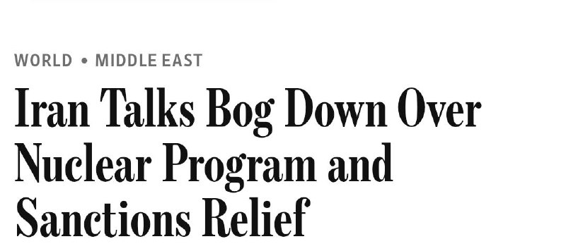
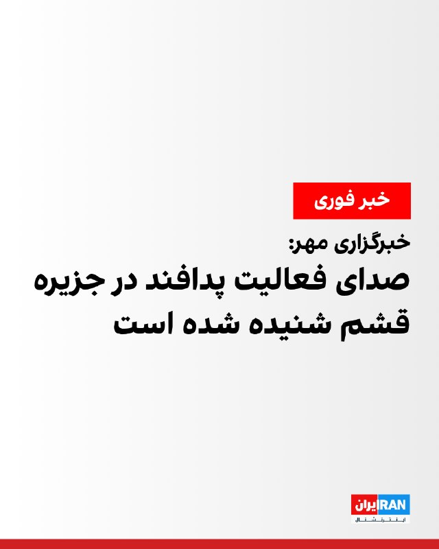
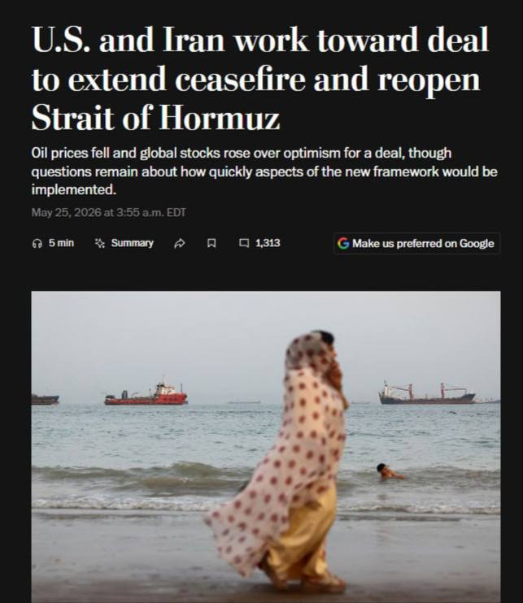

# خواننده تلگرام

<!-- TOP_NAV START -->

<a href="https://github.com/ProAlit/aio-downloader/blob/main/telegram/content/archive_1.md" style="display:inline-block; padding:6px 12px; margin:0 4px; background-color:#2ea44f; color:white; text-decoration:none; border-radius:4px; font-weight:bold;">صفحه بعد</a>

<!-- TOP_NAV END -->

<!-- MSG START -->

---
📅 بروزرسانی: 1405/03/04 18:23
---

## WithYashar — post 12423

  <a href="telegram/content/WithYashar_12423_1779720792.mp4" target="_blank">🎬 Download video</a>

یک خلبان کلمبیایی که در ارتفاع ۱۲۵۰۰ پایی پرواز می‌کرد، تصویری را ثبت کرد که به عنوان بهترین فیلم ثبت شده از بشقاب پرنده‌ها تا به حال توصیف شده است و بنا به گزارش‌ها، اصالت آن تأیید شده است.
@withyashar

## mwarmonitor — post 9696

🔴گفت‌وگوهای ایران درباره برنامه هسته‌ای و کاهش تحریم‌ها به بن‌بست خورده است.

🔸با این حال، هر دو طرف انگیزه‌هایی برای رسیدن به توافق دارند، اما هر کدام بر مواضع خود پافشاری می‌کنند؛ ترامپ نیز گفته است که «یک توافق بد را نخواهد پذیرفت».

@mwarmonitor

## pm_afshaa — post 91460

  <a href="telegram/content/pm_afshaa_91460_1779720794.webm" target="_blank">🎬 Download video</a>

🔴وال استریت ژورنال:
مذاکرات ایران رو بحث برنامه هسته‌ای و لغو تحریم‌ها به بن‌بست خورده.

💧 Rainbet.com the #1 Non-KYC Crypto Casino & Sportsbook @rainbetcom

😁 @Pm_Afshaa

## DEJradio — post 4951

  <a href="telegram/content/DEJradio_4951_1779720795.webm" target="_blank">🎬 Download video</a>

🛩️
🚨 فعال شدن پدافند در قشم
منابع داخلی: یک پهپاد سرنگون شد

عصر دوشنبه، حوالی ساعت ۱۶:۱۵ دقیقه به وقت ایران پدافند جزیره قشم فعال شد. ساعاتی بعد اعلام شد که نیروهای مسلح یک «پهپاد متخاصم» را بر فراز آب‌های خلیج فارس با استفاده از سامانه «آرش» مورد هدف قرار دادند.

در روزهای اخیر بارها مواردی از پرواز پهپادها بر فرار ایران گزارش شد اما مشخص نیست متعلق به کدام کشور بودند. برخی منابع ادعا کردند پهپاد ساقط شده اسرائیلی بود.

#پهپاد #قشم #خلیج_فارس
@DEJradio

## DEJradio — post 4950

⭕️ ترامپ گفت توافق با جمهوری اسلامی باید به گسترش پیمان ابراهیم منجر شود

دونالد ترامپ، رئیس‌ جمهوری آمریکا، روز دوشنبه گفت توافق احتمالی با تهران باید به گسترش پیمان ابراهیم در خاورمیانه بینجامد.
او در پیامی در شبکۀ «تروث سوشال اعلام کرد مذاکرات با جمهوری اسلامی «به خوبی پیش می‌رود».
ترامپ هشدار داد اگر مذاکرات شکست بخورد، منطقه دوباره به یک میدان جنگ بزرگ‌تر و شدیدتر از پیش تبدیل می‌شود.
رئیس جمهوری آمریکا تأکید کرد توافق یا باید برای همه بزرگ و معنادار باشد، یا توافقی در کار نیست.
ترامپ افزود عربستان سعودی و قطر باید بی‌درنگ به پیمان ابراهیم بپیوندند و دیگر کشورهای منطقه نیز از آنها پیروی کنند.
به گفتۀ ترامپ اگر جمهوری اسلامی توافق مورد نظر آمریکا را امضا کند، پیوستن تهران به پیمان ابراهیم می‌تواند بخشی از یک ائتلاف جهانی بی‌سابقه، باشد.
رئیس‌ جمهوری آمریکا اعلام کرد با رهبران پادشاهی سعودی، امارات، قطر، پاکستان، ترکیه، مصر، اردن و بحرین درمورد آیندۀ خاورمیانه و توافق احتمالی با جمهوری اسلامی گفت‌وگو کرده است.
ترامپ توافق احتمالی را «مهم‌ترین توافق تاریخ خاورمیانه» عنوان کرد.

#پیمان_ابراهیم #خاورمیانه
@DEJradio

## DEJradio — post 4949

⭕️ سی‌بی‌اس خبر زندگی پنهانی و پیکی مجتبی خامنه‌ای را تأیید کرد

شبکۀ خبری سی‌بی‌اس به نقل از مقام‌های آگاه در دولت آمریکا گزارش داد مجتبی خامنه‌ای، رهبر جمهوری اسلامی، در مکانی نامعلوم پنهان شده و دسترسی بسیار محدودی به دنیای خارج دارد.
بر پایۀ این گزارش، ارتباطات او تنها از طریق شبکه‌ای پیچیده از پیک‌ها و نامه‌برها انجام می‌شود.
نهادهای اطلاعاتی آمریکا گفتند حتا مقام‌های بلندپایۀ حکومت نیز از محل پنهان شدن خامنه‌ای آگاهی ندارند.
مقام‌های آمریکایی گفته‌اند مسئولان جمهوری اسلامی که مجوز مذاکره با دولت آمریکا را دارند، برای ارتباط‌گیری در داخل ساختار حکومت با مشکلات جدی روبه‌رو شده‌اند. آنها می‌گویند همین موضوع روند مذاکرات را کند کرده است.
دو مقام آمریکایی به سی‌بی‌اس گفتند هر بار که واشینگتن جزئیات پیشنهادی را ارسال می‌کند، دسترسی نداشتن به مجتبی خامنه‌ای، پاسخ تهران را با تاخیری طولانی همراه می‌کند.
مجتبی خامنه‌ای از زمان آغاز حملات آمریکا و اسرائیل به جمهوری اسلامی، به‌شدت زخمی و سپس ناپدید شده است.
با وجود معرفی مجتبی خامنه‌ای به عنوان رهبر سوم جمهوری اسلامی، تاکنون هیچ تصویر یا صدایی از او منتشر نشده است.
منابع آگاه همچنین گزارش دادند بسیاری از رهبران جمهوری اسلامی هفته‌های بسیاری را در پناهگاه‌های بسیار مستحکم سپری می‌کنند و فقط در موارد بسیار ضروری با یکدیگر ارتباط دارند.
مسعود پزشکیان در هفته‌های پیشین از دیداری دو ساعت و نیمه با مجتبی خامنه‌ای خبر داده و از «ویژگی‌های شخصیتی» او تمجید کرده بود.
برخی منابع آگاه بر این باورند که مجتبی خامنه‌ای کشته شده و تنها شبحی از او در نزد مقامات سپاه به بیانیه نویسی مشغول است.

#موشتبا
@DEJradio

## mamlekate — post 103582

📝 قالیباف و عراقچی در سفری غیرمنتظره وارد قطر شدند

@mamlekate

## IranIntlTV — post 338934

  <a href="telegram/content/IranIntlTV_338934_1779720796.mp4" target="_blank">🎬 Download video</a>

سرخط خبرهای دوشنبه ۴ خرداد
@iranintltv

## FarsiVOA — post 218619

  <a href="telegram/content/FarsiVOA_218619_1779720798.mp4" target="_blank">🎬 Download video</a>

ارتش اسرائیل یک ساختمان حزب‌الله را در رشیدیه، جنوب لبنان، هدف قرار داد. این حمله پس از هشدار تخلیه انجام شد.

ارتش اسرائیل پیشتر به ساکنان ۱۰ منطقه شامل شهر و روستا در جنوب لبنان هشدار داده بود که پیش از حملات هوایی علیه مواضع گروه حزب‌الله لبنان، این مناطق را تخلیه کنند.

## FarsiVOA — post 218618

🔺نوبت به اهالی سینما رسید؛ هومن سیدی و سعید روستایی احضار شدند

▪️قوه قضائیه جمهوری اسلامی با پرونده‌سازی علیه شماری از اهالی سینما، از جمله هومن سیدی و سعید روستایی، آنها را به اتهام واهی «همکاری با دولت متخاصم» به «دادسرای فرهنگ و رسانه» احضار کرده است.

⬇️ بیشتر بخوانید:

https://ir.voanews.com/a/filing-a-case-against-cinema-workers-saeed-roustaei-hooman-seydi-judiciary-legal-director-of-the-cinema-house/8153614.html/?nocach=1

## IranianMinds — post 20729

🔴 یک منبع ایرانی به المیادین:

هیئت ایرانی در دوحه پس از پایان دیدار‌های خود، امشب به تهران بازمی‌گردنند.

@IranianMinds

## IranianMinds — post 20728

  

🔴 وال استریت ژورنال :

در مذاکرات ایران و آمریکا دو طرف سر مسئله هسته ای و لغو‌ تحریم ها به بن بست خوردن.

@IranianMinds

## IranianMinds — post 20727

💯 اگر هنوز ۵۰۰ هزارتومان رو نگرفتی همین الان عضو شو‌ و جایزتو بگیر
نیازی هم به واریز نیست

👍 تنها سایت مورد #تایید ما با بونوس های واقعی

🌐 Winro.io

## IranianMinds — post 20726

  <a href="telegram/content/IranianMinds_20726_1779720801.webm" target="_blank">🎬 Download video</a>

⭕️ تنها جایی که در لحظه عضویت بهت 500 هزارتومان موجودی میده اینجاس 
❌

🎉 کافیه فقط عضو بشی تا #وینرو بهت 
🤩 
🤩 
🤩 هزارتومان جایزه بده ، نیازی هم به واریز نیست.

⌛ پشتیبانی 24 ساعته

🍆تنها سایت مورد اعتماد ما با بونوس های کاملا واقعی و رویایی:

🌐 Winro.io

🌐 Winro.io
کانال بونوس های رایگان g4

📱 @winro_io

## Dirty_Kids — post 390152

  

🔴 وال استریت ژورنال:
مذاکرات ایران بر سر برنامه هسته‌ای و لغو تحریم‌ها به بن‌بست خورده.

@Dirty_Kids 👻

## alonews — post 122593

  <a href="telegram/content/alonews_122593_1779720803.webm" target="_blank">🎬 Download video</a>

👈 ارتش اسرائیل (IDF) : پس از به صدا درآمدن آژیرهای خطر در ساعت ۱۶:۰۳ مبنی بر نفوذ هواپیمای متخاصم به چندین منطقه در شمال اسرائیل، یک پهپاد انفجاری که توسط حزب‌الله شلیک شده بود، در خاک اسرائیل، نزدیک مرز اسرائیل و لبنان سقوط کرد. هیچ تلفاتی گزارش نشده است.

🔴علاوه بر این، اندکی پیش، نیروی هوایی اسرائیل یک موشک شلیک شده توسط حزب‌الله به سمت خاک اسرائیل را رهگیری کرد.

🔴در حادثه‌ای دیگر، اندکی پیش، یک پهپاد انفجاری در خاک اسرائیل، نزدیک مرز اسرائیل و لبنان سقوط کرد.

✅ @AloNews خبر جنگ

## alonews — post 122592

  <a href="telegram/content/alonews_122592_1779720803.webm" target="_blank">🎬 Download video</a>

👈سناتور جمهوری‌خواه لیندسی گراهام:
پیشنهاد اخیر رئیس‌جمهور ترامپ که گسترش توافقنامه‌های ابراهیم را به عنوان بخشی از یک توافق مذاکره‌شده در مورد مناقشه ایران الزامی می‌کند، به سادگی درخشان است و منجر به مهم‌ترین تغییر در خاورمیانه در هزاران سال خواهد شد.

🔴با صلح عربستان سعودی و دیگر کشورهایی مانند پاکستان با اسرائیل، منطقه شاهد سطحی از ثبات خواهد بود که پیش از رئیس‌جمهور ترامپ هرگز تصور نمی‌شد و در نهایت به یکپارچگی منطقه‌ای منجر خواهد شد که خاورمیانه را به یک قدرت اقتصادی و منبع فرصت‌های خوب تبدیل می‌کند، به جای اینکه یک انبار باروت باشد.

🔴انتظار دارم متحدان عرب ما این را بپذیرند، همچنین دوستان ما در اسرائیل، با تمرکز بر این وظیفه، زیرا شکست گزینه‌ای نیست - که تحلیلی درست خواهد بود

✅ @AloNews خبر جنگ

---
📅 بروزرسانی: 1405/03/04 18:13
---

## mwarmonitor — post 9695

  <a href="telegram/content/mwarmonitor_9695_1779720198.mp4" target="_blank">🎬 Download video</a>

✈️نقل و انتقالات هوایی نیروی هوایی آمریکا به خاورمیانه با حجم بالا همچنان ادامه دارد، با وجود صحبت‌هایی که درباره نزدیک بودن نهایی شدن مذاکرات مطرح شده است.

@mwarmonitor

## mwarmonitor — post 9694

🔸وزیر امور خارجه امارات متحده عربی، شیخ عبدالله بن زاید آل نهیان، هشدار داده است که اروپا در نهایت به دلیل نبود اقدامات قاطع از سوی رهبران اروپایی و «وسواس نسبت به اصلاحات سیاسیِ افراطی (woke political correctness)»، ممکن است حتی بیشتر از خاورمیانه تولیدکننده افراط‌گرایان و اسلام‌گرایان تندرو باشد.

🔹او به‌طور مشخص به وجود هسته‌های افراط‌گرای اسلام‌گرا در شهرهای اروپایی مانند لندن، و همچنین در آلمان، اسپانیا و ایتالیا اشاره کرده و هشدار داده است که کشورهایی که در برخورد با این موضوع کوتاهی کنند ممکن است به‌عنوان «پرورشگاه‌های تروریسم» طبقه‌بندی شوند.

🔹بخش قابل توجهی از افرادی که در اروپا به‌دلیل طراحی یا تلاش برای حملات اسلام‌گرایانه بازداشت یا متوقف می‌شوند، نوجوانان محلی با تابعیت اروپایی (سنین ۱۴ تا ۱۹ سال) هستند که به‌طور کامل از طریق شبکه‌های اجتماعی و پلتفرم‌های بازی آنلاین رادیکال شده‌اند، بدون اینکه هرگز به خاورمیانه سفر کرده باشند.

🔸شیخ عبدالله بن زاید آل نهیان گفته است:
«روزی خواهد رسید که ما شاهد خواهیم بود افراط‌گرایان و تروریست‌های بسیار بیشتری از اروپا خارج می‌شوند، به دلیل نبود تصمیم‌گیری قاطع، تلاش برای سیاسی‌کاری بیش از حد، یا این تصور که آن‌ها اسلام و خاورمیانه و دیگران را بهتر از خودشان می‌شناسند. و متأسفم، اما این چیزی جز ناآگاهی نیست.»

@mwarmonitor

## FoxNewsTwitter — post 342216

  

Fox News (Twitter/X)

This Memorial Day, we honor the brave men and women who made the ultimate sacrifice for our freedom, their courage and service will never be forgotten.

"The greatest fighting force the world has ever known is built upon the extraordinary service of selfless men and women who safeguard our liberty and preserve our way of life. Since the birth of our Nation nearly 250 years ago, countless souls have lost their lives in this noble and righteous pursuit. On Memorial Day, we honor these American heroes." — The White House

## pm_afshaa — post 91459

  <a href="telegram/content/pm_afshaa_91459_1779720201.mp4" target="_blank">🎬 Download video</a>

🔴خوش چشم، کارشناس صداوسیما:
روبیو، ویتکاف و کوشنر از طریق واسطه‌ها بهمون گفتن به توییت‌های ترامپ توجه نکنید.

💧 Rainbet.com the #1 Non-KYC Crypto Casino & Sportsbook @rainbetcom

😁 @Pm_Afshaa

## DEJradio — post 4948

⭕️ بهای نفت در پی احتمال توافق جمهوری اسلامی و آمریکا سقوط کرد

بهای نفت روز دوشنبه در پی افزایش احتمال توافق میان آمریکا و جمهوری اسلامی برای پایان دادن به جنگ، حدودا شش درصد کاهش یافت.
قیمت‌ها در این روز به پایین‌ترین سطح در دو هفتۀ اخیر رسیده است.
بر پایۀ گزارش خبرگزاری رویترز، بهای نفت برنت با کاهش ۵.۷ درصدی به ۹۷ دلار و ۶۹ سنت برای هر بشکه رسید.
نفت خام وست‌تگزاس آمریکا نیز که شاخص قیمت نفت در این کشور به شمار می‌رود، با کاهش شش درصدی ۹۰ دلار و ۸۵ سنت معامله شد.
پیش از آغاز جنگ چهل روزه، درحدود بیست درصد از صادرات نفت و گاز طبیعی مایع در دنیا، از تنگۀ هرمز عبور می‌کرد.

#نفت
@DEJradio

## DEJradio — post 4947

⭕️ روبیو: یا با تهران به توافقی خوب می‌رسیم یا از راهی دیگر برخورد می‌کنیم

مارکو روبیو، وزیر امور خارجۀ آمریکا، روز دوشنبه گفت برای پایان دادن به جنگ با جمهوری اسلامی ممکن است «امروز» توافقی به‌دست بیاید.
او در دهلی‌نو، پایتخت هندوستان گفت شامگاه گذشته ممکن بود خبری برسد، اما شاید هم امروز چیزی در راه باشد.
روبیو افزود آمریکا یا به یک توافق خوب با جمهوری اسلامی می‌رسد، یا از راهی دیگری با آنها برخورد می‌کند.
وزیر امور خارجۀ آمریکا تأکید کرد واشینگتن پیش از بررسی گزینه‌های دیگر، به دیپلماسی کاملا فرصت می‌دهد.
او افزود طرح باز نگه داشتن تنگۀ هرمز از پشتیبانی گسترده‌ای در خلیج فارس برخوردار است و کشورهای منطقه آن را «معقول و ضروری» می‌دانند.
روبیو اطمینان داد جمهوری اسلامی وارد مذاکراتی «واقعی، مهم و زمان‌بر» درباره پرونده هسته‌ای می‌شود.
او تصریح کرد دونالد ترامپ عجله‌ای ندارد و هیچ توافق بدی را امضا نمی‌کند.

#مارکو_روبیو #مذاکرات
@DEJradio

## DEJradio — post 4946

  <a href="telegram/content/DEJradio_4946_1779720203.webm" target="_blank">🎬 Download video</a>

⭕️
🚨 یکی دیگر از معترضان انقلاب شیر و خورشید اعدام شد؛ صدور حکم اعدام برای چهار متهم پروندۀ اکباتان

قوۀ قضائیۀ جمهوری اسلامی اعلام کرد عباس اکبری فیض‌آبادی، از معترضان دی‌ماه ۱۴۰۴ را اعدام کرده است.
خبرگزاری میزان، وابسته به دستگاه قضائی مدعی شد عباس اکبری فیض‌آبادی، یکی از «لیدرهای مسلح» اعتراض‌ها در نائین بوده است. بنا بر این ادعا، او در حمله به فرمانداری نائین و تیراندازی به سوی مأموران نقش داشت.
هیچ جزئیاتی دربارۀ روند دادرسی، شرایط دادگاه و دسترسی این مخالف سیاسی رژیم به وکیل، منتشر نشده است.
جمهوری اسلامی از شکنجۀ روحی و جسمی بر بازداشت‌شدگان برای گرفتن اعتراف اجباری از آنها علیه خودشان استفاده می‌کند.
از سویی قوه قضائیه از صدور حکم اعدام برای چهار متهم پروندۀ کشته‌شدن یک بسیجی در شهرک اکباتان تهران در جریان اعتراض‌های ۱۴۰۱ خبر داد.
شعبۀ ۱۵ دادگاه انقلاب این افراد را با اتهام «افساد فی‌الارض» به اعدام محکوم کرد.
در روزهای پیشین شعبۀ ۱۳ دادگاه کیفری تهران حکم قصاص متهمان این پرونده را نقض و آن‌ها را به حبس و پرداخت دیه محکوم کرده بود.
وکلای متهمان گفتند احکام اعدام به‌صورت ناگهانی و شفاهی، بدون طی مراحل قانونی، از سوی قاضی صلواتی اعلام شده است.
قاضی صلواتی یکی از بدنام‌ترین افراد دستگاه قضائی است که به صدور فله‌ای حکم اعدام برای متهمان سیاسی شهرت دارد.

#اعدام #زندانیان_سیاسی
@DEJradio

## DEJradio — post 4945

⭕️ یک عضو فعال حماس در فاجعۀ کشتار هفتم اکتبر، توسط اسرائیل حذف شد

ارتش اسرائیل اعلام کرد طی عملیاتی لؤی هشام محمود بصل، عضو حماس را که در حملۀ هفتم اکتبر به پایگاه زیکیم نقش داشت، حذف کرد.
بر پایۀ بیانیه ارتش اسرائیل، بصل به‌عنوان تک‌تیرانداز در گردان زیتون حماس فعالیت می‌کرد.
اسرائیل گزارش داد که این فرد در روزهای اخیر نیز برای اجرای حملات علیه نیروهای اسرائیلی برنامه‌ریزی می‌کرد.
عملیات ارتش اسرائیل با هدف رفع یک تهدید فوری، انجام شد.
در جریان فاجعۀ هفتم اکتبر 2023 بیش از هزار تن از شهروندان اسرائیل کشته شده بودند.
حماس که توسط جمهوری اسلامی پشتیبانی می‌شود، در سیاهۀ تروریستی اروپا و آمریکا قرار دارد.

#اسرائیل #حماس
@DEJradio

## DEJradio — post 4944

⭕️پاکستان از چین خواست برای توافق احتمالی تهران و واشینگتن وارد عمل شود

منابع آگاه گفتند شهباز شریف، نخست‌وزیر پاکستان، در گفت‌وگو با مقام‌های چینی دربارۀ مذاکرات جمهوری اسلامی و آمریکا رایزنی کرد.
بر اساس گزارش‌ها، اسلام‌آباد خواستارنقش فعال و ضمانت چین در توافق احتمالی میان جمهوری اسلامی و آمریکا شد.
شهباز شریف که همراه با عاصم منیر، فرماندۀ ارتش پاکستان به پکن سفر کرده است، ادعا کرد مذاکرۀ تهران و واشینگتن «در مسیر درست در حال پیش‌روی است».
نخست‌وزیر پاکستان همچنین از پشتیبانی چین از تلاش‌های میانجی‌گرانۀ اسلام‌آباد برای برقراری آتش‌بس و کاهش تنش در منطقه خبر داد.

#مذاکرات #چین #پاکستان
@DEJradio

## DW_Farsi — post 125135

🔶 کی‌یف زیر آتش؛ اوکراین خواستار واکنش جهانی شد

یک روز پس از حمله گسترده روسیه به کی‌یف، پایتخت اوکراین، بار دیگر حملات متقابل میان دو کشور در مناطق مرزی ادامه یافت.

مقام‌های روسیه در کانال تلگرام اعلام کردند که در منطقه بلگورود یک مرد در جریان حمله موشکی و پهپادی کشته و فرد دیگری زخمی شده است. همچنین به گفته آنها، زیرساخت‌های انرژی آسیب دیده‌اند که به قطع برق و آب در شهر بلگورود منجر شده است.

سرپرست فرمانداری منطقه بریانسک نیز اعلام کرد یک مرد دیگر در حمله اوکراین به شهرک "بلایا بریوزکا" در نزدیکی بریانسک کشته شده است.

به گزارش تلویزیون دولتی روسیه، در شهر "هورلیفکا" در شرق اوکراین که تحت اشغال روسیه است، پنج نفر در حملات پهپادی زخمی شده‌اند.

@dw_farsi

## Dirty_Kids — post 390151

  

ترامپ :
مذاکرات با ایران داره خوب پیش میره؛

یا یه توافق خفن درمیاد که به نفع همه‌ست، یا اصلاً توافقی در کار نیست و دوباره برمی‌گردیم به جنگ، اونم شدیدتر از قبل؛
من با رهبرای عربستان، قطر، امارات، ترکیه، مصر، پاکستان و بقیه حرف زدم و گفتم وقتشه همتون وارد توافق ابراهیم بشید.
اگه ایرانم با من توافق کنه، خیلی اتفاق بزرگی میشه که اونا هم به این جمع اضافه بشن.
به نظرم این میتونه بزرگ‌ترین و تاریخی‌ترین توافق خاورمیانه باشه؛ یه چیزی که منطقه رو قوی، پولدار و متحد کنه.

@Dirty_Kids 👻

## Dirty_Kids — post 390150

  <a href="telegram/content/Dirty_Kids_390150_1779720204.mp4" target="_blank">🎬 Download video</a>

مامانا با بچه هاشونم دارن این چالشو میرن

@Dirty_Kids 👻

## Dirty_Kids — post 390149

  <a href="telegram/content/Dirty_Kids_390149_1779720207.mp4" target="_blank">🎬 Download video</a>

کلیپ وایرال شده تو اینستاگرام فارسی

یه قر بدیم با دوغ آبعلی و تو جایی که شاه ساخته یعنی خوشبختیم همه‌چی اوکیه

@Dirty_Kids 👻

## alonews — post 122591

  <a href="telegram/content/alonews_122591_1779720209.webm" target="_blank">🎬 Download video</a>

👈طبق گزارش مکو اسرائیل، ایران در طول آتش‌بس، بازسازی بخش‌هایی از صنعت موشکی و پهپادی خود را سریع‌تر از حد انتظار از سر گرفته است.

🔴بر اساس برآوردهای اسرائیل، ایران در حال بازسازی موشک‌ها، پرتابگرها، پهپادها و سامانه‌های دفاع هوایی در تأسیسات زیرزمینی موقت با استفاده از قطعات باقی‌مانده، حمایت روسیه و قطعات قاچاق شده چینی است.

🔴مقامات دفاعی اسرائیل معتقدند ایران می‌تواند تولید پهپاد را ظرف چند ماه از سر بگیرد و تولید موشک را ظرف یک سال به طور قابل توجهی گسترش دهد.

🔴فرمانده سنتکام، دریاسالار برد کوپر، شهادت داد که ۹۰٪ از پایه صنعتی دفاعی ایران نابود شده است، اما اطلاعات به‌روزشده نشان می‌دهد حدود دو سوم پرتابگرهای موشکی ایران سالم مانده و از تونل‌های زیرزمینی مجدداً مستقر شده‌اند.

✅ @AloNews خبر جنگ

## alonews — post 122590

  <a href="telegram/content/alonews_122590_1779720209.webm" target="_blank">🎬 Download video</a>

👈قیمت جدید لبنیات:

🔴شیر نایلونی: ۸۴ هزار تومان

🔴شیر بطری: ۹۸ هزار تومان

🔴پنیر یواف ۴۰۰ گرمی: ۲۰۳ هزار تومان

🔴ماست دبه‌ای ۲ کیلویی: ۲۲۸ هزار و ۷۰۰ تومان

✅ @AloNews خبر جنگ

---
📅 بروزرسانی: 1405/03/04 18:03
---

## WithYashar — post 12422

  <a href="telegram/content/WithYashar_12422_1779719594.mp4" target="_blank">🎬 Download video</a>

اتاق جنگ با یاشار : بار جدید نخود رسید
@withyashar

## mwarmonitor — post 9693

  

✈️دو فروند هواپیمای گشت دریایی بوئینگ P-8 پوسایدون نیروی دریایی آمریکا امروز در آن منطقه بین دریای عرب و خلیج عمان در حال عملیات بوده‌اند.

⁉️سؤال این است که آیا گروه رزمی ناو هواپیمابر یو‌اس‌اس جورج اچ. دبلیو. بوش در نزدیکی آن منطقه قرار دارد یا نه.

@mwarmonitor

## mwarmonitor — post 9692

مذاکرات با جمهوری اسلامی ایران به خوبی در حال پیشرفت است! این یا یک «توافق بزرگ» برای همه خواهد بود، یا هیچ توافقی در کار نخواهد بود — بازگشت به جبهه جنگ و شلیک، اما بزرگتر و قوی‌تر از هر زمان دیگری — و هیچ‌کس این را نمی‌خواهد! من در طول گفتگوهایم در روز شنبه…

## FoxNewsTwitter — post 342212

Fox News (Twitter/X)

Pizza Hut franchises across the country are rolling out "Pizza Hut Classic" remodels to bring back the iconic '80s and '90s dining experience.

Franchisees are reviving beloved staples like the red cups, checkered tablecloths, salad bars, and classic Tiffany-style lamps to draw families back into dining rooms.

After years of sleek modern redesigns, the old-school dine-in feel is suddenly making a comeback.

## FoxNewsTwitter — post 342211

  

Fox News (Twitter/X)

WATCH LIVE: Intrepid Museum marks Memorial Day with tribute to fallen troops https://twitter.com/i/broadcasts/1AKEmmmZMmYKL

## DEJradio — post 4943

⭕️معاون پزشکیان خواهان بازگشت سردار آزمون به تیم ملی شد

عبدالکریم حسین‌زاده، معاون رئیس‌ جمهوری در امور توسعۀ روستایی و مناطق محروم، خواستار دعوت دوبارۀ سردار آزمون به تیم ملی فوتبال جمهوری اسلامی ایران شد.
او در شبکۀ اجتماعی اکس مدعی شد «نیاز وطن» حفظ نخ‌های پیوند بین فرزندانش است.
بنا بر ادعای این مقام دولتی، بازگرداندن آزمون پیامی به نفع انسجام ملی، قلمداد می‌شود.
نام سردار آزمون در فهرست ۳۰ نفرۀ تیم ملی برای جام جهانی ۲۰۲۶ که به‌تازگی اعلام شد، دیده نمی‌شود.
پشتیبانی سردار آزمون از اعتراضات مردمی و انتشار تصاویرش در کنار حاکم دوبی، از دلایل غیررسمی کنار گذاشته شدن او از تیم ملی عنوان شد.
قوۀ قضائیه پیش‌تر دستور به توقیف اموال این بازیکن معترض تیم ملی داده بود.
سردار آزمون با ۵۷ گل زدۀ ملی، دومین گلزن برتر تاریخ تیم ملی فوتبال ایران است.

#سردار_آزمون #فوتبال #جام_جهانی
@DEJradio

## DEJradio — post 4942

⭕️ کلاس‌های دانشگاه آریامهر تا اطلاع بعدی مجازی می‌ماند

معاونت آموزشی دانشگاه آریامهر که پس از 57 با نام صنعتی شریف شناخته می‌شود، اعلام کرد کلاس‌های همۀ مقاطع تحصیلی این دانشگاه تا اطلاع بعدی همچنان به‌صورت مجازی برگزار می‌شود.
بر اساس ادعای مسئولان دانشگاه، با وجود تصمیم پیشین برای حضوری شدن کلاس‌های تحصیلات تکمیلی از نهم خردادماه، هنوز «امکان ارائۀ پایدار خدمات اینترنت و امکانات رفاهی» فراهم نیست.
تداوم اختلال گستردۀ اینترنت در ایران طی هفته‌های اخیر، فعالیت بسیاری از دانشگاه‌ها و مراکز آموزشی را تحت تاثیر قرار داده است.
از سویی در زمان بازگشایی حضوری دانشگاه‌ها، چندین تجمع دانشجویی در پشتیبانی از شاهزاده رضا پهلوی و انقلاب شیر و خورشید برگزار شده بود.

#دانشجویان #دانشگاه
@DEJradio

## DEJradio — post 4941

⭕️ آمادگی نیروی دریایی بریتانیا برای مین‌روبی احتمالی در تنگۀ هرمز

کشتی بریتانیایی آر.اف.ای لایم بی، در تنگۀ جبل‌الطارق برای مأموریت احتمالی مین‌روبی در تنگۀ هرمز آماده می‌شود.

رویترز گزارش داد این شناور قرار است همراه با ناوشکن اچ‌ام‌اس دراگون، و سایر کشتی‌های متحدان، برای عملیات احتمالی به رهبری بریتانیا و فرانسه راهی خلیج فارس شود.
نیروی دریایی بریتانیا از سویی پهپادهای دریایی مین‌شکار و تجهیزات ویژۀ شناسایی مین در این کشتی بارگیری می‌کند.
به گفتۀ مقام‌های بریتانیایی از ابتدای جنگ چهل روزه، دستکم شش هزار کشتی از عبور از تنگۀ هرمز منع شدند.
بریتانیا می‌گوید هنوز مشخص نیست جمهوری اسلامی واقعاً در آبراه هرمز مین‌گذاری کرده باشد.
شرکت‌های بیمه برای ازسرگیری کامل تردد دریایی خواهان یقین مطلق، درمورد امنیت مسیر شده‌اند.
برخی ناظران می‌گویند جمهوری اسلامی از «ادعای» مین‌گذاری برای ترساندن نفتکش‌ها و برهم زدن نظم بازار جهانی استفاده کرده است.

#بریتانیا #تنگه_هرمز
@DEJradio

## IranIntlTV — post 338933

  

🔻نجمه موسوی-پیمبری، از نزدیکان پرویز قلیچ‌خانی خبر داده که اسطوره فوتبال ایران پیش‌تر تصمیم گرفته بود پیکرش را به مراکز علمی اهدا کند: «پرویز قلیچ‌خانی، بر اساس باورهای شخصی خود تصمیم گرفته بود پیکرش را به مراکز علمی اهدا کند، به همین خاطر مراسم خاک‌سپاری برگزار نخواهد شد.»

🔹او که با انتشار یک پیام صوتی، این خبر را اعلام کرد، گفت: «پرویز، به دلیل فروتنی و برای جلوگیری از زحمت دیگران، تمایلی به برپایی مراسم یادبود رسمی نداشت. با این حال، دوستداران او می‌توانند، برای بزرگداشت جایگاه مردمیِ پرویز قلیچ‌خانی در هر کجای جهان برنامه‌هایی داوطلبانه برگزار کنند.»

🔹پرویز قلیچ‌خانی، کاپیتان پیشین تیم ملی فوتبال ایران، شنبه دوم خرداد ۱۴۰۵، در ۸۱ سالگی در حومه پاریس درگذشت. او تنها بازیکنی بود که سه بار با تیم ملی، قهرمان جام ملت‌های آسیا شد. قلیچ‌خانی پس از انقلاب به فعالیت سیاسی و روزنامه‌نگاری در خارج از کشور روی آورد.

@iranintltvsport

## FarsiVOA — post 218614

مارکو روبیو، وزیر امور خارجه آمریکا، و همسرش در جریان سفر به هند از تاج محل در شهر آگرا دیدار کرد.

@FarsiVOA

## DW_Farsi — post 125134

  <a href="telegram/content/DW_Farsi_125134_1779719597.mp4" target="_blank">🎬 Download video</a>

🎥 مخترعان آلمان کجا هستند؟

شرکت‌های بزرگ در آلمان سرمایه فراوانی دریافت می‌کنند. اما اقتصاد این کشور در رکود است. آیا آلمان روی گزینه درستی سرمایه‌گذاری می‌کند؟

@dw_farsi

## RadioFarda — post 157543

🔸دونالد ترامپ، رئیس جمهور آمریکا، روز دوشنبه در تازه‌ترین پیام خود در شبکه اجتماعی‌اش ضمن خبر دادن از پیشرفت «خوب» در مذاکره با ایران، از تمام کشورهای دخیل در این مذاکرات خواست پس از حصول توافق با ایران، بلافاصله به پیمان‌های ابراهیم بپیوندند. 🔸پیمان یا پیمان‌های…

## RadioFarda — post 157542

  

🔸دونالد ترامپ، رئیس جمهور آمریکا، روز دوشنبه در تازه‌ترین پیام خود در شبکه اجتماعی‌اش ضمن خبر دادن از پیشرفت «خوب» در مذاکره با ایران، از تمام کشورهای دخیل در این مذاکرات خواست پس از حصول توافق با ایران، بلافاصله به پیمان‌های ابراهیم بپیوندند.

🔸پیمان یا پیمان‌های ابراهیم طرحی بود که دونالد ترامپ در دوره اول خود برای تلاش در راه عادی‌سازی روابط میان اعراب و اسرائیل آغاز کرد و موفق شد تا چندین کشور از جمله بحرین و امارات متحده عربی را هم به این کار ترغیب کند.

🔸حال رئیس جمهور آمریکا روند توافق با جمهوری اسلامی را به این طرح پیوند زده و به گفته خود این «خواسته اجباری» را با دیگر کشورهای عرب خلیج فارس و همین طور ترکیه مطرح کرده که به‌فوریت و همزمان به پیمان ابراهیم بپیوندند.

@RadioFarda

## alonews — post 122589

  <a href="telegram/content/alonews_122589_1779719600.webm" target="_blank">🎬 Download video</a>

🔴فوری / وال استریت ژورنال: مذاکرات ایران رو بحث برنامه هسته‌ای و رفع تحریم‌ها به بن بست رسیده

✅ @AloNews خبر جنگ

## alonews — post 122588

  <a href="telegram/content/alonews_122588_1779719600.webm" target="_blank">🎬 Download video</a>

👈المیادین: هیئت ایرانی به ریاست قالیباف امشب به تهران باز می‌گردد

✅ @AloNews خبر جنگ

## alonews — post 122584

  <a href="telegram/content/alonews_122584_1779719600.mp4" target="_blank">🎬 Download video</a>

👈امروز - حمله‌های شدیدِ ارتش اسرائیل به جنوب لبنان انجام شد!

✅ @AloNews خبر جنگ

---
📅 بروزرسانی: 1405/03/04 17:53
---

## VahidOOnLine — post 242130

  

علیرضا سلیمی، عضو هیات‌رییسه مجلس گفت با توجه به شرایط جدید، از مجتبی خامنه‌ای اجازه خواستیم تا جلسات مجلس را به‌صورت وبیناری با امکان رای‌گیری برگزار کنیم.

او افزود به محض دریافت پاسخ از «رهبری»، هیات‌رییسه تصمیمات لازم را برای آغاز جدی فعالیت‌های عادی مجلس خواهد گرفت.
‌🏁 🇬🇧 IranintlTV

🤖 @VahidOOnLine

## pm_afshaa — post 91458

  <a href="telegram/content/pm_afshaa_91458_1779718983.webm" target="_blank">🎬 Download video</a>

🔴مارک لوین: درباره توافق احتمالی، کلی مطلب توی اینترنت نوشته شده؛ اما من هیچ چیزی درباره خودِ مردم ایران ندیدم.

💧 Rainbet.com the #1 Non-KYC Crypto Casino & Sportsbook @rainbetcom

😁 @Pm_Afshaa

## IranIntlTV — post 338932

  

علیرضا سلیمی، عضو هیات‌رییسه مجلس گفت با توجه به شرایط جدید، از مجتبی خامنه‌ای اجازه خواستیم تا جلسات مجلس را به‌صورت وبیناری با امکان رای‌گیری برگزار کنیم.

او افزود به محض دریافت پاسخ از «رهبری»، هیات‌رییسه تصمیمات لازم را برای آغاز جدی فعالیت‌های عادی مجلس خواهد گرفت.
https://iranintl.com/202605254256

## IranianMinds — post 20725

  

🔴 رویترز:

قالیباف و عراقچی در دوحه با نخست‌وزیر قطر درباره توافق احتمالی با آمریکا برای پایان جنگ گفت‌وگو کردند.

محور اصلی مذاکرات تنگه هرمز و ذخایر اورانیوم غنی‌شده ایران بود ، رئیس بانک مرکزی ایران هم در این نشست حضور داشت

درباره آزادسازی دارایی‌های بلوکه‌شده ایران در توافق احتمالی نیز صحبت شده است.

@IranianMinds

## Hranews — post 113153

گزارش تصویری؛ برگزاری برنامه نمادین نظامی برای کودکان بر خلاف پیمان‌نامه حقوق کودک

❗️
❗️
❗️
❗️
❗️– برخلاف تعهدات بین‌المللی ایران تحت عنوان الحاق به پیمان‌نامه #حقوق_کودک و تعهدات مربوط به عدم به‌کارگیری #کودکان در امور نظامی، برنامه‌ای نمادین تحت عنوان «اعزام به جبهه» با پوشاندن لباس نظامی به کودکان، قرار دادن سلاح در دست آنها، بازسازی صحنه‌های اعزام کودکان به جبهه جنگ و استفاده از دیگر نمادهای امور نظامی در حضور کودکان، در همدان برگزار شده است.

ادامه مطلب

↘️
@hranews_bot تماس ✉️ -  @Hranews  کانال هرانا 🆑

## alonews — post 122583

  <a href="telegram/content/alonews_122583_1779718984.webm" target="_blank">🎬 Download video</a>

👈رویترز همچنین گزارش می‌دهد که بنیامین نتانیاهو، نخست‌وزیر اسرائیل، در گفتگوهای خصوصی با نزدیکان خود گفته است که اسرائیل توانایی کمی برای تأثیرگذاری بر تصمیم‌گیری‌های رئیس‌جمهور ترامپ در مورد ایران دارد.

✅ @AloNews خبر جنگ

## alonews — post 122582

  <a href="telegram/content/alonews_122582_1779718985.mp4" target="_blank">🎬 Download video</a>

👈هواپیماهای باری نظامی آمریکایی در راه غرب آسیا

✅ @AloNews خبر جنگ

---
📅 بروزرسانی: 1405/03/04 17:42
---

## VahidOOnLine — post 242129

  

♦️ولادیمیر پوتین، رئیس‌جمهوری روسیه، روز دوشنبه چهارم خرداد ماه، در گفتگویی تلفنی با حمد بن عیسی آل خلیفه، پادشاه بحرین، بر ضرورت حل‌وفصل سریع بحران پیرامون ایران از طریق راهکارهای سیاسی و دیپلماتیک تاکید کرد.

بر اساس بیانیه کرملین، دو طرف در این تماس بر تعهد برای تقویت همکاری‌های روسیه و بحرین در حوزه‌های تجارت، اقتصاد، امور مالی، سرمایه‌گذاری و همچنین همکاری‌های فرهنگی و بشردوستانه تاکید کردند.

پوتین و پادشاه بحرین همچنین در بررسی تحولات خاورمیانه، بر لزوم راه‌حلی سریع به راه‌حلی سیاسی و دیپلماتیک برای بحران مربوط به ایران، با در نظر گرفتن کامل منافع همه کشورهای منطقه، تاکید کردند.
‌🇸🇦 Indypersian

🤖 @VahidOOnLine

## mwarmonitor — post 9691

🛢نفت خام برنت بیش از ۵ درصد سقوط کرد و معاملات آتی شاخص داوجونز صنعتی افزایش یافت، هرچند سرمایه‌گذاران همچنان نسبت به تأثیر مذاکرات آمریکا و ایران تردید دارند. وال‌استریت ژورنال

@mwarmonitor

## mwarmonitor — post 9690

🔸 رویترز: مذاکرات قالیباف و عراقچی در دوحه بر موضوع تنگه هرمز و اورانیوم غنی‌شده متمرکز خواهد بود. @mwarmonitor

## FoxNewsTwitter — post 342210

  <a href="telegram/content/FoxNewsTwitter_342210_1779718367.mp4" target="_blank">🎬 Download video</a>

Fox News (Twitter/X)

An unprecedented hazmat emergency is unfolding in southern California after officials found a crack in a chemical tank.

Fire officials say they've been conducting an all-night mission monitoring the overheated tank to see if the threat of an explosion has passed, as Governor Gavin Newsom declares a state of emergency.

More than 40,000 people are now under evacuation orders, @Max_Gorden reports.

## IranIntlTV — post 338931

  <a href="telegram/content/IranIntlTV_338931_1779718369.mp4" target="_blank">🎬 Download video</a>

اطلاعات رسیده به ایران‌اینترنشنال جزییات تازه‌ای را از نحوه جاویدنام شدن بابک جعفری در ۱۹ دی‌ماه روایت می‌کند. او که ۳۴ ساله بود، در اصفهان با شلیک گلوله ماموران به کمرش مجروح شد و در درمانگاه جان باخت.
خانواده جعفری برای جلوگیری از ربوده شدن پیکرش از سوی ماموران حکومت، پیکر او را دو روز در خانه نگه داشتند و سپس به خاک سپردند.

فرنوش فرجی، عضو تحریریه ایران‌اینترنشنال، گزارش می‌دهد
@iranintltv

## IranIntlTV — post 338930

  <a href="telegram/content/IranIntlTV_338930_1779718370.mp4" target="_blank">🎬 Download video</a>

یک شهروند با ارسال پیام به ایران‌اینترنشنال می‌گوید: «هیچ‌کس به فکر ما نیست. هیچ‌چیز رایگان به دست نمی‌آید؛ حتی نان و آب. آزادی کشور هم رایگان نیست. واقعیت این است که آمریکا به فکر منافع خودش و متحدانش است. ما هم باید به فکر ایران و منافع خودمان باشیم. پایان کار جمهوری اسلامی با ماست.»

## IranianMinds — post 20724

  

🔴کاور جدید مجله نیویورک‌پست:

نه گرد‌ و غبار،
نه دلارها.

@IranianMinds

## Dirty_Kids — post 390148

  <a href="telegram/content/Dirty_Kids_390148_1779718372.mp4" target="_blank">🎬 Download video</a>

بررسی یه خط از شعر خوانده حکومتی محسن چاووشی

هروقت عرزشی بهتون گفت بی‌ادب این ویدیو‌رو بکوبید تو صورتش

اینا مداح‌ها و آخونداشون که راهنماشون هستن مثلا، تهه مفسد و بی ادبن

@Dirty_Kids 👻

## Dirty_Kids — post 390147

  

هر وقت مرغ‌ها راهپیمایی گذاشتن در حمایت از کنتاکی فروش‌ها
جمهوری اسلامی هم به توافق ابراهیم میپیونده

@Dirty_Kids 👻

## alonews — post 122581

  <a href="telegram/content/alonews_122581_1779718374.webm" target="_blank">🎬 Download video</a>

👈عاصم منیر، فرمانده ارتش پاکستان، روز دوشنبه به وانگ یی، وزیر امور خارجه چین گفت که توافقی بین آمریکا و ایران در مورد تنش‌های جاری نزدیک به حصول است.

🔴در دیدارشان در پکن، منیر آخرین تحولات را به وانگ گزارش داد.

🔴منیر گفت که پاکستان حاضر است به تمام تلاش خود ادامه دهد و امیدوار است که چین نیز به ایفای نقش خود در این روند ادامه دهد.

🔴وانگ یی با اشاره به اینکه پاکستان میانجی‌گری واجد شرایط و مورد اعتماد همه طرف‌ها است، گفت که چین از تلاش‌های این کشور قدردانی کرده و از آنها حمایت می‌کند

✅ @AloNews خبر جنگ

## alonews — post 122580

  <a href="telegram/content/alonews_122580_1779718374.webm" target="_blank">🎬 Download video</a>

👈ارتش دفاعی اسرائیل هشدار تخلیه برای دو ساختمان در منطقه عباسیه صور، جنوب لبنان صادر کرده و ادعا می‌کند که این‌ها «تاسیسات وابسته به حزب‌الله» هستند.

✅ @AloNews خبر جنگ

---
📅 بروزرسانی: 1405/03/04 17:33
---

## mwarmonitor — post 9689

🔴 وزارت خارجه روسیه: اتباع خارجی فوراً کی‌یف را ترک کنند. @mwarmonitor

## mwarmonitor — post 9688

🔴 وزارت خارجه روسیه: اتباع خارجی فوراً کی‌یف را ترک کنند.

@mwarmonitor

## FoxNewsTwitter — post 342206

Fox News (Twitter/X)

SEE IT: Secretary of State Marco Rubio tours India during a high-level diplomatic trip focused on strengthening U.S.-India relations.

The visit centers on defense, trade, and regional security as both countries deepen cooperation.

## FoxNewsTwitter — post 342205

  <a href="telegram/content/FoxNewsTwitter_342205_1779717781.mp4" target="_blank">🎬 Download video</a>

Fox News (Twitter/X)

United States Senate candidate Graham Platner launched a blistering attack on the political establishment alongside Senator Bernie Sanders during the first stop of their "Fighting Oligarchy" tour.

Platner took aim at long-serving politicians, specifically calling out Senator Susan Collins and declared that the current system exists solely to enrich elected officials while leaving everyday Americans behind.

"We will not just fight the oligarchy, we will defeat the oligarchy and the political system that it maintains. We will defeat the political system that it maintains.”

“The politics of Susan Collins, a politics that turns politicians into millionaires but tells you to be grateful for crumbs. It is a lie. It is a lie intended to serve the billionaire class."

## mamlekate — post 103581

📝 مصوبه «اتصال اینترنت بین‌الملل» برای اجرا «در انتظار تأیید پزشکیان» است

منابع داخلی ایران از تصویب مصوبه‌ای تازه درباره اتصال اینترنت بین‌الملل خبر داده‌اند؛ مصوبه‌ای که هنوز اجرا نشده و اجرای آن به تأیید نهایی مسعود پزشکیان و ابلاغ به وزارت ارتباطات و فناوری اطلاعات منوط است.

@mamlekate

## ManotoTV — post 105829

  <a href="telegram/content/ManotoTV_105829_1779717782.mp4" target="_blank">🎬 Download video</a>

گفت‌وگو با کیوان عباسی:
«می‌گفت ایرانی‌ها باید بیشتر کنار هم بایستند…
و دوباره باور کنند که سرنوشت ایران را خود مردم ایران رقم می‌زنند.»

## FarsiVOA — post 218613

  <a href="telegram/content/FarsiVOA_218613_1779717784.mp4" target="_blank">🎬 Download video</a>

وزارت امور خارجه اسرائیل ویدیویی از اصابت پهپاد انفجاری حزب‌الله به یک خانه غیرنظامی اسرائیلی در شهر متولا منتشر و اعلام کرد «این سازمان تروریستی همچنان به نقض آتش‌بس ادامه می‌دهد و موشک و پهپاد به سمت خانواده‌ها و جوامع غیرنظامی شلیک می‌کند.»

ارتش اسرائیل تاکید کرد نیروهای این ارتش به فعالیت خود در منطقه برای رفع هرگونه تهدید فوری ادامه می‌دهند.

## Persian_Trend_Official — post 14949

  <a href="telegram/content/Persian_Trend_Official_14949_1779717786.webm" target="_blank">🎬 Download video</a>

🔴 آمریکا و عربستان به‌دنبال تولید پهپادی مشابه شاهد ۱۳۶ ایران

▪️ رسانه‌ها گزارش داده‌اند یک شرکت تسلیحاتی آمریکایی و یک شرکت سعودی در حال ساخت کارخانه‌ای نزدیک ریاض برای تولید پهپادهای رزمی مشابه Shahed 136 هستند

▪️ گفته می‌شود این پهپادها بر اساس الگوی پهپادهای انتحاری ایرانی طراحی خواهند شد

▪️ این اقدام نشان‌دهنده تأثیر گسترده پهپادهای ارزان و انبوه ایران بر دکترین نظامی کشورهای منطقه و غرب است

🫆:Tony

📌 @persian_trend_official
پرشین ترند | متفاوت‌ترین کانال نظامی

## Persian_Trend_Official — post 14948

⭕️وزیر نفت:

♦️باید عرضه بنزین کشور را بطور خاص مدیریت کنیم و در تلاشیم تا تاسیسات آسیب‌دیده به سرعت به مدار تولید بازگردد.

🫆:Tony

📌 @persian_trend_official
پرشین ترند | متفاوت‌ترین کانال نظامی

## BBCPersian — post 282024

  <a href="telegram/content/BBCPersian_282024_1779717786.mp4" target="_blank">🎬 Download video</a>

🔻‌رسانه‌های آمریکایی وقوع آتش‌سوزی مهیبی را در یک منطقه صنعتی در ساوت گیت در لس‌انجلس کانتی کالیفرنیا گزارش کردند. این آتش‌سوزی در یک مرکز صنعتی بازیافت لاستیک خودرو رخ داد.

در پی این آتش‌سوزی در روز یکشنبه (۲۴ مه)، مقام‌های محلی از مردم خواستند که به همراه حیوانات خانگی‌شان با در و پنجره‌های بسته داخل خانه‌ها بمانند.

علت آتش‌سوزی و اینکه آیا در زمان شروع آتش‌سوزی افرادی در محل حضور داشته‌اند یا خیر، تاکنون مشخص نشده است.

آتش‌نشانان آتش را مهار کردند و تاکنون هیچ مصدومی در این حادثه گزارش نشده است.

https://bbc.in/43etyAd
@BBCPersian

## manototv — post 105829

گفت‌وگو با کیوان عباسی:
«می‌گفت ایرانی‌ها باید بیشتر کنار هم بایستند…
و دوباره باور کنند که سرنوشت ایران را خود مردم ایران رقم می‌زنند.»

## alonews — post 122579

  <a href="telegram/content/alonews_122579_1779717788.webm" target="_blank">🎬 Download video</a>

👈وزیر نفت: باید عرضه بنزین کشور را بطور خاص مدیریت کنیم و در تلاشیم تا تاسیسات آسیب‌دیده به سرعت به مدار تولید بازگردد

✅ @AloNews خبر جنگ

## alonews — post 122578

  <a href="telegram/content/alonews_122578_1779717788.webm" target="_blank">🎬 Download video</a>

👈هواپیماهای جنگی اسرائیل لحظاتی پیش موجی از حملات هوایی شدیدی را در نبطیه در جنوب لبنان انجام دادند.

✅ @AloNews خبر جنگ

## alonews — post 122577

  <a href="telegram/content/alonews_122577_1779717788.webm" target="_blank">🎬 Download video</a>

🔴 فوری / هشدار روسیه: اتباع خارجی خاک کی‌یف را ترک کنند!

✅ @AloNews خبر جنگ

---
📅 بروزرسانی: 1405/03/04 17:22
---

## VahidOOnLine — post 242128

  <a href="telegram/content/VahidOOnLine_242128_1779717165.mp4" target="_blank">🎬 Download video</a>

♦️شی جین‌پینگ، رئیس‌جمهوری چین، روز دوشنبه چهارم خرداد ماه در پکن با شهباز شریف، نخست‌وزیر پاکستان، دیدار کرد. این دیدار در حالی انجام شد که تلاش‌های دیپلماتیک برای پایان دادن رسمی به جنگ ایران و آمریکا همچنان ادامه دارد.
خبرگزاری دولتی شین‌هوا گزارش داد این دیدار پس از گفتگوی شهباز شریف با لی چیانگ، نخست‌وزیر چین، انجام شد. عاصم منیر، فرمانده ارتش پاکستان و چهره اصلی میانجیگری میان تهران و واشنگتن در این سفر شهباز شریف را همراهی می‌کند.
به گزارش خبرگزاری فرانسه، شهباز شریف در جریان دیدار با مقام‌های چینی گفت: «جهان در مقطع حساسی قرار دارد.» او همچنین افزود پاکستان «نقشی صادقانه» در میانجیگری میان آمریکا و ایران ایفا کرده است.
نخست‌وزیر پاکستان ضمن قدردانی از حمایت پکن برای «پیشبرد صلح» گفت: «اوضاع در مسیر درستی حرکت می‌کند.»
این سفر پس از حضور عاصم منیر و محسن نقوی، وزیر کشور پاکستان، در تهران در روزهای جمعه و شنبه و در چارچوب تلاش‌ها برای پایان دادن به جنگ انجام شده است.
چین نیز اعلام کرده همراه با پاکستان برای «بازگرداندن سریع صلح و ثبات به خاورمیانه» همکاری خواهد کرد.
‌🇸🇦 Indypersian

🤖 @VahidOOnLine

## VahidOOnLine — post 242127

  

♦️قیمت نفت روز دوشنبه چهارم خرداد ماه، پس از بالاگرفتن گمانه‌زنی‌ها درباره دستیابی به توافقی برای پایان جنگ و بازگشایی تنگه هرمز کاهش یافت.

به گزارش شبکه خبری سی‌ان‌ان، بهای نفت برنت، شاخص جهانی قیمت نفت، حدود شش درصد کاهش یافت و به حدود ۹۷ دلار در هر بشکه رسید. این رقم که در پایان معاملات روز جمعه حدود ۱۰۴ دلار بود، همچنان بالاتر از قیمت ۷۴ دلاری پیش از آغاز جنگ باقی مانده است.

قیمت نفت خام وست تگزاس اینترمدیت، شاخص نفت آمریکا، نیز با کاهش شش درصدی به حدود ۹۰ دلار در هر بشکه رسید؛ در حالی که این شاخص روز جمعه حدود ۹۷ دلار بسته شده بود.

با وجود تعطیلی بازارهای سهام آمریکا به مناسبت روز تعطی رسمی در آمریکا، نشانه‌هایی از خوش‌بینی سرمایه‌گذاران نسبت به توافق احتمالی میان واشینگتن و تهران دیده می‌شود.

بازارهای اروپایی نیز هفته را با رشد آغاز کردند و شاخص «استاکس ۵۰» که عملکرد ۵۰ شرکت بزرگ منطقه یورو را دنبال می‌کند، ۱.۷۵ درصد افزایش یافت. بازارهای آسیایی نیز عمدتا روندی صعودی داشتند.
‌🇸🇦 Indypersian

🤖 @VahidOOnLine

## WithYashar — post 12421

## WithYashar — post 12420

  <a href="telegram/content/WithYashar_12420_1779717167.mp4" target="_blank">🎬 Download video</a>

۹۵٪ از توافق ایران تکمیل شده؛ ایران اگر بخواهد به توافق صلح ابراهیم می‌تواند بپیوندد/ خبرنگار فاکس‌نیوز در تل‌آویو:

"ترامپ به طور خاص از عربستان سعودی و قطر خواست که بپیوندند و اضافه کرد که دیگران نیز باید از آنها پیروی کنند. او حتی در صورتی که ایران این توافق را امضا کند، درِ ورود ایران به پیمان ابراهیم را باز گذاشت.

در حال حاضر، دولت ترامپ می‌گوید توافق با ایران ۹۵ درصد کامل شده است، اما جزئیات نهایی همچنان در حال بررسی است. دیروز در تماسی با خبرنگاران، یکی از مقامات ارشد دولت توضیح داد که ممکن است چندین روز طول بکشد تا به تفاهم‌نامه برسیم، زیرا سیستم ایران به سادگی نمی‌تواند به سرعتی که ایالات متحده می‌خواهد حرکت کند...

در حال حاضر، ایران میلیاردها دلار از دارایی‌های بلوکه‌شده خود را به همراه معافیت‌های تحریم نفتی دریافت خواهد کرد، اما به گفته مقامات آمریکایی، تنها در صورتی که به تعهدات خود پایبند باشند."
@withyashar

## IranIntlTV — post 338929

🔻فشار روانی بر داوطلبان کنکور به‌دلیل نامعلوم بودن زمان برگزاری آزمون

پیام‌های رسیده به ایران‌اینترنشنال نشان می‌دهد دانش‌آموزان پایه‌های یازدهم و دوازدهم با بلاتکلیفی درباره زمان برگزاری امتحان‌های نهایی و کنکور روبه‌رو هستند. به گفته آنان، همزمان با آموزش مجازی، قطع اینترنت و فشار اقتصادی نیز آینده تحصیلی‌شان را در هاله‌ای از ابهام قرار داده است.

در همین راستا، دانش‌آموزی ۱۷ ساله در پیامی برای ایران‌اینترنشنال نوشت آینده خود و هم‌نسلانش را مبهم و گیج‌کننده می‌بیند.

او از قطع اینترنت، کیفیت پایین آموزش و مشکلات اقتصادی خانواده‌ها سخن گفت که باعث بی‌انگیزگی آن‌ها شده است.

سردرگمی دانش‌آموزان در انتظار اعلام زمان کنکور

این دانش‌آموز از نبود شفافیت در مورد زمان و نحوه برگزاری امتحان‌های نهایی و کنکور ابراز نگرانی کرد.

به گفته او، نامتناسب بودن دخل و خرج، امکان برنامه‌ریزی برای آینده را به امری محال بدل کرده است.

دانش‌آموز دیگری نیز در پیامی مشابه، با اشاره به اینکه زمان و نحوه برگزاری امتحان‌ها و کنکور اعلام نشده، گفت آن‌ها فشار روانی زیادی را تحمل می‌کنند، اما صدایشان شنیده نمی‌شود.

تاثیر قطع اینترنت بر کیفیت آمادگی داوطلبان کنکور

ده‌ها پیام رسیده به ایران‌اینترنشنال نیز حاکی از تاثیر قطع اینترنت بر روند یادگیری دانش‌آموزان است.

یک دانش‌آموز در آستانه کنکور درباره وابستگی کامل روند مطالعه‌اش به اینترنت گفت: «بیشتر دوره‌های آموزشی را از تلگرام دانلود می‌کردم. دروس تخصصی را هم از یوتیوب و حتی دوره‌هایی را از اینستاگرام خریداری می‌کردم.»

یک داوطلب پشت‌کنکوری در پیامی برای ایران‌اینترنشنال نوشت امیدوار بوده امسال در رشته پزشکی پذیرفته شود، اما با شرایط فعلی این احتمال را دور از دسترس می‌بیند.

او گفت فایل‌های درسی و ویدیوهای آموزشی‌اش در تلگرام قرار داشته و با ادامه قطع اینترنت، امکان دسترسی و دانلود آن‌ها را ندارد.

در شرایطی که زمان زیادی تا برگزاری کنکور باقی نمانده، اعلام نشدن زمان دقیق آن از سوی سازمان سنجش آموزش کشور فشار روانی بسیاری به دانش‌آموزان وارد کرده و برخی از آن‌ها بار دیگر موضوع سهمیه‌های ورودی دانشگاه‌ها را مطرح کرده‌اند.

به گفته یکی از این دانش‌آموزان، نظام سهمیه‌بندی در سال‌های گذشته به نابرابری در پذیرش دانشگاه‌ها منجر شده و در شرایط فعلی، با توجه به بلاتکلیفی در مورد زمان کنکور، این احساس تبعیض پررنگ‌تر شده است.

پیش از این نیز دانش‌آموزان در پیام‌هایی به ایران‌اینترنشنال از این بلاتکلیفی و فشارهای ناشی از آن سخن گفته بودند.

برای نمونه، دانش‌آموزی از تهران گفت: «شرایط زندگی خیلی سخت شده و فشارهای روانی بالاست؛ مخصوصا برای دانش‌آموزان پایه‌های یازدهم و دوازدهم. درست نیست که در این شرایط امتحانی بگیرند که روی کنکور هم تاثیر می‌گذارد.»
اعتراض به هزینه‌های سنگین آموزشی

بعضی پیام‌های رسیده به ایران‌اینترنشنال حاوی دعوت به تجمع اعتراضی مقابل سازمان سنجش است.

در یکی از این پیام‌ها از دانش‌آموزان پایه‌های یازدهم و دوازدهم تهران خواسته شده برای اعتراض به شیوه برگزاری امتحان‌ها و تاثیر آن بر کنکور، مقابل این سازمان تجمع کنند.

یک دانش‌آموز پایه یازدهم نیز در پیامی اعلام کرد هنوز زمان دقیق امتحان‌های نهایی مشخص نیست و درباره برگزاری آن‌ها در تیرماه یا شهریورماه اظهار نظرهای متفاوتی مطرح شده است.

به گفته او، در دوره آموزش مجازی به‌دلیل قطع اینترنت و ارائه نشدن کامل برخی دروس، فرآیند یادگیری با اختلال مواجه بوده، در حالی که نتیجه این امتحان‌ها، تاثیری مستقیم بر کنکور دارد.

دانش‌آموزان دیگری نیز به پیامدهای جنگ و شرایط اقتصادی اشاره کردند.

یکی از آن‌ها گفت پس از حدود ۸۰ روز اختلال در روند عادی آموزش و افت کیفیت تدریس، اکنون باید در امتحان‌های نهایی و سپس کنکور شرکت کنند. در شرایطی که به گفته او، سطح استرس و نگرانی در میان دانش‌آموزان پایه‌های یازدهم و دوازدهم بی‌سابقه است.

از رودهن نیز مخاطب دیگری به افزایش قیمت کتاب‌های کمک‌آموزشی اشاره کرد و گفت بهای برخی از آن‌ها به ۹۰۰ هزار تا یک میلیون و ۵۰۰ هزار تومان رسیده است.
🔗ادامه این گزارش را اینجا بخوانید
@iranintltv

## IranIntlTV — post 338928

🔻کاهش قدرت خرید مردم، کسب‌وکارها را به تعطیلی کشانده است

🖋سبا حیدرخانی

با ادامه بحران اقتصادی، افزایش قیمت کالاها، کاهش قدرت خرید، دیگر پیامدهای جنگ و نگرانی شهروندان از آینده، بسیاری از کسب‌وکارهایی که مستقیما با مردم در ارتباط هستند، با رکود شدید، کاهش فروش، تعدیل نیرو و خطر تعطیلی مواجه شده‌اند.

در هفته‌های اخیر صاحبان مشاغل خدماتی و اصنافی که معیشتشان به خرید روزانه و مصرف عمومی مردم وابسته است، در پیام‌هایی به ایران‌اینترنشنال تاکید کردند مردم حتی خریدهای روزمره و خدماتی را هم کاهش داده‌اند و بسیاری از بازارها به مرحله‌ای رسیده‌اند که دیگر مشتری وجود ندارد.

بر اساس این پیام‌ها، طیف گسترده‌ای از مشاغل، از رستوران‌ها و قهوه‌خانه‌ها تا فروشگاه‌های پوشاک و واحدهای گردشگری و خواروبارفروشی‌ها با رکود مواجه شده‌اند.

بسیاری از صاحبان این مشاغل می‌گویند افزایش شدید قیمت کالاها و کاهش قدرت خرید مردم باعث شده شهروندان، در کنار حذف بسیاری از هزینه‌های غیرضروری، حتی خریدهای معمول و روزمره خود را نیز محدود کنند.

برخی، وضعیت کنونی را یکی از دشوارترین دوره‌های سال‌های اخیر توصیف و تاکید کردند ترس از نامعلوم بودن آینده باعث شده مردم بیش از گذشته محتاط شوند و تا حد ممکن پول خود را برای موارد «ضروری و پیش‌بینی نشده» نگه دارند.
رستوران‌ها و فست‌فودها متاثر از بحران اقتصادی

صاحب یک قهوه‌خانه در میدان خراسان تهران گفت: «تنباکو کیلویی پنج میلیون تومان و ذغال کیلویی ۴۰۰ هزار تومان شده است. مجبور می‌شویم قیمت خدمات را بالا ببریم، اما با این کار مشتری‌ها را هم از دست می‌دهیم.»

یک شهروند دیگر هم از تعطیلی کارگاه تولیدی خود خبر داد و گفت به‌دلیل گرانی مواد اولیه، جنگ و کاهش توان مالی مردم، ورشکست شده و ناچار شده کارگاهش را ببندد.

او افزود: «چند کارگر بیکار شدند و همه دستگاه‌ها را نصف قیمت فروختم، چون توان پرداخت اجاره را نداشتم.»

در بازار تهران نیز به گفته شهروندان، بسیاری از غذاخوری‌ها عملا بدون مشتری مانده‌اند.

مخاطبی در پیامی به ایران‌اینترنشنال در یک نمونه به قیمت ۸۰۰ هزار تومانی یک پرس قرمه‌سبزی اشاره کرد و گفت فروش بیشتر رستوران‌ها و فست‌فودها به صفر رسیده است.

پیش‌تر احمد میدری، وزیر تعاون، کار و رفاه اجتماعی، از ثبت‌نام دریافت بیمه بیکاری حدود ۲۳۰ هزار کارگری خبر داده بود که از آغاز جنگ تاکنون شغل خود را از دست داده‌اند.

حجت‌الله میرزایی، مدیر سابق صندوق‌های بازنشستگی کشور، نیز ۳۱ اردیبهشت پیش‌بینی کرد در سال جاری حدود ۴.۵ میلیون نفر دیگر به جمعیت زیر خط فقر اضافه شوند.

علاوه بر صاحبان کسب‌وکار، شهروندان نیز در پیام‌های هر روزه خود به ایران‌اینترنشنال گفتند با شدت تورم و نامعلوم بودن وضعیت گرانی‌های بیشتر، مردم حتی برای خواروبار هم فقط برای یکی دو روز خرید می‌کنند و دیگر توان خرید ماهانه ندارند.

بر اساس این پیام‌ها، برای یک سبد خرید روزمره شامل یک پاکت شیر، یک جعبه خرما، یک مایع ظرفشویی، سه بسته کره ۱۰۰ گرمی، یک ماست کوچک، یک بسته جو پرک، رشته پلویی، دو بسته چیپس خلالی، ۵۰۰ گرم قهوه و ۲۵۰ گرم گردو از میدان تره‌بار، باید شش میلیون و ۴۰۰ هزار تومان هزینه کرد.
🔗ادامه این گزارش را اینجا بخوانید
@iranintltv

## Persian_Trend_Official — post 14947

🔴 هشدار فوری روسیه: اتباع خارجی فوراً کی‌یف را ترک کنند

▪️ وزارت خارجه روسیه با صدور بیانیه‌ای اضطراری از آغاز موج جدید و گسترده حملات به کی یف خبر داد
▪️ مسکو از تمام اتباع خارجی حاضر در کی‌یف خواسته هرچه سریع‌تر این شهر را ترک کنند
▪️ این هشدار در حالی صادر شده که حملات هوایی و موشکی روسیه علیه پایتخت اوکراین طی ساعات اخیر تشدید شده است

🫆:Tony

📌 @persian_trend_official
پرشین ترند | متفاوت‌ترین کانال نظامی

## BBCPersian — post 282023

‌ 🔻دونالد ترامپ، رئیس‌جمهور آمریکا، یک بار دیگر از پیشرفت در مذاکرات با ایران ابراز رضایت کرد. آقای ترامپ در پستی در شبکه اجتماعی خود، تروث سوشال، نوشت: «مذاکرات با ایران خوب پیش می‌رود! یا توافق عالی برای همه خواهد بود یا هیچ توافقی نخواهد بود.» او در عین…

## BBCPersian — post 282022

  

‌
🔻دونالد ترامپ، رئیس‌جمهور آمریکا، یک بار دیگر از پیشرفت در مذاکرات با ایران ابراز رضایت کرد.

آقای ترامپ در پستی در شبکه اجتماعی خود، تروث سوشال، نوشت: «مذاکرات با ایران خوب پیش می‌رود! یا توافق عالی برای همه خواهد بود یا هیچ توافقی نخواهد بود.»

او در عین حال هشدار داد که اگر توافق حاصل نشود، آمریکا به جبهه جنگ باز می‌گردد و «تیراندازی بزرگتر و شدیدتر از گذشته و هر زمان آغاز خواهد شد و کسی چنین چیزی را نمی‌خواهد.»

رئیس‌جمهور آمریکا همچنین مذاکرات با ایران را به پیمان ابراهیم پیوند داد و با اشاره دوباره به گفت‌و‌گوهایی که روز شنبه با رهبران عربستان، امارات، قطر، پاکستان، ترکیه، مصر، اردن و بحرین داشته است، گفت که به آنها گفته است:

«بعد از تلاش‌های آمریکا برای حل این مساله پیچیده (در مورد ایران) حداقل برای این کشورها باید اجباری باشد که همزمان پیمان ابراهیم را امضا کنند.»

📷GETTY
https://bbc.in/4wPXxf5
@BBCPersian

## alonews — post 122576

  <a href="telegram/content/alonews_122576_1779717169.webm" target="_blank">🎬 Download video</a>

👈پزشکیان: ما آماده‌ایم به دنیا این اطمینان را بدهیم که بدنبال سلاح هسته‌ای و ناآرامی در منطقه نیستیم

✅ @AloNews خبر جنگ

---
📅 بروزرسانی: 1405/03/04 17:12
---

## pm_afshaa — post 91457

  <a href="telegram/content/pm_afshaa_91457_1779716570.mp4" target="_blank">🎬 Download video</a>

حملات پی در پی اسرائیل به جنوب لبنان

💧 Rainbet.com the #1 Non-KYC Crypto Casino & Sportsbook @rainbetcom

😁 @Pm_Afshaa

## FarsiVOA — post 218612

🔺پرزیدنت ترامپ: توافق با رژیم ایران باید به گسترش «پیمان ابراهیم» و اتحاد تاریخی خاورمیانه منجر شود

▪️دونالد ترامپ، رئیس جمهوری ایالات متحده، روز دوشنبه ۴ خرداد در پیامی مفصل در شبکه اجتماعی «تروت سوشال» اعلام کرد که مذاکرات با جمهوری اسلامی «به خوبی پیش می‌رود»، و تاکید کرد هرگونه توافق احتمالی با تهران باید به گسترش «پیمان ابراهیم» در خاورمیانه منجر شود.

⬇️ بیشتر بخوانید:

https://ir.voanews.com/a/president-trump-says-iran-deal-will-expand-abraham-accords/8153597.html/?nocach=1

## FarsiVOA — post 218611

تازه‌ترین آمار شرکت مدیریت منابع آب ایران نشان می‌دهد که ‌هم‌اکنون میزان پرشدگی پنج صد مهم کشور از جمله «سدهای لار، دوستی، پانزدهم خرداد، بارزو و ساوه» کمتر از ۱۰ درصد است.

خبرگزاری ایسنا با تحلیل آمار ورودی مخازن سدهای کشور در سال آبی جاری (ابتدای مهر ماه) تا دوم خرداد، نوشت که علیرغم افزایش موجودی مخازن سدهای غربی، استان‌های تهران، مرکزی، خراسان رضوی، قم، اصفهان، زنجان و همدان در وضعیت نامطلوبی قرار دارند.

بر این اساس تامین آب شرب در شهرهای وابسته به این منابع از جمله تهران، کرج، مشهد، اراک، قم، اصفهان، یزد، زنجان و همدان، با محدودیت مواجه است.

گزارش کامل را در وب‌سایت صدای آمریکا بخوانید.

@FarsiVOA

## DW_Farsi — post 125133

🔶 رسانه‌ها: قالیباف و عراقچی برای مذاکرات وارد قطر شده‌اند

خبرگزاری‌های رویترز  و فرانسه به نقل از یک مقام آگاه از حضور محمدباقر قالیباف، مذاکره‌کننده ارشد ایران و عباس عراقچی، وزیر خارجه این کشور در دوحه قطر به منظور گفت‌وگو با نخست‌وزیر این کشور خبر داده‌اند.

بر اساس این گزارش‌ها، در این گفت‌وگوها توافق احتمالی میان ایران و آمریکا برای پایان دادن به جنگ بررسی خواهد شد.

رویترز به نقل از این مقام آگاه نوشت، محور اصلی مذاکرات موضوع تنگه هرمز و ذخایر اورانیوم بسیار غنی‌شده ایران خواهد بود.

به گفته خبرگزاری‌های داخلی، عبدالناصر همتی، رئیس بانک مرکزی نیز عازم قطر شده و در این سفر "آزادسازی اموال بلوکه‌شده ایران" را بررسی خواهد کرد.

این سفر در پی گفت‌وگوهای اخیر هیأت قطری در تهران در چارچوب میانجی‌گری در مذاکرات ایران و آمریکا صورت می‌گیرد.

در حالی که سرنوشت توافق احتمالی میان ایران و آمریکا در هاله‌ای از ابهام قرار دارد، روزنامه واشنگتن پست به نقل از یک مقام ارشد آمریکایی خبر داده که این دو کشور به یک "چارچوب" مشترک دست یافته‌اند که شامل تمدید ۶۰ روزه آتش‌بس تا رسیدن دو طرف به توافق نهایی برای پایان دادن به جنگ می‌شود.

با این حال این مقام گفت که هنوز هیچ توافقی با ایران امضا نشده و مشخص نیست که این چارچوب تا چه  حد الزام‌آور است.

محورهای اصلی توافق پیشنهادی

واشنگتن پست همچنین به نقل از یک دیپلمات آگاه که نامش ذکر نشد نوشت "آخرین پیشنهاد در انتظار تأیید ایران است."

طبق این گزارش، این پیشنهاد شامل این موارد کلیدی زیر می‌شود:

بازگشایی تنگه هرمز: ایران متعهد می‌شود فورا تنگه هرمز را بازگشایی و عملیات مین‌روبی را آغاز کند و ظرف ۳۰ روز شرایط تردد کشتی‌ها را به وضعیت پیش از جنگ بازگرداند.

توقف کامل درگیری‌ها: ایران، آمریکا و متحدانش متعهد ‌می‌شوند عملیات نظامی را در تمامی جبهه‌ها، از جمله لبنان فورا متوقف کنند.

مسئله هسته‌ای ایران: جمهوری اسلامی باید تعهد بدهد که هرگز سلاح هسته‌ای تولید نخواهد کرد. همچنین توافق شده که ذخایر اورانیوم غنی‌شده ایران یا "غبار هسته‌ای" تحت یک مکانیزم مورد توافق، منهدم یا واگذار شود.

@dw_farsi

## Persian_Trend_Official — post 14946

  

♦️ معاون اول پزشکیان:

🔹 ستاد راهبری فضای مجازی، ستاد شورای‌عالی امنیت ملی است

🔹 عارف گفت: رئیس‌جمهور به عنوان رئیس‌ دولت، رئیس شورای عالی امنیت ملی، رئیس شورای عالی فضای مجازی و رئیس شورای عالی انقلاب فرهنگی از اختیارات قانونی خود برای تشکیل این ستاد استفاده کرده است. 

♦️معاون اول رئیس‌جمهور ادامه داد: برای اولین بار است که رئیس‌جمهور در حکمی از عنوان رئیس‌جمهور و رئیس شورای عالی امنیت ملی استفاده کرده است، بنابراین این ستاد هم ستاد دولت و هم ستاد شورای عالی امنیت ملی است.

🫆:Tony

📌 @persian_trend_official
پرشین ترند | متفاوت‌ترین کانال نظامی

## BBCPersian — post 282020

  <a href="telegram/content/BBCPersian_282020_1779716572.mp4" target="_blank">🎬 Download video</a>

🔻سرخط خبرهای دوشنبه ۴ خرداد ۱۴۰۵
@BBCPersian

## alonews — post 122575

  

❤️امروز فقط با گیگی 159 تومن کانفیگ اختصاصی خودت رو بخر
❤️

🤩
🤩
🤩
🤩
🤩
🤩
🤩
🤩
🤩
🤩
🤩
🤩
ساب
✅
ضریب
❌
ضمانت بازگشت وجه
✅
پشتیبانی مادام
✅
پس دیگه معطل هیچی نباش و بدون واسطه خرید کن
😁

خرید مستقیم از ربات:
@manageuser_robot
پرداخت ریالی فعال هست 
‼️

پشتیبانی درصورت بروز هرگونه مشکل:
@Niiiiiimaaaaa

عضو کانال بشید کد تخفیف ده درصدی هم بردارید 
😁

✈️https://t.me/+iDE5AfsFulQ1YTg0

## alonews — post 122574

  <a href="telegram/content/alonews_122574_1779716575.webm" target="_blank">🎬 Download video</a>

👈ناو شارل دوگل فرانسه، و یه اسکورتش، ۵۰ مایلی شرق بندر Salalah عمان

✅ @AloNews خبر جنگ

## alonews — post 122573

  <a href="telegram/content/alonews_122573_1779716575.webm" target="_blank">🎬 Download video</a>

👈وزارت خارجه ایران اعلام کرد که جمهوری اسلامی، اسرائیل را «یک موجودیت اشغالگر و غیرقانونی» میداند و هرگز آن را به رسمیت نخواهد شناخت

✅ @AloNews خبر جنگ

---
📅 بروزرسانی: 1405/03/04 17:02
---

## VahidOOnLine — post 242126

♦️خبرگزاری فارس، نزدیک به سپاه پاسداران، روز دوشنبه سوم خرداد ماه، از سرنگونی یک پهپاد توسط نیروهای مسلح جمهوری اسلامی ایران بر فراز خلیج فارس خبر داد.
بر اساس این گزارش، این عملیات با استفاده از «آرش‌های کمانگیر با سامانه‌های جدید» و در جریان آنچه فارس «نمایش اقتدار دفاعی جمهوری اسلامی» توصیف کرده، انجام شده است.
فارس به نقل از مقام‌های نامشخص نوشت این عملیات با بهره‌گیری از سامانه‌ای با «قابلیت‌های پنهان» انجام شده و افزود: «این نشانه از طرف ماست تا دیگر هیچ پهپاد رادارگریزی نتواند بر آسمان خلیج فارس نفوذ کند.»
فارس افزود: «این اقدام، تاکید دوباره‌ای بر حاکمیت و امنیت کامل ایران بر حریم هوایی خلیج فارس و آمادگی نیروهای دفاعی برای مقابله با هرگونه تجاوز است. جزئیات فنی و عملیاتی این سامانه جدید تاکنون محرمانه باقی مانده است.»
این گزارش دقایقی پس از انتشار خبرهایی درباره شنیده شدن صدای فعالیت پدافند هوایی در محدوده جزیره قشم منتشر شد.
‌🇸🇦 Indypersian

🤖 @VahidOOnLine

## WithYashar — post 12419

مهر: ایران با سامانه دفاعی جدید خودش به نام «کمان ارش» یه پهپاد جاسوسی دشمن رو رهگیری کرد
@withyashar
گویا همین پدافند قشم است

## pm_afshaa — post 91456

🔴حملات شدید اسراییل به لبنان

💧 Rainbet.com the #1 Non-KYC Crypto Casino & Sportsbook @rainbetcom

😁 @Pm_Afshaa

## pm_afshaa — post 91455

🔴ترامپ به فاکس نیوز:واقعاً فکر می‌کنید بعد از تمام کارهایی که انجام دادم، من فقط پول به ایران می‌دهم؟

💧 Rainbet.com the #1 Non-KYC Crypto Casino & Sportsbook @rainbetcom

😁 @Pm_Afshaa

## FarsiVOA — post 218610

  <a href="telegram/content/FarsiVOA_218610_1779715961.mp4" target="_blank">🎬 Download video</a>

یک شهروند با گلایه از بحران اقتصادی که درپی جنگ اخیر و تعطیلی کارخانه‌ها، موجب بیکار شدن او شده است می‌گوید: «از توافق و آتش‌بس حرف می‌زنند اما در مورد کارخانه‌های بسته شده هیچ نمی‌گویند.»

اقتصاددانان ایرانی تصویری نگران‌کننده از اقتصاد ایران پس از جنگ ترسیم می‌کنند و هشدار داده‌اند در صورت ادامه آثار جنگ، بین ۳.۵ تا ۴.۵ میلیون نفر دیگر به جمعیت فقیر ایران افزوده می‌شوند و شمار افراد زیر خط فقر به بیش از ۴۰ میلیون نفر خواهد رسید.

جنگ، تحریم، تورم کالایی، توقف سرمایه‌گذاری، ضعف بازار کار و کاهش درآمد خانوارها در حال تبدیل شدن به یک بحران معیشتی گسترده‌اند؛ بحرانی که می‌تواند طبقه متوسط را کوچک‌تر، فقر را عمیق‌تر و بازار کار را ناپایدارتر کند.

## Persian_Trend_Official — post 14945

⭕️عاصم منیر، فرمانده ارتش پاکستان، در دیدار با شی جین‌پینگ در پکن.

«توافق میان ایران و آمریکا به مراحل نهایی خود رسیده و دستیابی به آن بسیار نزدیک است»

🫆:Tony

📌 @persian_trend_official
پرشین ترند | متفاوت‌ترین کانال نظامی

## Persian_Trend_Official — post 14944

  <a href="telegram/content/Persian_Trend_Official_14944_1779715963.webm" target="_blank">🎬 Download video</a>

🔴 پهپاد دشمن با « کمان آرش » بر فراز خلیج فارس شکار شد

♦️در ساعات گذشته، فضای خلیج فارس شاهد رونمایی از سامانه کمان آرش با بود

♦️یک پهپاد متخاصم بر فراز آب‌های خلیج فارس با موفقیت توسط این سامانه سرنگون کردند.

▪️اطلاعاتی راجب این سامانه پدافندی در دسترس نیست.

🫆:Tony

📌 @persian_trend_official
پرشین ترند | متفاوت‌ترین کانال نظامی

## Dirty_Kids — post 390146

  <a href="telegram/content/Dirty_Kids_390146_1779715963.mp4" target="_blank">🎬 Download video</a>

نون‌شونو از مالیدن بدست آوردن

@Dirty_Kids 👻

## alonews — post 122572

  <a href="telegram/content/alonews_122572_1779715964.webm" target="_blank">🎬 Download video</a>

👈عصر دوشنبه، صدای فعالیت پدافند در جزیره قشم  از سوی ساکنان محلی گزارش شده است. 
🔴بر اساس این گزارش، هنوز ماهیت این صداها مشخص نیست و هنوز هیچ‌یک از نهادهای رسمی درباره علت وقوع این صداها اظهارنظر نکرده‌اند 
✅ @AloNews خبر جنگ

---
📅 بروزرسانی: 1405/03/04 16:52
---

## VahidOOnLine — post 242125

  

♦️ خبرگزاری مهر عصر دوشنبه سوم خرداد ماه به نقل از ساکنان جزیره قشم از شنیده شدن صدای فعالیت پدافند در محدوده این جزیره ایرانی خبر داد.
بر اساس این گزارش، هنوز ماهیت این صداها مشخص نیست و تاکنون هیچ‌یک از نهادهای رسمی درباره علت آن اظهارنظر نکرده‌اند.
‌🇸🇦 Indypersian

🤖 @VahidOOnLine

## mwarmonitor — post 9687

🔴بانک مرکزی اسرائیل کاهش نرخ بهره را از سر گرفته است؛ اقدامی که با کاهش تورم، تقویت شِکِل اسرائیل و نشانه‌هایی از پیشرفت در مسیر توافق احتمالی میان آمریکا و ایران تقویت شده است. بلومبرگ

@mwarmonitor

## DW_Farsi — post 125132

  <a href="telegram/content/DW_Farsi_125132_1779715369.mp4" target="_blank">🎬 Download video</a>

🎥 مارکو روبیو: ترامپ توافق بد با ایران را نمی‌پذیرد

مارکو روبیو، وزیر خارجه آمریکا، در جریان سفر رسمی خود به هند گفت مذاکرات واشنگتن و جمهوری اسلامی همچنان ادامه دارد و آمریکا پیش از بررسی گزینه‌های دیگر، به "دیپلماسی" فرصت خواهد داد.

روبیو اعلام کرد مذاکرات میان واشنگتن و جمهوری اسلامی همچنان "در حال پیشرفت" است و آمریکا پیش از رفتن به‌سوی گزینه‌های دیگر، به دیپلماسی فرصت خواهد داد. روبیو در دهلی نو گفت چارچوبی "نسبتاً قوی" برای توافق روی میز قرار دارد که شامل بازگشایی تنگه هرمز و آغاز مذاکراتی محدود و جدی درباره برنامه هسته‌ای جمهوری اسلامی است. هم‌زمان، آسوشیتدپرس به نقل از مقام‌های منطقه‌ای گزارش داده آمریکا به توافقی نزدیک شده که می‌تواند به جنگ پایان دهد و جمهوری اسلامی ذخایر اورانیوم با غنای بالای خود را کنار بگذارد. روبیو همچنین درباره لبنان گفت تا زمانی که حزب‌الله مسلح باقی بماند، رسیدن به صلح در لبنان دشوار خواهد بود.

@dw_farsi

## Persian_Trend_Official — post 14943

  

⭕️ناوگروه نیروی
دریایی فرانسه به محوریت ناو هواپیمابر شارل دوگل پس از توقفی در جیبوتی، در دریای عرب مستقر شده است.

♦️این ناو هواپیمابر روز گذشته در حال مانور به همراه یک ناوشکن اسکورت مشاهده شد؛ که احتمالاً یا ناوشکن فرانسوی «شوالیه پل» بوده یا همتای بریتانیایی آن یعنی «اچ‌ام‌اس دراگون».

♦️این ناوگروه اکنون کمتر از یک روز دریانوردی با خط محاصره نیروی دریایی آمریکا فاصله دارد. با این حال، به دلایل سیاسی، برگزاری رزمایش مشترک با ناوهای آمریکایی حاضر در منطقه همچنان بعید به نظر می‌رسد.

ناو شارل دوگل

16°50’9.60”N 55°55’26.40”E

🫆:Tony

📌 @persian_trend_official
پرشین ترند | متفاوت‌ترین کانال نظامی

## IranianMinds — post 20723

🔴 ترامپ به مجری فاکس‌نیوز: هرگز پول نقد به ایران نمی‌دهم

لارنس‌بی جونز مجری مطرح فاکس‌نیوز پس از گفت‌وگو با رئیس‌جمهور آمریکا اعلام کرد ترامپ به شدت شایعات مربوط به توافق هسته‌ای ضعیف را رد می‌کند و اعلام می‌دارد که هرگز «پول نقد» به تهران تحویل نخواهد داد.
رئیس‌جمهور ترامپ به او گفته است که منتقدانی که ادعای رویکرد نرم دارند، کاملاً اشتباه می‌کنند.

ترامپ افزود:
«آیا واقعاً فکر می‌کنید که من بعد از همه آن حرف‌هایی که زده‌ام درباره اینکه ایران هرگز به سلاح هسته‌ای دست نخواهد یافت، رئیس‌جمهور بشوم و بعد فقط پول نقد به آنها بدهم؟»

@IranianMinds

## BBCPersian — post 282019

  

🔻چهارمین جلسه ستاد ویژه ساماندهی فضای مجازی به ریاست محمدرضا عارف، معاون اول رئیس‌جمهور، و با حضور اعضای ستاد برگزار شد.

به گزارش پایگاه اطلاع‌رسانی دولت، در این جلسه «مصوبات مهمی درباره وضعیت اینترنت کشور تصویب شد که پس از تایید نهایی رئیس‌جمهور پزشکیان، برای اجرا به وزارت ارتباطات و فناوری اطلاعات ابلاغ می‌شود.»

جزئیات بیشتری از این مصوبات رسما منتشر نشده است اما خبرگزاری فارس نوشت که در این جلسه «طرح اتصال دوباره اینترنت بین‌‌الملل با ۹ رای موافق تصویب و برای تایید نهایی به دفتر مسعود پزشکیان ارسال شد.»

رفع فیلترینگ از وعده‌های انتخاباتی دولت پزشکیان بود که محقق نشد و از شروع جنگ اخیر اینترنت بین‌الملل به روی شهروندان در ایران جز برای کسانی که «اینترنت پرو»، سیم‌کارت «سفید»، یا دسترسی به استارلینک داشته‌اند مقدور بوده است.

قطع اینترنت بین‌المللی در ایران طولانی‌ترین قطع گسترده در تاریخ اینترنت است.

ادامه مطلب⬇️
📸NurPhoto via Getty Images
https://bbc.in/4uAWWMU
@BBCPersian

## BBCPersian — post 282018

  

🔻ایتامار بن گویر، وزیر امنیت ملی اسرائیل، خواستار بازگشت اسرائیل به «جنگی شدید» در لبنان شد.

این وزیر راست افراطی اسرائیل در حسابش در شبکه اجتماعی ایکس نوشت: «عادی‌سازی واقعیت پهپادهای انفجاری جایز نیست؛ وقت آن رسیده است که نخست‌وزیر روی میز ترامپ بکوبد و به او اطلاع دهد که ما در حال بازگشت به جنگ در لبنان هستیم.»

او در ادامه درخواست کرد: «ما باید برق لبنان را قطع کنیم، ضاحیه را فتح کنیم و به جنگی شدید بازگردیم.»

تقاضای این وزیر راست افراطی در حالی است که هفته گذشته آتش‌بس در لبنان تمدید شد و دور بعد مذاکرات صلح قرار است تا حدود یک هفته دیگر در واشنگتن برگزار شود.

پهپادهای ارزان‌قیمت مورد استفاده حزب‌الله در طول درگیری‌های اخیر به‌طور فزاینده‌ای از سیستم راداری اسرائیل عبور کرده‌ و خساراتی را برجا گذاشته‌اند.

📸Bloomberg via Getty Images
https://bbc.in/49Q61ZO
@BBCPersian

## Dirty_Kids — post 390145

  <a href="telegram/content/Dirty_Kids_390145_1779715374.mp4" target="_blank">🎬 Download video</a>

🔴 رقص این دختر بچه ایرانی تو جشن پایان سالشون توی مدرسه علوی مشهد در سطح جهانی وایرال شده و تو ۲ روز بیش از ۴۰ میلیون بازدید داشته!

@Dirty_Kids 👻

## alonews — post 122571

  <a href="telegram/content/alonews_122571_1779715375.webm" target="_blank">🎬 Download video</a>

👈صبح امروز / انتخابات هیئت‌رئیسۀ مجلس

✅ @AloNews خبر جنگ

## alonews — post 122570

  <a href="telegram/content/alonews_122570_1779715376.webm" target="_blank">🎬 Download video</a>

👈دمای هوای تهران برای جمعه به ۴۰ درجه خواهد رسید!

✅ @AloNews خبر جنگ

## alonews — post 122569

  <a href="telegram/content/alonews_122569_1779715376.webm" target="_blank">🎬 Download video</a>

👈نماینده حزب‌الله: لبنان بخشی از هرگونه توافق احتمالی بین ایران و آمریکاست

✅ @AloNews خبر جنگ

---
📅 بروزرسانی: 1405/03/04 16:42
---

## VahidOOnLine — post 242124

  

♦️خبرگزاری مهر، روز دوشنبه چهارم خرداد ماه گزارش کرد، محمدباقر قالیباف که برای مذاکرات پایان جنگ به دوحه سفر کرده است با تمیم بن حمد بن خلیفه آل‌ثانی، امیر قطر دیدار خواهد کرد.
بر اساس این گزارش، در این سفر «مسائل دوجانبه و همچنین موضوعات مربوط به مذاکرات پایان جنگ و رفع تحریم‌ها» مورد بحث و بررسی قرار خواهد گرفت.
خبرگزاری رویترز ظهر دوشنبه از عزیمت محمد باقر قالیباف، عباس عراقچی و عبدالناصر همتی، رئیس بانک مرکزی جمهوری اسلامی ایران به قطر خبر داده بود.
‌🇸🇦 Indypersian

🤖 @VahidOOnLine

## FoxNewsTwitter — post 342201

Fox News (Twitter/X)

Americans across the country are honoring its fallen heroes on Memorial Day. Today, we remember the brave men and women who made the ultimate sacrifice in service to our nation. 🇺🇸

Communities nationwide marked the holiday with ceremonies, parades, and moments of remembrance dedicated to those who gave their lives for America.

## IranIntlTV — post 338927

  <a href="telegram/content/IranIntlTV_338927_1779714755.mp4" target="_blank">🎬 Download video</a>

اطلاعات تازه نشان می‌دهد در سه ماه گذشته سهم آیفون از ترافیک وب موبایل ایران افزایش یافته و سهم اندروید کاهش یافته است؛ تغییری که همزمان با قطع گسترده اینترنت، نشانه‌ای از پاکسازی طبقاتی اینترنت در ایران است.

در این الگو، کاربران دارای پول یا دسترسی ویژه همچنان به وب جهانی متصل مانده‌اند؛ اما کاربران عادی از اینترنت جهانی کنار زده شده‌اند.
@iranintltv

## IranIntlTV — post 338926

  <a href="telegram/content/IranIntlTV_338926_1779714756.mp4" target="_blank">🎬 Download video</a>

ستاد راهبری و ساماندهی فضای مجازی بازگشت اینترنت به وضعیت قبل از دی ۱۴۰۴ را تصویب کرد. جلسه این ستاد به ریاست معاون اول مسعود پزشکیان تشکیل شد و اتصال دوباره به اینترنت بین‌المللی با ۹ رای موافق و ۳ رای مخالف تصویب شد.

گفت‌وگو با رضا حاجی‌حسینی، روزنامه‌نگار
@iranintltv

## IranIntlTV — post 338925

  <a href="telegram/content/IranIntlTV_338925_1779714757.mp4" target="_blank">🎬 Download video</a>

یک شهروند با ارسال پیامی به ایران‌اینترنشنال در خصوص مذاکره آمریکا و جمهوری اسلامی خطاب به ترامپ می‌گوید: «اول از تو بابت همراهی‌هایت ممنونم ولی اگر با قاتل مردم ایران هر توافقی کنی، نه می‌بخشیم و نه فراموش می‌کنیم. البته که ما قطعا خودمان ریشه این جهل و فساد را از تاریخ ایران درمی‌آوریم و به زباله‌دان تاریخ می‌اندازیم.»

## DW_Farsi — post 125131

🎥 وقتی خودبودن جرم می‌شود؛ "مادرم گفت می‌کشمت"

یک مرد کوئیر عراقی از نجف می‌گوید که تهدیدهای خانواده‌اش همراه با قوانین ضد جامعه دگرباشان در عراق، او را مجبور کرد تا برای یافتن جایی که بتواند آزادانه و با امنیت زندگی کند، به بیروت فرار کند. آیا وضعیت در بیروت بهتر است؟

@dw_farsi

## Persian_Trend_Official — post 14942

  <a href="telegram/content/Persian_Trend_Official_14942_1779714759.webm" target="_blank">🎬 Download video</a>

📎شنیده شدن صدای فعالیت پدافند در محدوده جزیره قشم

عصر دوشنبه، صدای فعالیت پدافند در جزیره قشم از سوی ساکنان محلی گزارش شده است.

🔹بر اساس این گزارش، هنوز ماهیت این صداها مشخص نیست و هنوز هیچ‌یک از نهادهای رسمی درباره علت وقوع این صداها اظهارنظر نکرده‌اند./ مهر نیوز

👩‍💻@PhantomDirective

🆔@persian_trend_official
پرشین ترند | متفاوت‌ترین کانال نظامی

## Persian_Trend_Official — post 14941

  <a href="telegram/content/Persian_Trend_Official_14941_1779714759.webm" target="_blank">🎬 Download video</a>

#طنز

سکوت رهبر مقوایی مقتدر ج.ا و سردار حاجی زاده به خصوص تو این موقعیت واقعا خطرناکه، من جای اسرائیلی ها بودم میترسیدم.

📝 Nick

📌 @persian_trend_official
پرشین ترند | متفاوت‌ترین کانال نظامی

## Persian_Trend_Official — post 14940

  

©️جانوری به نام اصلاح طلب
©️

💀انتقاد عارف از قطع اینترنت:«اتوبان» را به خاطر یک راننده متخلف نمی‌بندند/ برخی مخالفت‌ها با بستن اینترنت ریشه در منافع شرکتی دارد.

نمی‌شود شعار کمک به مردم سر دهیم ولی در عمل به مردم اعتماد نکرده و اینترنت را بر روی مردم ببندیم .با این کار خود سرمایه‌های اجتماعی را سوزانده و فرصت طی کردن مسیر فناوری‌ها از دست بدهیم.

💀در کجای دنیا اگر یک کامیون در یک اتوبان تخلف کند، اتوبان را مسدود می کنند؟

ما کاری که با اینترنت می‌کنیم مثل این است که به جای برخورد با راننده متخلف، کل مسیر یک اتوبان را بر روی همه خودروها ببندیم.

💀آیا اساسا حق داریم به خاطر سلایق شخصی یا کم‌کاری در حوزه‌‌های مختلف این حق را از مردم بگیریم؟

من می‌دانم برخی مخالفت‌ها با بستن اینترنت ریشه‌ در سلایق شخصی و منافع شرکتی دارد.

👩‍💻@PhantomDirective

🆔@persian_trend_official
پرشین ترند | متفاوت‌ترین کانال نظامی

## RadioFarda — post 157541

🔸در حالی که رئیس جمهور آمریکا در پیامی تازه در شبکه اجتماعی خود نوشته است که مذاکره با ایران «خوب پیش می‌رود»، رسانه‌ها در ایران از سفر هیئت عالی‌رتبه مذاکره‌کنندگان جمهوری اسلامی به قطر خبر می‌دهند. 🔸خبرگزاری صداوسیما روز دوشنبه نوشت: «رئیس مجلس شورای اسلامی…

## RadioFarda — post 157540

  

🔸در حالی که رئیس جمهور آمریکا در پیامی تازه در شبکه اجتماعی خود نوشته است که مذاکره با ایران «خوب پیش می‌رود»، رسانه‌ها در ایران از سفر هیئت عالی‌رتبه مذاکره‌کنندگان جمهوری اسلامی به قطر خبر می‌دهند.

🔸خبرگزاری صداوسیما روز دوشنبه نوشت: «رئیس مجلس شورای اسلامی امروز در صدر هیئتی رسمی برای رایزنی درباره روابط دوجانبه و تحولات منطقه‌ای و بین‌المللی به دوحه سفر کرد.»

🔸پیشتر مقامات دولت مسعود پزشکیان از محمدباقر قالیباف به عنوان رئیس هیئت مذاکره‌کننده نام برده‌اند، از همین رو سفر او در مقطعی که حرف از نزدیکی به توافق میان ایران و آمریکا به میان آمده است مهم جلوه می‌کند.
عباس عراقچی، وزیر امور خارجه، هم در این سفر قالیباف را همراهی می‌کند.

🔸قطر که پیشتر هم در مذاکرات این‌چنینی نقش میانجی را بازی کرده بود، از هفته گذشته به پاکستان پیوسته است که در هفته‌های گذشته نقش میانجی اصلی میان تهران و واشینگتن را داشته است.

@RadioFarda

## IranianMinds — post 20722

🔴 دونالد ترامپ در پستی طولانی نوشت:

مذاکرات با جمهوری اسلامی ایران به‌خوبی پیش می‌رود!

این توافق یا باید یک «توافق بزرگ» برای همه طرف‌ها باشد، یا هیچ توافقی انجام نخواهد شد. در غیر این صورت به جبهه نبرد و تیراندازی بازمی‌گردیم، اما این بار بزرگ‌تر و قوی‌تر از قبل. کسی هم چنین چیزی را نمی‌خواهد!

من گفته‌ام که پس از تمام تلاش‌هایی که ایالات متحده برای حل این پازل بسیار پیچیده انجام داده، ضروری است که همه این کشورها حداقل به‌صورت همزمان به پیمان ابراهیم بپیوندند.

ممکن است یکی دو کشور دلیل موجهی برای عدم پیوستن داشته باشند که در آن صورت پذیرفته خواهد شد، اما اکثر کشورها باید آماده، مایل و قادر باشند تا این توافق با ایران را به رویدادی بسیار تاریخی‌تر از آنچه که در غیر این صورت می‌شد تبدیل کنند.

در صحبت با بسیاری از رهبران بزرگ کشورهای مذکور، آن‌ها اعلام کردند که به محض امضای سند، افتخار خواهند داشت که جمهوری اسلامی ایران نیز به عنوان بخشی از پیمان ابراهیم حضور داشته باشد. وای، این واقعاً چیزی خاص خواهد بود!

من به‌طور الزامی از همه کشورها می‌خواهم که فوراً پیمان ابراهیم را امضا کنند و اگر ایران توافق خود را با من به عنوان رئیس‌جمهور ایالات متحده آمریکا امضا کند، مایه افتخار خواهد بود که ایران نیز بخشی از این ائتلاف بی‌نظیر جهانی باشد.

@IranianMinds

## Dirty_Kids — post 390144

  <a href="telegram/content/Dirty_Kids_390144_1779714761.mp4" target="_blank">🎬 Download video</a>

تحلیلگر صداسیما: پول بشینه توی حساب جمهوری اسلامی میریم پای میز مذاکره

ریدن براتون :))))))

@Dirty_Kids 👻

## alonews — post 122568

  <a href="telegram/content/alonews_122568_1779714761.webm" target="_blank">🎬 Download video</a>

👈به گفته شمس الواعظین عضو شورای اطلاع‌رسانی دولت، اختلاف در رقم و زمان آزادی اموال بلوکه‌شده ایران وجود دارد که با حل آن، امشب یا فردا شب تحول امیدوارکننده رخ می‌دهد.

✅ @AloNews خبر جنگ

## alonews — post 122566

  <a href="telegram/content/alonews_122566_1779714761.webm" target="_blank">🎬 Download video</a>

👈شهر سلطانیه در جنوب لبنان پس از حملات هوایی اسرائیل.

✅ @AloNews خبر جنگ

---
📅 بروزرسانی: 1405/03/04 16:32
---

## VahidOOnLine — post 242123

  

خبرگزاری مهر، وابسته به سازمان تبلیغات اسلامی، اعلام کرد عصر دوشنبه، ساکنان محلی در جزیره قشم صدای فعالیت پدافند را گزارش کرده‌اند.
بنا بر این خبر، ماهیت این صداها مشخص نیست و هنوز هیچ‌یک از نهادهای رسمی درباره علت وقوع این صداها اظهارنظر نکرده‌اند.
‌🏁 🇬🇧 IranintlTV

🤖 @VahidOOnLine

## VahidOOnLine — post 242122

🗣روایت شما از بحران اقتصادی و زندگی در آتش‌بس- دوشنبه ۴ خرداد:

🔹در ممسنی جو به شدت امنیتی است و تمام کسانی که در چهلم جاویدنامان حماسه آفریدند را دستگیر می‌کنند.

🔹در کاشان سر هر چهارراه و میدان چادر زده‌اند و به زن‌ها و بچه‌ها تیراندازی و کار با تفنگ آموزش می‌دهند؛ از بچه‌ای که باید به کلی از این مسائل دور باشد سوءاستفاده ابزاری می‌کنند.

🔹کسی بیشتر از ما دانش‌آموزان پایه‌های یازدهم و دوازدهم استرس و ترس ندارد؛ مایی که قرار است بعد از ۸۰ روز سختی و مشقت و کیفیت تدریس پایین امتحان نهایی و بعدش کنکور بدهیم.

🔹ما میدان خراسان تهران کنار پاساژ خراسان قهوه‌خونه داریم الان با این وضعیت گرانی چطور کار کنیم؟ تنباکو کیلویی ۵ میلیون و ذغال کیلویی ۴۰۰ هزار تومان است.

🔹من بیماری خودایمنی دارم و به‌خاطر پیدا نکردن یک قرص ساده کارم به بستری در بیمارستان کشیده.

🔹سیستان و بلوچستان اصلا کارت آزاد بنزین در این ۱۰ سال نداشته و خیلی‌ها ماشین‌هایشان را در نیمه دوم ماه استفاده نمی‌کنند.

🔹رفته بودم سوپرمارکت خرید کنم، متصدی فروشگاه گفت محصولات لبنی دوباره ۳۰ درصد افزایش یافته، آخرین تغییر قیمت ۱۰ روز پیش بود!
‌🏁 🇬🇧 IranintlTV

🤖 @VahidOOnLine

## WithYashar — post 12418

اتاق جنگ با یاشار : نقشه عالی پیش میره 😃💪🏾 مثل بنز داره کار میکنه … از این جدیدایه فابریک صفر کارخونه برند نیو

## mwarmonitor — post 9686

مذاکرات با جمهوری اسلامی ایران به خوبی در حال پیشرفت است! این یا یک «توافق بزرگ» برای همه خواهد بود، یا هیچ توافقی در کار نخواهد بود — بازگشت به جبهه جنگ و شلیک، اما بزرگتر و قوی‌تر از هر زمان دیگری — و هیچ‌کس این را نمی‌خواهد! من در طول گفتگوهایم در روز شنبه…

## FoxNewsTwitter — post 342200

  

Fox News (Twitter/X)

The DOJ is removing years of online records about Capitol riot prosecutions, saying the case pages were “partisan propaganda” tied to the Biden-era Justice Department.

The erased releases tracked hundreds of criminal cases stemming from the 2021 Capitol breach, including convictions for violent assaults on police officers.

At the same time, the administration is opening a $1.776 billion fund for people who claim they were unfairly investigated or prosecuted — and officials haven’t ruled out compensation for convicted Jan. 6 rioters.

## FoxNewsTwitter — post 342199

Fox News (Twitter/X)

NEW: President Trump announcing that he linked an expansion of the Abraham Accords to his ongoing negotiations for an Iran peace deal:

“During my discussions on Saturday... I stated that, after all the work done by the United States to try and pull this very complex puzzle together, it should be mandatory that all of these Countries, at a minimum, simultaneously, sign onto the Abraham Accords. Those Countries discussed are Saudi Arabia, The United Arab Emirates (already a Member!), Qatar, Pakistan, Türkiye, Egypt, Jordan, and Bahrain (already a Member!).”

“Most should be ready, willing, and able to make this Settlement with Iran a far more Historic Event than it would, otherwise, be... If Iran signs its Agreement with me, as President of the United States of America, it would be an Honor to have them also be part of this unparalleled World Coalition.”

## IranIntlTV — post 338924

  

خبرگزاری مهر، وابسته به سازمان تبلیغات اسلامی، اعلام کرد عصر دوشنبه، ساکنان محلی در جزیره قشم صدای فعالیت پدافند را گزارش کرده‌اند.
بنا بر این خبر، ماهیت این صداها مشخص نیست و هنوز هیچ‌یک از نهادهای رسمی درباره علت وقوع این صداها اظهارنظر نکرده‌اند.
https://iranintl.com/202605253102

## IranIntlTV — post 338923

  <a href="telegram/content/IranIntlTV_338923_1779714181.mp4" target="_blank">🎬 Download video</a>

گمانه‌زنی‌ها درباره احتمال ازسرگیری مذاکرات میان جمهوری اسلامی و آمریکا، رسانه‌های اجتماعی فارسی‌زبان را به‌شدت تحت تاثیر قرار داده است.

عادله بورنگ، عضو تحریریه ایران‌اینترنشنال، برخی از واکنش‌های کاربران را بررسی می‌کند
@iranintltv

## IranIntlTV — post 338922

🗣روایت شما از بحران اقتصادی و زندگی در آتش‌بس- دوشنبه ۴ خرداد:

🔹در ممسنی جو به شدت امنیتی است و تمام کسانی که در چهلم جاویدنامان حماسه آفریدند را دستگیر می‌کنند.

🔹در کاشان سر هر چهارراه و میدان چادر زده‌اند و به زن‌ها و بچه‌ها تیراندازی و کار با تفنگ آموزش می‌دهند؛ از بچه‌ای که باید به کلی از این مسائل دور باشد سوءاستفاده ابزاری می‌کنند.

🔹کسی بیشتر از ما دانش‌آموزان پایه‌های یازدهم و دوازدهم استرس و ترس ندارد؛ مایی که قرار است بعد از ۸۰ روز سختی و مشقت و کیفیت تدریس پایین امتحان نهایی و بعدش کنکور بدهیم.

🔹ما میدان خراسان تهران کنار پاساژ خراسان قهوه‌خونه داریم الان با این وضعیت گرانی چطور کار کنیم؟ تنباکو کیلویی ۵ میلیون و ذغال کیلویی ۴۰۰ هزار تومان است.

🔹من بیماری خودایمنی دارم و به‌خاطر پیدا نکردن یک قرص ساده کارم به بستری در بیمارستان کشیده.

🔹سیستان و بلوچستان اصلا کارت آزاد بنزین در این ۱۰ سال نداشته و خیلی‌ها ماشین‌هایشان را در نیمه دوم ماه استفاده نمی‌کنند.

🔹رفته بودم سوپرمارکت خرید کنم، متصدی فروشگاه گفت محصولات لبنی دوباره ۳۰ درصد افزایش یافته، آخرین تغییر قیمت ۱۰ روز پیش بود!

---
📅 بروزرسانی: 1405/03/04 16:22
---

## VahidOOnLine — post 242121

  

دونالد ترامپ در شبکه تروث سوشال نوشت که پیوستن جمهوری اسلامی به پیمان ابراهیم، می‌تواند به «اتفاقی تاریخی» تبدیل شود.
او افزود که در گفت‌وگو با سران عربستان سعودی، امارات متحده عربی، قطر، ترکیه، مصر، اردن و بحرین، تاکید کرده لازم است همه این کشورها به‌طور هم‌زمان پیمان ابراهیم را برای عادی‌سازی روابط با اسرائیل امضا کنند.

ترامپ نوشت: ««کشورهایی که درباره آن‌ها صحبت شد عبارت‌اند از عربستان سعودی، امارات متحده عربی (که هم‌اکنون عضو است)، قطر، پاکستان، ترکیه، مصر، اردن و بحرین (که هم‌اکنون عضو است). ممکن است یکی دو کشور دلیلی برای انجام ندادن این کار داشته باشند و این پذیرفته خواهد شد، اما بیشتر آن‌ها باید آماده، مایل و قادر باشند که این توافق با ایران را به رویدادی بسیار تاریخی‌تر از آنچه در غیر این صورت می‌بود تبدیل کنند.»
‌🏁 🇬🇧 IranintlTV

🤖 @VahidOOnLine

## VahidOOnLine — post 242120

  

♦️دونالد ترامپ، رئیس‌جمهوری آمریکا، روز دوشنبه چهارم خرداد ماه در پیامی در شبکه اجتماعی تروث سوشال اعلام کرد مذاکرات با جمهوری اسلامی ایران «به‌خوبی» در حال پیشرفت است.
او تاکید کرد که نتیجه مذاکرات یا «توافقی بزرگ برای همه» خواهد بود یا در غیر این صورت، منطقه به «میدان نبرد و تیراندازی» بازخواهد گشت؛ آن هم در ابعادی «بزرگ‌تر و قدرتمندتر از همیشه».
ترامپ نوشت هیچ‌کس خواهان چنین سناریویی نیست و افزود در گفتگوهای خود با رهبران کشورهای منطقه درباره آینده توافق با ایران رایزنی کرده است.
رئیس‌جمهوری آمریکا همچنین اعلام کرد در صورت امضای توافق با تهران، حضور جمهوری اسلامی ایران در یک چارچوب منطقه‌ای جدید می‌تواند به «اتحاد، قدرت و شکوفایی اقتصادی» خاورمیانه منجر شود.
‌🇸🇦 Indypersian

🤖 @VahidOOnLine

## WithYashar — post 12417

دو مقام اسرائیلی به رویترز: نتانیاهو به نزدیکان خود می‌گوید که هیچ تأثیری بر تصمیمات ترامپ ندارد
@withyashar

## mwarmonitor — post 9685

مذاکرات با جمهوری اسلامی ایران به خوبی در حال پیشرفت است! این یا یک «توافق بزرگ» برای همه خواهد بود، یا هیچ توافقی در کار نخواهد بود — بازگشت به جبهه جنگ و شلیک، اما بزرگتر و قوی‌تر از هر زمان دیگری — و هیچ‌کس این را نمی‌خواهد!
من در طول گفتگوهایم در روز شنبه با پرزیدنت محمد بن سلمان آل سعود از عربستان سعودی، محمد بن زاید آل نهیان از امارات متحده عربی، امیر تمیم بن حمد بن خلیفه آل ثانی، نخست‌وزیر محمد بن عبدالرحمن بن جاسم بن جابر آل ثانی و وزیر علی الثوادی از قطر، فیلد مارشال سید عاصم منیر احمد شاه از پاکستان، پرزیدنت رجب طیب اردوغان از ترکیه، پرزیدنت عبدالفتاح السیسی از مصر، ملک عبدالله دوم از اردن و ملک حمد بن عیسی آل خلیفه از بحرین، اعلام کردم که پس از تمام تلاش‌های انجام‌شده توسط ایالات متحده برای کنار هم چیدن این پازل بسیار پیچیده، باید اجباری باشد که همه این کشورها، در کمترین حالت، به‌طور هم‌زمان «پیمان ابراهیم» را امضا کنند.
کشورهای مورد بحث عبارتند از: عربستان سعودی، امارات متحده عربی (که در حال حاضر عضو است!)، قطر، پاکستان، ترکیه، مصر، اردن و بحرین (که در حال حاضر عضو است!). این احتمال وجود دارد که یک یا دو کشور دلیلی برای عدم انجام این کار داشته باشند و این پذیرفته خواهد شد، اما اکثر آن‌ها باید آماده، مایل و قادر باشند تا این توافق با ایران را به رویدادی به مراتب تاریخی‌تر از آنچه در غیر این صورت می‌بود، تبدیل کنند.
پیمان ابراهیم برای کشورهای درگیر (امارات متحده عربی، بحرین، مراکش، سودان و قزاقستان) یک شکوفایی مالی، اقتصادی و اجتماعی بزرگ را، حتی در این زمانه جنگ و درگیری، به اثبات رسانده است؛ به‌طوری که اعضای فعلی آن هرگز حتی پیشنهاد خروج یا حتی وقفه‌ای در آن را نداده‌اند. دلیل آن این است که پیمان ابراهیم برای آن‌ها عالی بوده است، برای همه حتی بهتر خواهد بود و برای اولین بار در ۵۰۰۰ سال گذشته، قدرت، استحکام و صلح واقعی را به خاورمیانه خواهد آورد. این سندی خواهد بود که مانند هیچ سند دیگری که تا به حال در هیچ کجای جهان امضا شده، مورد احترام قرار خواهد گرفت. سطح اهمیت و اعتبار آن بی‌نظیر خواهد بود!
این روند باید با امضای فوری توسط عربستان سعودی و قطر شروع شود و بقیه نیز باید از آن‌ها پیروی کنند. اگر این کار را نکنند، نباید بخشی از این توافق باشند، چرا که این امر نشان‌دهنده سوءنیت است. در گفتگو با بسیاری از رهبران بزرگی که در بالا نام برده شد، آن‌ها مایه افتخار خود خواهند دانست که به محض امضای سند ما، جمهوری اسلامی ایران نیز بخشی از پیمان ابراهیم شود. وای، این واقعاً چیز ویژه‌ای خواهد بود! این مهم‌ترین توافقی خواهد بود که هر یک از این کشورهای بزرگ، اما همیشه درگیر در مناقشه، امضا کرده‌اند. هیچ‌چیز در گذشته یا در آینده، بر آن پیشی نخواهد گرفت.
بنابراین، من به صورت الزامی درخواست می‌کنم که همه کشورها فوراً پیمان ابراهیم را امضا کنند و اگر ایران توافق خود را با من، به عنوان رئیس‌جمهور ایالات متحده آمریکا، امضا کند، مایه افتخار خواهد بود که آن‌ها نیز بخشی از این ائتلاف جهانی بی‌نظیر باشند.
خاورمیانه متحد، قدرتمند و از نظر اقتصادی قوی خواهد شد، شاید شبیه به هیچ منطقه دیگری در هیچ کجای جهان! با رونوشت این «تروث» (پیام)، من از نمایندگانم می‌خواهم که فرآیند امضای این کشورها در پیمانِ از قبل تاریخیِ ابراهیم را آغاز کرده و با موفقیت به پایان برسانند. با تشکر از توجه شما به این موضوع!

دونالد جی. ترامپ رئیس‌جمهور ایالات متحده آمریکا

@mwarmonitor

## pm_afshaa — post 91454

  <a href="telegram/content/pm_afshaa_91454_1779713561.webm" target="_blank">🎬 Download video</a>

🔴پست جدید ترامپ: مذاکرات با جمهوری اسلامی ایران به خوبی پیش می‌رود! یا یک توافق عالی برای همه خواهد بود یا هیچ توافقی حاصل نمی‌شود - بازگشت به جبهه نبرد و تیراندازی، اما بزرگتر و قوی‌تر از همیشه - و هیچ کس این را نمی‌خواهد! در جریان مذاکرات روز شنبه‌ام با…

## IranIntlTV — post 338921

  

دونالد ترامپ در شبکه تروث سوشال نوشت که پیوستن جمهوری اسلامی به پیمان ابراهیم، می‌تواند به «اتفاقی تاریخی» تبدیل شود.
او افزود که در گفت‌وگو با سران عربستان سعودی، امارات متحده عربی، قطر، ترکیه، مصر، اردن و بحرین، تاکید کرده لازم است همه این کشورها به‌طور هم‌زمان پیمان ابراهیم را برای عادی‌سازی روابط با اسرائیل امضا کنند.

ترامپ نوشت: ««کشورهایی که درباره آن‌ها صحبت شد عبارت‌اند از عربستان سعودی، امارات متحده عربی (که هم‌اکنون عضو است)، قطر، پاکستان، ترکیه، مصر، اردن و بحرین (که هم‌اکنون عضو است). ممکن است یکی دو کشور دلیلی برای انجام ندادن این کار داشته باشند و این پذیرفته خواهد شد، اما بیشتر آن‌ها باید آماده، مایل و قادر باشند که این توافق با ایران را به رویدادی بسیار تاریخی‌تر از آنچه در غیر این صورت می‌بود تبدیل کنند.»
https://iranintl.com/202605256204

## Hranews — post 113152

  

امروز دوشنبه ۴ خرداد ۱۴۰۵، ستاد راهبری و ساماندهی فضای مجازی به ریاست محمدرضا عارف معاون اول رئیس‌جمهور، بازگشت #اینترنت به وضعیت پیش از دی‌ماه ۱۴۰۴ را تصویب کرد. این مصوبه به رئیس‌جمهور ارسال شده و در صورت تایید وی، جهت اجرا به وزارت ارتباطات ابلاغ خواهد شد./امتداد

↘️
@hranews_bot تماس ✉️ -  @Hranews  کانال هرانا 🆑

## alonews — post 122565

  <a href="telegram/content/alonews_122565_1779713562.webm" target="_blank">🎬 Download video</a>

👈عصر دوشنبه، صدای فعالیت پدافند در جزیره قشم  از سوی ساکنان محلی گزارش شده است.

🔴بر اساس این گزارش، هنوز ماهیت این صداها مشخص نیست و هنوز هیچ‌یک از نهادهای رسمی درباره علت وقوع این صداها اظهارنظر نکرده‌اند

✅ @AloNews خبر جنگ

---
📅 بروزرسانی: 1405/03/04 16:12
---

## VahidOOnLine — post 242119

  

♦️شبکه خبری فاکس روز شنبه چهارم خرداد ماه در گزارشی نوشت صدها ملوان بریتانیایی در حال آماده‌سازی برای اعزام به تنگه هرمز با هدف پاکسازی مین‌های دریایی هستند و این عملیات پس از دستیابی به توافق احتمالی میان آمریکا و ایران آغاز خواهد شد.
بر اساس این گزارش، کشتی «آر‌اف‌ای لایم‌بی» که اکنون در نزدیکی سواحل جبل‌الطارق مستقر است، پس از نهایی شدن توافق راهی خاورمیانه می‌شود. این شناور در حال بارگیری مهمات و پهپادهای دریایی مین‌یاب مجهز به سونار است.
فاکس نیوز به نقل از آسوشیتدپرس گزارش داد این کشتی قرار است پیش از عبور از کانال سوئز به سمت خلیج فارس، به ناوشکن بریتانیایی «اچ‌ام‌اس دراگون» و دیگر شناورهای متحد برای پشتیبانی هوایی ملحق شود.
جما بریتون، رئیس گروه مقابله با مین و تهدیدات نیروی دریایی سلطنتی بریتانیا، به آسوشیتدپرس گفت ایران می‌تواند «طیف گسترده‌ای» از مین‌های دریایی را در تنگه هرمز مستقر کند.
به گفته او، این مین‌ها ممکن است راکتی، متصل به کابل یا کار گذاشته‌شده در بستر دریا باشند و با صدا، حرکت یا نور فعال شوند.
‌🇸🇦 Indypersian

🤖 @VahidOOnLine

## VahidOOnLine — post 242118

  

دونالد ترامپ در تروث سوشال نوشت مذاکرات با جمهوری اسلامی به‌خوبی در حال پیشرفت است. یا توافقی بزرگ برای همه خواهد بود، یا اصلا توافقی در کار نخواهد بود؛ در غیر این صورت بازگشت به میدان نبرد و تیراندازی در ابعادی بزرگ‌تر و قدرتمندتر از قبل رخ خواهد داد، و هیچ‌کس این را نمی‌خواهد.»

‌🏁 🇬🇧 IranintlTV

🤖 @VahidOOnLine

## pm_afshaa — post 91453

  <a href="telegram/content/pm_afshaa_91453_1779712973.webm" target="_blank">🎬 Download video</a>

🔴پست جدید ترامپ:

مذاکرات با جمهوری اسلامی ایران به خوبی پیش می‌رود! یا یک توافق عالی برای همه خواهد بود یا هیچ توافقی حاصل نمی‌شود - بازگشت به جبهه نبرد و تیراندازی، اما بزرگتر و قوی‌تر از همیشه - و هیچ کس این را نمی‌خواهد! در جریان مذاکرات روز شنبه‌ام با محمد بن سلمان آل سعود، رئیس جمهور عربستان سعودی، محمد بن زاید آل نهیان، رئیس جمهور امارات متحده عربی، امیر تمیم بن حمد بن خلیفه آل ثانی، نخست وزیر محمد بن عبدالرحمن بن جاسم بن جابر آل ثانی و وزیر علی الذوادی از قطر، فیلد مارشال سید عاصم منیر احمد شاه از پاکستان، رجب طیب اردوغان، رئیس جمهور ترکیه، عبدالفتاح السیسی، رئیس جمهور مصر، ملک عبدالله دوم، پادشاه اردن و ملک حمد بن عیسی آل خلیفه از بحرین، اظهار داشتم که پس از تمام کارهایی که ایالات متحده برای کنار هم قرار دادن این پازل بسیار پیچیده انجام داده است، باید اجباری باشد که همه این کشورها، حداقل، همزمان، توافقنامه ابراهیم را امضا کنند. این کشورها مورد بحث عبارتند از عربستان سعودی، امارات متحده عربی (که از قبل عضو است!)، قطر، پاکستان، ترکیه، مصر، اردن و بحرین (که از قبل عضو است!). ممکن است یک یا دو نفر دلیلی برای انجام ندادن این کار داشته باشند و این پذیرفته خواهد شد، اما اکثر آنها باید آماده، مایل و قادر باشند که این توافق با ایران را به یک رویداد تاریخی بسیار مهم‌تر از آنچه در غیر این صورت می‌توانست باشد، تبدیل کنند. توافق‌نامه‌های ابراهیم برای کشورهای درگیر (امارات متحده عربی، بحرین، مراکش، سودان و قزاقستان) یک رونق مالی، اقتصادی و اجتماعی بوده است، حتی در این دوران درگیری و جنگ، به طوری که اعضای فعلی هرگز پیشنهاد خروج یا حتی مکثی در آن نداده‌اند. دلیل این امر این است که توافق‌نامه‌های ابراهیم برای آنها عالی بوده است و برای همه حتی بهتر خواهد بود و برای اولین بار در 5000 سال گذشته، قدرت، استحکام و صلح واقعی را برای خاورمیانه به ارمغان می‌آورد. این سندی خواهد بود که مانند هیچ سند دیگری که تاکنون در هیچ کجای جهان امضا شده است، مورد احترام قرار نخواهد گرفت. سطح اهمیت و اعتبار آن بی‌نظیر خواهد بود! این توافق‌نامه باید با امضای فوری عربستان سعودی و قطر آغاز شود و همه دیگران نیز باید از آن پیروی کنند. اگر این کار را نکنند، نباید بخشی از این توافق باشند، زیرا این نشان دهنده نیت بد است. در صحبت با بسیاری از رهبران بزرگ ذکر شده در بالا، آنها مفتخر خواهند بود که به محض امضای سند ما، جمهوری اسلامی ایران را به عنوان بخشی از توافق‌نامه‌های ابراهیم داشته باشند. وای، این چیز خاصی خواهد بود! این مهمترین توافق‌نامه‌ای خواهد بود که هر یک از این کشورهای بزرگ، اما همیشه در حال جنگ، هرگز امضا خواهند کرد. هیچ چیز در گذشته یا در آینده از آن پیشی نخواهد گرفت. بنابراین، من به طور اجباری درخواست می‌کنم که همه کشورها فوراً توافق‌نامه‌های ابراهیم را امضا کنند و اگر ایران توافق‌نامه خود را با من، به عنوان رئیس جمهور ایالات متحده آمریکا، امضا کند، باعث افتخار خواهد بود که آنها نیز بخشی از این ائتلاف جهانی بی‌نظیر باشند. خاورمیانه متحد، قدرتمند و از نظر اقتصادی قوی خواهد بود، شاید مانند هیچ منطقه دیگری در هیچ کجای جهان! با کپی کردن این حقیقت، از نمایندگان خود می‌خواهم که روند پیوستن این کشورها به توافق‌نامه‌های تاریخی ابراهیم را آغاز و با موفقیت تکمیل کنند. از توجه شما به این موضوع متشکرم!

💧Rainbet.com the #1 Non-KYC Crypto Casino & Sportsbook @rainbetcom

😁 @Pm_Afshaa

## DEJradio — post 4940

⭕️ قالیباف و عراقچی برای دیدار با مقام‌های قطر به دوحه رفتند

خبرگزاری رویترز به نقل از یک مقام آگاه گزارش داد محمدباقر قالیباف، رئیس مجلس و عباس عراقچی، وزیر امور خارجۀ جمهوری اسلامی، در دوحه حضور دارند.
بر اساس این گزارش که عصر دوشنبه منتشر شد، این دو مقام جمهوری اسلامی قرار است با محمد بن عبدالرحمن آل‌ثانی، نخست‌وزیر و وزیر خارجۀ قطر، دیدار و گفت‌وگو کنند.
رویترز نوشت این دیدارها در چارچوب رایزنی‌ برای دستیابی به توافق میان تهران و واشینگتن انجام می‌شود.
قطر در هفته‌های اخیر در کنار پاکستان به یکی از کانال‌های اصلی میانجی‌گری میان جمهوری اسلامی و آمریکا تبدیل شده است.
مقامات قطر پیش از جنگ چهل روزه نیز تلاش بسیاری کردند تا مانع حملۀ آمریکا و اسرائیل به جمهوری اسلامی بشوند.

#قطر
@DEJradio

## DEJradio — post 4939

⭕️
🌐 محاصرۀ دیجیتال در ایران هشتادوهفتمین روز رسید

نت‌بلاکس، اعلام کرد قطعی سراسری اینترنت در ایران وارد هشتادوهفتمین روز پیاپی شده است. این قطعی از مرز ۲۰۶۴ ساعت عبور کرده است.
این نهاد جهانی پایش اینترنت هشدار داد قطعی اینترنت، شفافیت دربارۀ اعدام‌ها و وضعیت زندانیان و بازداشت‌شدگان را از میان برده است.
نهاد عفو بین‌الملل اعلام کرده در هفته‌های اخیر، دستکم ۳۶ نفر در پرونده‌های سیاسی اعدام شدند.
بر پایۀ گزارش‌های داخلی، نبود اینترنت سبب آسیب گسترده به اقتصاد دیجیتال و کاهش فروش آنلاین شده است.
از سویی اینترنت طبقاتی و دسترسی ویژۀ برخی نهادها و شرکت‌ها به اینترنت بین‌الملل، انتقادهای گسترده‌ای را در ایران برانگیخته است.
حکومت از سویی اینترنت رانتی را در اختیار هواداران خود می‌گذارد تا به نفع آن، در شبکه‌های اجتماعی در دنیا تبلیغ کنند.

#اینترنت
@DEJradio

## kianmeli1 — post 87659

  <a href="telegram/content/kianmeli1_87659_1779712973.mp4" target="_blank">🎬 Download video</a>

🔴لحظه نفس‌گیر سوءقصد نافرجام به معاون رئیس‌جمهور آرژانتین

تصاویری از لحظه سوءقصد به کریستینا فرناندز دِ کرشنر، معاون رئیس‌جمهور وقت آرژانتین، نشان می‌دهد فرد مهاجم اسلحه را از فاصله چند سانتی‌متری به سوی صورت او نشانه رفت، اما سلاح شلیک نکرد و او زنده ماند.

این حادثه در میان تجمع هواداران او رخ داد؛ جایی که مهاجم توانست خود را به فاصله‌ای بسیار نزدیک برساند و ماشه را بکشد، اما گیر کردن اسلحه مانع از وقوع یک ترور سیاسی شد.

این صحنه یکی از تکان‌دهنده‌ترین لحظات سیاسی آرژانتین در سال‌های اخیر بود؛ لحظه‌ای که تنها چند سانتی‌متر و یک نقص فنی، سرنوشت یک کشور را تغییر داد.
https://t.me/kianmeli1

## IranIntlTV — post 338920

  

دونالد ترامپ در تروث سوشال نوشت مذاکرات با جمهوری اسلامی به‌خوبی در حال پیشرفت است. یا توافقی بزرگ برای همه خواهد بود، یا اصلا توافقی در کار نخواهد بود؛ در غیر این صورت بازگشت به میدان نبرد و تیراندازی در ابعادی بزرگ‌تر و قدرتمندتر از قبل رخ خواهد داد، و هیچ‌کس این را نمی‌خواهد.»

https://iranintl.com/202605251185

## Persian_Trend_Official — post 14936

🇹🇷
🇸🇾
🇪🇺: برای اولین بار پس از سقوط اسد، ارتش سوریه در تمرینات نظامی خارج از کشور شرکت کرد.

آنها در «EFES-2026» ترکیه، همراه با نزدیک به ۵۰ کشور و اعضای ناتو شرکت کردند.

👩‍💻@PhantomDirective

🆔@persian_trend_official
پرشین ترند | متفاوت‌ترین کانال نظامی

## IranianMinds — post 20721

🔴یک مقام آمریکایی به واشنگتن‌پست:

ایران تا زمانی‌که از ذخایر هسته‌ای خود صرف‌نظر نکند، حتی یک دلار هم دریافت نخواهد کرد.

@IranianMinds

## BBCPersian — post 282017

  

🔻خبرگزاری‌های رویترز و فرانسه به نقل از یک مقام آگاه، از سفر غیر‌منتظره محمد باقر قالیباف و عباس عراقچی، مذاکره‌کنندگان ارشد ایران، به دوحه خبر داده‌اند.

بر اساس این گزارش‌ها، رئیس مجلس و وزیر خارجه ایران برای گفت‌وگو با نخست‌وزیر قطر به دوحه سفر کرده‌اند.

رویترز نوشت که این گفت‌و‌گوها عمدتا درباره «تنگه هرمز و ذخایر اورانیوم غنی‌شده» ایران است.

رسانه‌های ایران گزارش داده بودند که عبدالناصر همتی، رئیس کل بانک مرکزی ایران، برای «بررسی آزادسازی اموال بلوکه‌شده و در راستای کمیسیون اقتصادی مذاکرات» به قطر سفر کرده است.

هیئتی از قطر هفته پیش به ایران سفر کرده بود.

یکی از خواسته‌های ایران در مذاکره با آمریکا آزاد شدن منابع مالی مسدودشده‌اش است.

📸Anadolu via Getty Images
https://bbc.in/4tYZR0B
@BBCPersian

## alonews — post 122564

  <a href="telegram/content/alonews_122564_1779712976.webm" target="_blank">🎬 Download video</a>

👈جروزالم پست: ترامپ از تأثیرگذاران راست‌گرا و چهره‌های رسانه‌ای مرتبط با اردوگاه MAGA برای توضیح کلیات توافق با تهران و جلوگیری از شورش سیاسی در پایه محافظه‌کار رئیس‌جمهور استفاده می‌کند.

✅ @AloNews خبر جنگ

---
📅 بروزرسانی: 1405/03/04 16:02
---

## WithYashar — post 12416

ترامپ در تروث : «مذاکرات با جمهوری اسلامی ایران به‌خوبی در حال پیشرفت است! یا این توافق، توافقی بزرگ برای همه خواهد بود، یا اصلاً توافقی در کار نخواهد بود — وگرنه بازگشت به میدان نبرد و تیراندازی آغاز می‌شود، آن هم بزرگ‌تر و قدرتمندتر از همیشه — و هیچ‌کس چنین چیزی را نمی‌خواهد!

در جریان گفت‌وگوهایم در روز شنبه با محمد بن سلمان آل سعود، ولیعهد عربستان سعودی، محمد بن زاید آل نهیان، رئیس کشور امارات متحده عربی، شیخ تمیم بن حمد آل ثانی، امیر قطر، محمد بن عبدالرحمن بن جاسم بن جبر آل ثانی، نخست‌وزیر قطر، علی الثوادی، وزیر قطری، سید عاصم منیر احمد شاه، فرمانده ارتش پاکستان، رجب طیب اردوغان، رئیس‌جمهور ترکیه، عبدالفتاح السیسی، رئیس‌جمهور مصر، ملک عبدالله دوم، پادشاه اردن، و حمد بن عیسی آل خلیفه، پادشاه بحرین، اعلام کردم که پس از تمام تلاش‌هایی که ایالات متحده برای کنار هم قرار دادن این پازل بسیار پیچیده انجام داده، لازم است که همه این کشورها، حداقل به‌صورت هم‌زمان، به پیمان ابراهیم بپیوندند.
@withyashar
کشورهایی که درباره آن‌ها صحبت شد عبارت‌اند از: عربستان سعودی، امارات متحده عربی (که هم‌اکنون عضو است)، قطر، پاکستان، ترکیه، مصر، اردن و بحرین (که هم‌اکنون عضو است). ممکن است یک یا دو کشور دلیلی برای انجام ندادن این کار داشته باشند و این پذیرفته خواهد شد، اما بیشتر آن‌ها باید آماده، مایل و قادر باشند تا این توافق با ایران را به رویدادی تاریخی‌تر از آنچه در غیر این صورت می‌بود تبدیل کنند.

پیمان‌های ابراهیم برای کشورهای عضو آن — یعنی امارات متحده عربی، بحرین، مراکش، سودان و قزاقستان — یک جهش عظیم مالی، اقتصادی و اجتماعی به همراه داشته‌اند، حتی در این دوران جنگ و درگیری؛ تا جایی که هیچ‌یک از اعضای فعلی حتی صحبت از خروج یا توقف موقت هم نکرده‌اند.

دلیلش این است که پیمان‌های ابراهیم برای آن‌ها فوق‌العاده بوده و برای همه نیز حتی بهتر خواهد بود، و برای نخستین بار در پنج هزار سال گذشته، قدرت، توان و صلح واقعی را به خاورمیانه خواهد آورد.

این سند، همانند هیچ توافق دیگری که تاکنون در جهان امضا شده، مورد احترام قرار خواهد گرفت. سطح اهمیت و اعتبار آن بی‌همتا خواهد بود!
@withyashar
این روند باید با امضای فوری عربستان سعودی و قطر آغاز شود و دیگران نیز باید به‌دنبال آن حرکت کنند. اگر این کار را نکنند، نباید بخشی از این توافق باشند، زیرا این نشان‌دهنده نیت بد است.

در گفت‌وگو با بسیاری از رهبران بزرگی که نام برده شد، آن‌ها اعلام کردند که به‌محض امضای سند ما، از حضور جمهوری اسلامی ایران در پیمان‌های ابراهیم استقبال خواهند کرد. واو، این واقعاً چیزی ویژه خواهد بود!

این مهم‌ترین توافقی خواهد بود که هر یک از این کشورهای بزرگ اما همواره درگیرِ منازعه تاکنون امضا کرده‌اند. هیچ‌چیز در گذشته یا آینده از آن فراتر نخواهد رفت.
@withyashar
بنابراین، من به‌طور الزامی درخواست می‌کنم که همه کشورها فوراً پیمان‌های ابراهیم را امضا کنند، و اگر ایران توافق خود را با من، به‌عنوان رئیس‌جمهور ایالات متحده آمریکا، امضا کند، حضور ایران نیز در این ائتلاف بی‌نظیر جهانی مایه افتخار خواهد بود.

خاورمیانه متحد، قدرتمند و از نظر اقتصادی نیرومند خواهد شد؛ شاید بیش از هر منطقه دیگری در جهان!

با انتشار این پیام در تروث سوشال، از نمایندگان خود می‌خواهم روند پیوستن این کشورها به پیمان‌های ابراهیمِ تاریخی را آغاز کرده و با موفقیت به پایان برسانند.
@withyashar

## FoxNewsTwitter — post 342198

  <a href="telegram/content/FoxNewsTwitter_342198_1779712375.mp4" target="_blank">🎬 Download video</a>

Fox News (Twitter/X)

A possible Iran deal is “95% complete” — but the final stretch may take days.

U.S. officials say the plan would formally end the war, reopen the Strait of Hormuz without tolls, and eventually address Iran’s enriched nuclear material.

Iran could see billions in frozen assets released and oil sanctions waivers — but only if officials say Tehran holds up its end of the bargain. | @TreyYingst

## pm_afshaa — post 91452

🔴همتی رئیس بانک مرکزی برای آزادسازی منابع ارزی ایران راهی قطر شده

💧 Rainbet.com the #1 Non-KYC Crypto Casino & Sportsbook @rainbetcom

😁 @Pm_Afshaa

## DEJradio — post 4938

⭕️ سفر همتی به قطر در راستای پروندۀ پول‌های بلوکه‌شدۀ رژیم

خبرگزاری‎‌های داخلی ایران، از سفر عبدالناصر همتی، رئیس کل بانک مرکزی جمهوری اسلامی، به قطر خبر دادند. بنا بر گزارش‌ها یکی از محورهای این سفر، پیگیری آزادسازی منابع ارزی جمهوری اسلامی است.
قطر از سال ۲۰۲۳ و پس از انتقال حدود شش میلیارد دلار از دارایی‌های بلوکه‌شده ایران در کرۀ جنوبی، به یکی از محورهای اصلی پروندۀ مالی تهران و واشینگتن تبدیل شد.
در هفته‌های اخیر، همزمان با مذاکرات غیرمستقیم تهران و واشینگتن، موضوع آزادسازی دارایی‌های مسدودشدۀ جمهوری اسلامی مطرح شد.
برخی از منابع خارجی گزارش دادند که آزادسازی بخشی از این منابع می‌تواند به پیشرفت مذاکرات و امنیت تنگۀ هرمز پیوند خورده باشد.
قطر اکنون علاوه بر نگهداری بخشی از منابع مالی بلوکه شدۀ جمهوری اسلامی، یکی از مسیرهای فعال میانجی‌گری میان تهران و واشینگتن به شمار می‌رود.

#مذاکرات #توافق #تحریم
@DEJradio

## DEJradio — post 4937

⭕️ ترامپ گفت توافق با جمهوری اسلامی یا عالی و معنادار می‌شود یا توافقی در کار نیست

دونالد ترامپ، رئیس‌ جمهوری آمریکا، روز دوشنبه در شبکۀ اجتماعی تروث نوشت توافق احتمالی با جمهوری اسلامی یا «عالی و معنادار» می‌شود یا اصلا توافقی انجام نمی‌گیرد.
ترامپ منتقدان دموکرات و برخی جمهوری‌خواهان را متهم کرد که آنها دربارۀ موضوعاتی نظر می‌دهند که هنوز مذاکره نشده‌ است.
او بازهم توافق هسته‌ای برجام را «فاجعه» خواند. ترامپ گفت دولت باراک اوباما مسیری مستقیم و آشکار را برای دستیابی جمهوری اسلامی به جنگ‌افزار هسته‌ای ایجاد کرده بود.
رئیس‌ جمهوری آمریکا تأکید کرد توافق احتمالی دولت او دقیقأا درنقطۀ مقابل برجام قرار می‌گیرد.
ترامپ افزود: من چنین توافق‌هایی مشابه برجام را انجام نمی‌دهم.

#مذاکرات #ترامپ
@DEJradio

## kianmeli1 — post 87658

  <a href="telegram/content/kianmeli1_87658_1779712378.mp4" target="_blank">🎬 Download video</a>

🔴ترامپ به مجری فاکس‌نیوز: هرگز پول نقد به ایران نمی‌دهم

لارنس‌بی جونز مجری مطرح فاکس‌نیوز پس از گفت‌وگو با رئیس‌جمهور آمریکا اعلام کرد ترامپ به شدت شایعات مربوط به توافق هسته‌ای ضعیف را رد می‌کند و اعلام می‌دارد که هرگز «پول نقد» به تهران تحویل نخواهد داد.
رئیس‌جمهور ترامپ به او گفته است که منتقدانی که ادعای رویکرد نرم دارند، کاملاً اشتباه می‌کنند.

ترامپ افزود:
«آیا واقعاً فکر می‌کنید که من بعد از همه آن حرف‌هایی که زده‌ام درباره اینکه ایران هرگز به سلاح هسته‌ای دست نخواهد یافت، رئیس‌جمهور بشوم و بعد فقط پول نقد به آنها بدهم؟»
https://t.me/kianmeli1

## IranIntlTV — post 338919

  <a href="https://t.me/IranintlTV/338919" target="_blank">📎 Download file</a>

🎧نسخه صوتی اخبار نیم‌روزی | دوشنبه ۴ خرداد
@iranintlTV

## Shin_Persian — post 6217

  

Shin ✓ @hey_itsmyturn Mon, 25 May 2026 12:25:27 UTC President Trump @POTUS: "Negotiations with the Islamic Republic of Iran are proceeding nicely! It will only be a Great Deal for all or, no Deal at all — Back to the Battlefront and shooting, but bigger…

## Shin_Persian — post 6216

Shin ✓ @hey_itsmyturn
Mon, 25 May 2026 12:25:27 UTC

President Trump @POTUS:
"Negotiations with the Islamic Republic of Iran are proceeding nicely! It will only be a Great Deal for all or, no Deal at all — Back to the Battlefront and shooting, but bigger and stronger than ever before — And nobody wants that! During my discussions on Saturday with President Mohammed bin Salman Al Saud, of Saudi Arabia, Mohammed bin Zayed Al Nahyan, of The United Arab Emirates, Emir Tamim bin Hamad bin Khalifa Al Thani, Prime Minister Mohammed bin Abdulrahman bin Jassim bin Jaber Al Thani, and Minister Ali al-Thawadi, of Qatar, Field Marshal Syed Asim Munir Ahmed Shah, of Pakistan, President Recep Tayyip Erdoğan, of Türkiye, President Abdel Fattah El-Sisi, of Egypt, King Abdullah II, of Jordan, and King Hamad bin Isa Al Khalifa, of Bahrain, I stated that, after all the work done by the United States to try and pull this very complex puzzle together,  it should be mandatory that all of these Countries, at a minimum, simultaneously, sign onto the Abraham Accords. Those Countries discussed are Saudi Arabia, The United Arab Emirates (already a Member!), Qatar, Pakistan, Türkiye, Egypt, Jordan, and Bahrain (already a Member!). It may be possible that one or two have a reason for not doing so, and that will be accepted, but most should be ready, willing, and able to make this Settlement with Iran a far more Historic Event than it would, otherwise, be. The Abraham Accords have proven to be, for the Countries involved (The United Arab Emirates, Bahrain, Morocco, Sudan, and Kazakhstan), a Financial, Economic, and Social BOOM, even during this time of Conflict and War, with the current Members never even suggesting leaving, or taking so much as even a pause. The reason for this is that the Abraham Accords have been great for them, and will be even better for everybody, and bring true Power, Strength, and Peace to the Middle East for the first time in 5,000 years. It will be a Document respected like no other that has ever been signed, anywhere in the World. Its level of Importance and Prestige will be unparalleled! It should start with the immediate signing by Saudi Arabia and Qatar, and everybody else should follow suit. If they don’t, they should not be part of this Deal in that it shows bad intention. In speaking to numerous of the Great Leaders mentioned above, they would be honored, as soon as our Document is signed, to have the Islamic Republic of Iran as part of the Abraham Accords. Wow, now that would be something special! This will be the most important Deal that any of these Great, but always in Conflict Countries, will ever sign. Nothing in the past, or in the future, will surpass it. Therefore, I am mandatorily requesting that all Countries immediately sign the Abraham Accords, and that, if Iran signs its Agreement with me, as President of the United States of America, it would be an Honor to have them also be part of this unparalleled World Coalition. The Middle East would be United, Powerful, and Economically Strong, like perhaps no other area, anywhere in the World! By copy of this TRUTH, I am asking my Representatives to begin, and successfully complete, the process of signing these Countries into the already Historic Abraham Accords. Thank you for your attention to this matter!DONALD J. TRUMPPRESIDENT OF THE UNITED STATES OF AMERICA"

ترجمه فارسی در بخش نظرات

𝕏 · @shin_persian

## Shin_Persian — post 6215

Shin ✓ @hey_itsmyturn
Mon, 25 May 2026 12:23:07 UTC

State-owned Mehr reports that Regime’s parliament spokesman, Mohammad Bagher Ghalibaf, as well as FM Araghchi and Head of the Central Bank Hemmati have traveled to Qatar to discuss the ceasefire talks and sanction relief
#Iran

فارسی

خبرگزاری دولتی مهر گزارش می‌دهد که محمدباقر قالیباف سخنگوی مجلس رژیم، به همراه عراقچی وزیر امور خارجه و همتی رئیس بانک مرکزی برای گفتگو درباره مذاکرات آتش‌بس و رفع تحریم‌ها به قطر سفر کرده‌اند.
#Iran

𝕏 · @shin_persian

## Persian_Trend_Official — post 14935

  

📸 حنظله اطلاعات ۶۹ افسر اسرائیلی که به کاروان صمود حمله کردند را افشا کرد

گروه هکری حنظله:

🔹نام‌ها و مشخصات کامل ۶۹ افسر نیروی دریایی اسرائیل که اخیراً به کاروان جهانی «صمود» حمله کردند، افشا شده و برای هر یک از این افراد مبلغ ۱۰۰ هزار دلار جایزه تعیین شده است.

👩‍💻PhantomDirective

🆔@persian_trend_official
پرشین ترند | متفاوت‌ترین کانال نظامی

## Dirty_Kids — post 390143

دسته جمعی به گا رفتیم مقصرم تو یخچاله.

@Dirty_Kids 👻

## Dirty_Kids — post 390142

‏ترامپ هم مثل منه، معلوم نیست چه گهی داره تو زندگیش می‌خوره‌.

@Dirty_Kids 👻

## alonews — post 122563

  <a href="telegram/content/alonews_122563_1779712383.webm" target="_blank">🎬 Download video</a>

👈ترامپ : مذاکرات با جمهوری اسلامی ایران به خوبی در حال پیشرفت است!

🔴این فقط یک توافق بزرگ برای همه خواهد بود یا اصلاً توافقی نخواهد بود — بازگشت به جبهه نبرد و تیراندازی، اما بزرگ‌تر و قوی‌تر از هر زمان قبل — و هیچ‌کس آن را نمی‌خواهد!

🔴من اعلام کردم که پس از تمام کارهایی که ایالات متحده انجام داده تا سعی کند این پازل بسیار پیچیده را کنار هم بچیند، باید الزامی باشد که تمام این کشورها، حداقل، همزمان به توافق‌نامه‌های ابراهیم بپیوندند.

🔴ممکن است یکی یا دو کشور دلیل داشته باشند که این کار را نکنند و این پذیرفته خواهد شد، اما اکثریت باید آماده، مایل و قادر باشند که این تسویه حساب با ایران را به رویدادی بسیار تاریخی‌تر تبدیل کنند تا آن چیزی که در غیر این صورت خواهد بود.

🔴در صحبت با بسیاری از رهبران بزرگ ذکر شده در بالا، آن‌ها افتخار خواهند کرد، به محض اینکه سند ما امضا شود، که جمهوری اسلامی ایران به عنوان بخشی از توافق‌نامه‌های ابراهیم حضور داشته باشد. وای، این واقعاً چیزی خاص خواهد بود!

🔴من به صورت الزامی درخواست می‌کنم که تمام کشورها فوراً توافق‌نامه‌های ابراهیم را امضا کنند و اگر ایران توافق‌نامه خود را با من، به عنوان رئیس‌جمهور ایالات متحده آمریکا، امضا کند، افتخاری خواهد بود که آن‌ها نیز بخشی از این ائتلاف بی‌نظیر جهانی باشند.

✅ @AloNews خبر جنگ

## alonews — post 122562

  <a href="telegram/content/alonews_122562_1779712383.mp4" target="_blank">🎬 Download video</a>

👈 رئیس‌جمهور چین شی جین‌پینگ به نخست‌وزیر پاکستان شریف: از زمان برقراری روابط دیپلماتیک ۷۵ سال پیش، چین و پاکستان یکدیگر را درک کرده‌اند، به یکدیگر اعتماد کرده‌اند و از یکدیگر حمایت کرده‌اند و دوستی سنتی شکست‌ناپذیری را شکل داده‌اند.

🔴علی‌رغم تغییرات بین‌المللی، چین همواره روابط با پاکستان را در دیپلماسی همسایگی خود در اولویت قرار داده است.

✅ @AloNews خبر جنگ

## alonews — post 122561

  <a href="telegram/content/alonews_122561_1779712385.mp4" target="_blank">🎬 Download video</a>

👈 شی جین‌پینگ، رئیس‌جمهور چین: فیلد مارشال منیر، می‌دانم که شما تازه برای تلاش‌های مثبت در میانجی‌گری برای صلح از ایران بازگشته‌اید.

🔴ما نقش سازنده پاکستان را تقدیر می‌کنیم.

✅ @AloNews خبر جنگ

## alonews — post 122559

  <a href="telegram/content/alonews_122559_1779712388.webm" target="_blank">🎬 Download video</a>

👈ارتش دفاعی اسرائیل دو هشدار تخلیه برای ساختمان‌هایی در برج الشمالی، منطقه صور، جنوب لبنان صادر کرده است.

🔴 ارتش اسرائیل ادعا می‌کند که این ساختمان‌ها توسط حزب‌الله استفاده می‌شوند..

✅ @AloNews خبر جنگ

## alonews — post 122558

  <a href="telegram/content/alonews_122558_1779712388.webm" target="_blank">🎬 Download video</a>

👈خبرگزاری مهر: محمد باقر قالیباف با امیر قطر دیدار خواهد کرد!

✅ @AloNews خبر جنگ

## alonews — post 122557

  <a href="telegram/content/alonews_122557_1779712388.webm" target="_blank">🎬 Download video</a>

👈ترامپ به مجری فاکس‌نیوز: هرگز پول نقد به ایران نمی‌دهم

✅ @AloNews خبر جنگ

---
📅 بروزرسانی: 1405/03/04 15:52
---

## WithYashar — post 12415

  <a href="telegram/content/WithYashar_12415_1779711774.mp4" target="_blank">🎬 Download video</a>

فاکس نیوز: رئیس‌جمهور ترامپ با قاطعیت شایعات دربارهٔ یک توافق هسته‌ای ضعیف را رد کرد و اعلام کرد که هرگز به تهران «پول نقد تحویل نخواهد داد.»

رئیس‌جمهور ترامپ به لارِنس بیلی جونز؛ (مجری تلویزیونی، مفسر سیاسی و خبرنگار آمریکایی شبکه فاکس‌نیوز) گفت منتقدانی که ادعا می‌کنند او در برابر ایران رویکردی نرم دارد، کاملاً در اشتباه‌اند.

«واقعاً فکر می‌کنید بعد از تمام حرف‌هایی که دربارهٔ این‌که ایران هرگز نباید به سلاح هسته‌ای دست پیدا کند زده‌ام، من به‌عنوان رئیس‌جمهور فقط بیایم و پول نقد به آن‌ها تحویل بدهم؟»
@withyashar

## WithYashar — post 12414

  <a href="telegram/content/WithYashar_12414_1779711776.mp4" target="_blank">🎬 Download video</a>

روایت مذاکرات ایران: رئیس‌جمهور ترامپ با قاطعیت شایعات دربارهٔ یک توافق هسته‌ای ضعیف را رد کرد و اعلام کرد که هرگز به تهران «پول نقد تحویل نخواهد داد.»

رئیس‌جمهور ترامپ به لارِنس بیلی جونز؛ (مجری تلویزیونی، مفسر سیاسی و خبرنگار آمریکایی شبکه فاکس‌نیوز) گفت منتقدانی که ادعا می‌کنند او در برابر ایران رویکردی نرم دارد، کاملاً در اشتباه‌اند.

«واقعاً فکر می‌کنید بعد از تمام حرف‌هایی که دربارهٔ این‌که ایران هرگز نباید به سلاح هسته‌ای دست پیدا کند زده‌ام، من به‌عنوان رئیس‌جمهور فقط بیایم و پول نقد به آن‌ها تحویل بدهم؟»
@withyashar

## FoxNewsTwitter — post 342197

  

Fox News (Twitter/X)

JUST IN: President Trump releases a Memorial Day message ahead of taking part in a wreath-laying ceremony at Arlington National Cemetery:

"God Bless those that have made the ultimate sacrifice. I love you all!"

## pm_afshaa — post 91451

  <a href="telegram/content/pm_afshaa_91451_1779711780.webm" target="_blank">🎬 Download video</a>

🔴رویترز: قالیباف و عراقچی برای گفت‌وگو درباره توافق با آمریکا وارد قطر شدن.

اولویت اصلی مذاکرات در دوحه، تنگه هرمز و غنی‌سازی اورانیوم هست.

رئیس بانک مرکزی که بخشی از هیئت ایرانی در دوحه بود، قراره درباره آزادسازی احتمالی دارایی مسدود شده ایران به عنوان بخشی از توافق نهایی میان ایران و آمریکا صحبت کنه.

💧 Rainbet.com the #1 Non-KYC Crypto Casino & Sportsbook @rainbetcom

😁 @Pm_Afshaa

## pm_afshaa — post 91450

  <a href="telegram/content/pm_afshaa_91450_1779711780.webm" target="_blank">🎬 Download video</a>

🔴فاکس نیوز: قالیباف و عراقچی امروز زودتر به قطر رسیدن برای مذاکرات مرتبط با تلاش‌های دیپلماتیک جاری که هدف آن پایان دادن به درگیری است.

💧 Rainbet.com the #1 Non-KYC Crypto Casino & Sportsbook @rainbetcom

😁 @Pm_Afshaa

## IranIntlTV — post 338918

  

🔻اسماعیل بقایی، سخنگوی وزارت امور خارجه در نشست خبری خود درباره ویزای اعضای تیم ملی فوتبال گفت: «طرف ما فیفاست. سفر تیم فوتبال ایران به آمریکا، هیچ هدف دیگری جز شرکت در مسابقات جام جهانی ندارد. برگزارکننده فیفاست و بر اساس قواعد فیفا عمل می‌شود.»

🔹او گفت: «آمریکا موظف است همه شرایط لازم را برای حضور بدون مشکل تیم ملی فوتبال ایران فراهم کند.»

🔹بقایی درباره تغییر کمپ تیم ملی گفت: «تصمیمی که فدراسیون فوتبال گرفته، در هماهنگی کامل با فیفا، فدراسیون فوتبال مکزیک و با طرف‌های ذی‌ربط آمریکایی بوده، تا مانع ایجاد مشکل برای تیم ملی شوند.»

🔹روز شنبه، مهدی تاج، رییس فدراسیون فوتبال خبر داد که کمپ تیم ملی از آریزونای آمریکا به تیخوانای مکزیک تغییر کرده و به گفته او با این تغییر، مشکل ویزا برطرف می‌شود.

@iranintltvsport

## IranIntlTV — post 338917

  <a href="telegram/content/IranIntlTV_338917_1779711782.mp4" target="_blank">🎬 Download video</a>

🔻قهرمانی آرسنال در لیگ برتر فوتبال انگلستان، هفته گذشته، پس از ۲۲ سال انتظار، قطعی شد و دیشب با پایان فصل سرخ‌پوش‌های لندن چهاردهمین جام قهرمانی‌ را بالای سر بردند. شبی تاریخی که با نام عارف جعفرزاده، از جاویدنامان انقلاب ملی گره خورد.

🔹عارف جعفرزاده، هوادار ۳۲ ساله تیم آرسنال و اهل رشت بود که در اعتراضات دی‌ماه ۱۴۰۴ به دست نیروهای سرکوبگر جان خود را از دست داد.

🔹گزارش آیدین مقیمی، ایران اینترنشنال از آخرین بازی خانگی آرسنال

@iranintltvsport

## DW_Farsi — post 125130

🔶 میلیون‌ها زائر مسلمان به رغم جنگ ایران راهی مکه شده‌اند

روز دوشنبه ۲۵ مه (۴ خرداد) مناسک حج برای بسیاری از مسلمانان سراسر جهان آغاز می‌شود.

جنگ ایران امنیت کشورهای حوزه خلیج فارس را به خطر افکنده و به همین دلیل پیش‌‌تر هشدارهایی در زمینه مراسم حج صادر شده بود. اما به رغم این تهدیدات، برخی مسلمانان جهان امسال نیز از سفر زیارتی به مکه چشم‌پوشی نکرده‌اند.

طبق اعلام مقامات عربستان سعودی، تا پایان هفته‌ای که گذشت بیش از یک‌ونیم میلیون نفر برای شرکت در حج وارد این شهر شده‌اند که این شمار نشان‌گر افزایش تعداد زائران بین‌المللی حج نسبت به سال گذشته است.

@dw_farsi

## Persian_Trend_Official — post 14934

🔴 فاکس‌نیوز: قالیباف و عراقچی برای رایزنی درباره پایان جنگ وارد دوحه شدند ▪️ فاکس‌نیوز گزارش داد محمدباقر قالیباف، رئیس مجلس ایران، و عباس عراقچی، وزیر خارجه ایران، امروز وارد دوحه شدند ▪️ این سفر در چارچوب تلاش‌های دیپلماتیک جاری برای پایان‌دادن به درگیری‌ها…

## Dirty_Kids — post 390141

  

مامان بزرگم وقتی داییم و زن داییم برای بار پنجم توی عروسیشون لب گرفتن:

@Dirty_Kids 👻

## Dirty_Kids — post 390138

نه بابا فشار چیه؛ توی توییتر یه نفر توییت زده «گل مورد علاقه شما چیه؟»

و حالا پسرا شروع کردن از دوس دخترشون عکس گذاشتن.

@Dirty_Kids 👻

## alonews — post 122556

  <a href="telegram/content/alonews_122556_1779711785.webm" target="_blank">🎬 Download video</a>

👈جروزالم پست: رهبری چین ممکن است محاسبه کند که همکاری معنادار با واشنگتن در مورد ایران، انعطاف‌پذیری متقابل آمریکایی را در مورد هدف ملی اصلی پکن شایسته می‌داند.

✅ @AloNews خبر جنگ

## alonews — post 122555

  <a href="telegram/content/alonews_122555_1779711785.webm" target="_blank">🎬 Download video</a>

👈 «اتاق بازرگانی ایران و پاکستان، یک نهاد تجاری خصوصی دوجانبه که منافع تجاری ایران و پاکستان را نمایندگی می کند، امارات متحده عربی را متهم کرده است که فعالانه مانع ادغام ایران در کریدور اقتصادی چین-پاکستان از تبدیل شدن به یک کریدور اقتصادی پورتدارو پاکستان (CPEC) در دو کشور است دبی." - فارس نیوز.

✅ @AloNews خبر جنگ

---
📅 بروزرسانی: 1405/03/04 15:42
---

## VahidOOnLine — post 242117

  

♦️خبرگزاری رویترز، روز دوشنبه چهارم خرداد به نقل از یک منبع آگاه گزارش کرد محمدباقر قالیباف، رئیس مجلس شورای اسلامی و مذاکره‌کننده ارشد جمهوری اسلامی به همراه عباس عراقچی برای مذاکره با نخست‌وزیر قطر در مورد توافق احتمالی ایران و آمریکا با هدف پایان دادن به جنگ، به دوحه سفر کرده‌اند.

این مقام که نامش فاش نشده به رویترز گفت که «مذاکرات عمدتا بر تنگه هرمز و ذخایر اورانیوم غنی‌شده با خلوص بالا متمرکز است.»

به گزارش رویترز،عبدالناصر همتی، رئیس بانک مرکزی ایران نیز عضو هیئتی است که قرار است در مورد آزادسازی احتمالی دارایی‌های مسدود شده ایران به عنوان بخشی از توافق نهایی با مقام‌های قطری گفتگو کند.
‌🇸🇦 Indypersian

🤖 @VahidOOnLine

## DEJradio — post 4936

  <a href="telegram/content/DEJradio_4936_1779711162.mp4" target="_blank">🎬 Download video</a>

🔺📢 پیام از ساوه:
کارگر کارخانه پتروشیمی بودم، بعد از جنگ بیکار شدم

یک شهروند از ساوه با ارسال ویدیویی می‌گوید، «من تا قبل از جنگ تو شرکت محصولات پتروشیمی کار می‌کردم، الان بخاطر وضع اقتصادی بسته شده و همه کارگران و کارمنداش بیکاران و حقوق نمیگیرن. کسی به فکر ما نیست و معلوم نیست کی به‌درد ما برسن؟»

#ساوه #جنگ
@DEJradio

## IranIntlTV — post 338916

  <a href="telegram/content/IranIntlTV_338916_1779711163.mp4" target="_blank">🎬 Download video</a>

مقام‌های اسرائیلی نسبت به توافق احتمالی میان جمهوری اسلامی و آمریکا ابراز نگرانی کردند و آن را توافقی بد توصیف کردند.

بابک اسحاقی، خبرنگار ایران‌اینترنشنال، گزارش می‌دهد

@iranintltv

## IranIntlTV — post 338915

  <a href="telegram/content/IranIntlTV_338915_1779711165.mp4" target="_blank">🎬 Download video</a>

علیرضا اعوانی، مدیرعامل شرکت گاز استان تهران، در یک برنامه تلویزیونی اعلام کرد تعرفه گاز ۸۲ درصد افزایش یافت. تشدید بحران انرژی و سوخت در ایران و سیاست‌های دولت برای کنترل مصرف، واکنش‌های گسترده‌ای در پی داشته است.

گفت‌وگو با آرش آزرمی، دبیر بخش اقتصادی ایران‌اینترنشنال

@iranintltv

## IranIntlTV — post 338914

  <a href="telegram/content/IranIntlTV_338914_1779711166.mp4" target="_blank">🎬 Download video</a>

یک شهروند با ارسال ویدیویی به ایران‌اینترنشنال می‌گوید راننده تاکسی اینترنتی است و سهمیه بنزین در نظر گرفته‌شده برای او کفاف سه روز کاری‌اش را هم نمی‌دهد: «حالا کارت آزاد جایگاه‌ها را هم حذف کرده‌اند و نمی‌دانیم چه کنیم.»

## FarsiVOA — post 218609

رسانه‌های محلی گزارش دادند یک زن پاراگلایدرسوار در آسمان اتریش با یک هواپیمای سسنا ۱۷۲ برخورد کرد.

او پس از فعال کردن چتر نجات اضطراری، سالم فرود آمد و خلبان هواپیما نیز توانست هواپیما را با موفقیت فرود بیاورد.

@FarsiVOA

## DW_Farsi — post 125129

🔸 عقب‌نشینی اردوغان از تعطیلی یک دانشگاه لیبرال در استانبول

پس از اعتراض صدها دانشجو، رجب طیب اردوغان، رئیس جمهور ترکیه، دستور جنجالی خود درباره تعطیلی دانشگاه خصوصی "بیلگی" استانبول را لغو کرد. فرمان مربوط به این تصمیم روز یکشنبه ۲۴ مه (سوم خرداد) در روزنامه رسمی ترکیه منتشر شد.
این فرمان تصمیمی را لغو کرده است که اردوغان از روز جمعه گذشته اجرایی کرده بود؛ تصمیمی که بر اساس آن بایستی این دانشگاه معتبر با گرایش‌های لیبرال تعطیل می‌شد. رسانه‌های ترکیه از جمله روزنامه "ترکیه" درباره این تحول جدید گزارش داده‌اند.
رئیس جمهور ترکیه تصمیم اولیه خود را با "ناکافی" خواندن سطح آموزشی این مؤسسه توجیه کرده بود. تعطیلی موقت این دانشگاه تنها یک ماه پیش از برگزاری امتحانات نهایی برنامه‌ریزی‌شده برای ماه ژوئن صورت گرفته بود.

نزدیک به هزار دانشجو و شماری از استادان، روز یکشنبه در محوطه دانشگاه علیه لغو مجوز فعالیت آن دست به اعتراض زده بودند.

در جریان این اعتراضات، ده‌ها دانشجو ساختمان دانشگاه بیلگی را اشغال کردند، اما توسط مأموران پلیس از ساختمان بیرون برده شدند.

به گفته یکی از شرکت‌کنندگان در این حرکت اعتراضی، نیروهای پلیس دست و پای دانشجویان را گرفته و از ساختمان بیرون انداختند. در جریان این برخوردها، بینی یکی از دانشجویان نیز شکست.

در دانشگاه خصوصی بیلگی که در سال ۱۹۹۶ تأسیس شده است، بیش از ۲۰ هزار دانشجوی ترک و خارجی تحصیل می‌کنند. این مرکز آموزشی در برنامه تبادل دانشجوی "اراسموس" اتحادیه اروپا نیز مشارکت دارد.

📌 برای دسترسی کامل به گزارش به وبسایت دویچه‌وله فارسی مراجعه کنید.
@dw_farsi

## BBCPersian — post 282016

  

🔻عبدالناصر همتی، رئیس کل بانک مرکزی ایران، عازم قطر شد.

به گزارش رسانه‌های دولتی ایران، این سفر در پی گفت‌وگوهای اخیر هیئت قطری در تهران درباره دارایی‌های مسدودشده ایران انجام شده است.

یکی از خواسته‌های ایران در مذاکرات با آمریکا آزاد شدن منابع مالی مسدود شده‌اش در خارج از کشور، از جمله در قطر، بوده است.

در زمان ریاست جمهوری ابراهیم رئیسی، بخشی از دارایی‌های مسدود شده ایران از بانک‌های کره جنوبی به قطر منتقل شد تا همزمان با آزادی برخی از اتباع آمریکایی از زندان‌های ایران، با نظارت ایالات متحده صرف خرید کالاهای ضروری مورد درخواست ایران از جمله غدا و دارو شود.

با تبادل زندانیان، این پول به بانک‌های قطر منتقل شد، اما با حمله هفتم اکتبر حماس به اسرائیل و آغاز جنگ در غزه، انتقال پول به ایران انجام نشد.

علی خامنه‌ای، رهبر سابق جمهوری اسلامی در سفر امیر قطر به تهران در بهمن ۱۴۰۳، خواستار آزاد شدن این منابع مالی شده بود.

📸ASRIRAN
https://bbc.in/49V4TEj
@BBCPersian

## alonews — post 122554

  <a href="telegram/content/alonews_122554_1779711168.webm" target="_blank">🎬 Download video</a>

👈تسنیم خبر سفر قالیباف و عراقچی به قطر را تأیید کرد

✅ @AloNews خبر جنگ

## alonews — post 122553

  <a href="telegram/content/alonews_122553_1779711169.webm" target="_blank">🎬 Download video</a>

👈ارتش دفاعی اسرائیل هشدار تخلیه برای ساختمانی در اردوگاه پناهندگان فلسطینی رشدیه در نزدیکی شهر صور در جنوب لبنان صادر کرده است و ادعا می‌کند که این ساختمان توسط حزب‌الله استفاده می‌شود.

🔴 از ساکنان خواسته شده حداقل ۳۰۰ متر از این ساختمان فاصله بگیرند

✅ @AloNews خبر جنگ

## alonews — post 122552

  <a href="telegram/content/alonews_122552_1779711169.webm" target="_blank">🎬 Download video</a>

👈رئیس مجلس ایران، قالیباف، و وزیر امور خارجه عراقچی امروز زودتر به دوحه، قطر، رسیدند برای گفتگو درباره تلاش‌های دیپلماتیک جاری برای پایان دادن به درگیری، طبق گزارش فاکس نیوز 
✅ @AloNews خبر جنگ

## alonews — post 122551

  <a href="telegram/content/alonews_122551_1779711169.webm" target="_blank">🎬 Download video</a>

🔴مسجد ابوذر در بلوار ابوذر ،اتوبان محلاتی؛
آموزش کار با اسلحه.

🤔جمهوری اسلامی از چه خطری این روزها وحشت کرده ؟

✅@AloNews

---
📅 بروزرسانی: 1405/03/04 15:32
---

## VahidOOnLine — post 242116

  

رویترز به نقل از یک مقام آگاه گزارش داد محمدباقر قالیباف و عباس عراقچی برای دیدار با نخست‌وزیر قطر، در خصوص توافق احتمالی میان جمهوری اسلامی و آمریکا، وارد دوحه شده‌اند.

پیش‌تر رسانه‌های ایران از سفر عبدالناصر همتی، رییس کل بانک مرکزی به قطر خبر داده بودند.
iranintl
‌🏁 🇬🇧 IranintlTV

🤖 @VahidOOnLine

## WithYashar — post 12413

همتی رئیس بانک مرکزی هم در تیمه برای پیگیری آزادسازی منابع ارزی ایران و راهی قطر شد ه

قرار شده است که قطر بخشی از پول‌های بلوکه شده ایران را پرداخت کند و بعد آمریکا به آن بپردازد!

سید محمد مرندی، عضو سابق تیم مذاکره‌کننده هسته‌ای: ظاهرا قرار بر این است قطری ها بخشی از پول را برای ما تامین و بعداز آمریکا دریافت کنند.
@withyashar

## WithYashar — post 12412

فاکس نیوز : قالیباف و عراقچی امروز رفتن قطر برای مذاکرات
@withyashar

## FoxNewsTwitter — post 342196

  

Fox News (Twitter/X)

WATCH LIVE: Memorial Day ceremony to honor fallen service members https://twitter.com/i/broadcasts/1lJQRRRrOEkxE

## DEJradio — post 4935

  <a href="telegram/content/DEJradio_4935_1779710578.mp4" target="_blank">🎬 Download video</a>

👑🎥 درخواست شهروندان داخل کشور؛ "اتحاد برای ایران"

#ایران #اتحاد
@DEJradio

## IranIntlTV — post 338913

  

رویترز به نقل از یک مقام آگاه گزارش داد محمدباقر قالیباف و عباس عراقچی برای دیدار با نخست‌وزیر قطر، در خصوص توافق احتمالی میان جمهوری اسلامی و آمریکا، وارد دوحه شده‌اند.

پیش‌تر رسانه‌های ایران از سفر عبدالناصر همتی، رییس کل بانک مرکزی به قطر خبر داده بودند.
iranintl.com/202605250172

## IranIntlTV — post 338912

  <a href="telegram/content/IranIntlTV_338912_1779710581.mp4" target="_blank">🎬 Download video</a>

نعیم قاسم، دبیرکل حزب‌الله لبنان، ابراز امیدواری کرد هرگونه توافق احتمالی میان جمهوری اسلامی و ایالات متحده به توقف کامل جنگ در لبنان منجر شود.

گفت‌وگو با می فرحات، خبرنگار ایران‌اینترنشنال

@iranintltv

## DW_Farsi — post 125128

  

🔸 رئیس جمهور لبنان: خروج نیروهای اسرائیلی غیرقابل مذاکره است

جوزف عون، رئیس جمهور لبنان، می‌گوید عقب‌نشینی اسرائیل از جنوب این کشور "یک خواسته غیرقابل مذاکره" است که مقامات لبنانی آن را در قالب گفت‌وگوها پیگیری خواهند کرد.
عون در بیانیه‌ای به مناسبت بزرگداشت عقب‌نشینی اسرائیل از اشغال جنوب لبنان در ۲۵ مه ۲۰۰۰ گفت: «امسال، سالگرد آزادسازی در حالی فرا می‌رسد که لبنان زیر بار یک واقعیت دردناک کمر خم کرده است.»
او افزود: «حملات اسرائیل متوقف نشده است و روستاهای عزیز جنوبی ما هنوز از اشغال مجدد رنج می‌برند.»
به گفته عون، "لبنان این واقعیت را نخواهد پذیرفت".
او تصریح کرد: «مسیر خروج کامل اسرائیل همچنان یک مطالبه ملی پایدار و بدون مصالحه خواهد بود که دولت لبنان برای دستیابی به آن از طریق گزینه مذاکره تلاش می‌کند.»
مقامات اسرائیلی گفته‌اند که نیروهای این کشور "تا زمان رفع تهدید حزب‌الله" در جنوب لبنان باقی خواهند ماند.
@dw_farsi

## IranianMinds — post 20720

🔴 خبرگزاری رویترز :

عباس عراقچی و محمدباقر قالیباف وارد قطر شدن.

@IranianMinds

## IranianMinds — post 20719

  

🔴مارک لوین :

در اینترنت مطالب زیادی درباره یک توافق احتمالی با جمهوری اسلامی وجود دارد. اما من هیچ چیزی درباره خود مردم ایران ندیدم و کسی در مورد مردم ایران حرف نمی زند..

@IranianMinds

## BBCPersian — post 282015

  

🔻آژانس پناهندگان فلسطینی سازمان ملل، اونروا، می‌گوید که بیش از ۱۲۵ هزار مورد عفونت پوستی ناشی از جوندگان و حشرات را در این منطقه محاصره‌شده شناسایی کرده است.

این نهاد در حسابش در شبکه اجتماعی ایکس نوشت: «تیم‌های بهداشت ما در حال سم‌پاشی و آفت‌کشی ایمن در مناطقی هستند که تعداد زیادی از آوارگان هنوز در سکونتگاه‌های موقت پرجمعیت زندگی می‌کنند.»

این آژانس می‌گوید: «کمبود شدید سوخت، آفت‌کش‌، چادر و دارو واکنش به این بحران را محدود می‌کند.»

به گفته اونروا، غزه نیاز به «ورود نامحدود لوازم بهداشتی و پزشکی» دارد.

براساس گزارش‌ها، با توجه به اینکه همچنان صدها هزار فلسطینی آواره در غزه هنوز در چادرها زندگی می‌کنند و هیچ نشانه‌ای از بازسازی این منطقه به چشم نمی‌خورد، تلاش برای تهیه آب تمیز و مقابله با حیوانات ناقل بیماری به طور فزاینده‌ای دشوار شده است.

📸Anadolu via Getty Images
https://bbc.in/4uFNNTh
@BBCPersian

## alonews — post 122550

  <a href="telegram/content/alonews_122550_1779710584.webm" target="_blank">🎬 Download video</a>

👈 همچنان حمله‌های ارتش اسرائیل به جنوب لبنان

✅ @AloNews خبر جنگ

## alonews — post 122549

  <a href="telegram/content/alonews_122549_1779710585.webm" target="_blank">🎬 Download video</a>

👈دو مقام اسرائیلی به رویترز: نتانیاهو به نزدیکان خود می‌گوید که هیچ تأثیری بر تصمیمات ترامپ ندارد

✅ @AloNews خبر جنگ

## alonews — post 122547

  <a href="telegram/content/alonews_122547_1779710585.mp4" target="_blank">🎬 Download video</a>

👈تخریب در قانا و نبطیه در جنوب لبنان پس از حملات اسرائیل

✅ @AloNews خبر جنگ

---
📅 بروزرسانی: 1405/03/04 15:22
---

## VahidOOnLine — post 242115

  

♦️شی جین‌پینگ، رئیس جمهوری چین روز دوشنبه چهارم خردادماه در جریان دیدار با شهباز شریف، نخست وزیر پاکستان در پکن از نقش «سازنده» اسلام‌آباد در میانجیگری میان ایالات متحده آمریکا و جمهوری اسلامی ایران تقدیر کرد.

به گزارش خبرگزاری دولتی پاکستان، شهباز شریف که به همراه فیلدمارشال عاصم منیر، فرمانده ارتش و میانجی اصلی مذاکرات تهران و واشنگتن به پکن سفر کرده از حمایت‌های چین از گفتگوهای صلح تشکر کرد.

به گزارش رویترز، شهباز شریف پیش از ملاقات با رئیس جمهوری چین و در جریان دیدار با لی چیانگ، نخست‌وزیر این کشور، گفته بود «جهان در حال گذار از یک لحظه حساس در بحبوحه بحران» در خلیج فارس است.
‌🇸🇦 Indypersian

🤖 @VahidOOnLine

## mwarmonitor — post 9684

🔴« محمدباقر قالیباف، رئیس مجلس ایران، و عباس عراقچی، وزیر امور خارجه، امروز زودتر به دوحه رسیدند تا درباره تلاش‌های دیپلماتیک جاری برای پایان دادن به درگیری‌ها گفت‌وگو کنند؛ یک منبع مطلع از این سفر به فاکس نیوز گفته است.» @mwarmonitor

## kianmeli1 — post 87657

🔴ادعای فاکس نیوز به نقل از منابع مطلع:

محمدباقر قالیباف، رئیس مجلس و رییس تیم مذاکرکننده ایران و عباس عراقچی، وزیر امور خارجه، امروز وارد دوحه شدند تا مذاکرات مرتبط با تلاش‌های دیپلماتیک جاری که هدف آن پایان دادن به درگیری است را پیگیری کنند.
https://t.me/kianmeli1

## DW_Farsi — post 125127

  

🔸 ایران می‌گوید "هیچ تعهدی" در موضوع هسته‌ای به آمریکا نداده است

حسین نوش‌آبادی، مدیرکل پارلمانی و قوانین وزارت خارجه ایران، روز دوشنبه ۴ خرداد (۲۵ مه) در گفت‌وگو با خبرگزاری ایسنا گفت ایران هیچ تعهدی در پیش‌نویس توافق‌ اولیه با آمریکا در موضوع هسته‌ای و اورانیوم با غنای بالا به طرف مقابل نداده است.

او همچنین آنچه "شایعه تعلیق ۲۰ ساله غنی‌سازی" نامید را کذب محض دانست.

نوش‌آبادی درباره مفاد پیش‌نویس پیشنهادی ایران افزود: «پایان جنگ در همه جبهه‌ها از جمله لبنان، آزاد شدن میلیاردها دلار از دارایی‌های مسدود شده ایران، لغو محاصره دریایی آمریکا و گشایش تنگه هرمز، خروج نیروهای آمریکایی از محیط پیرامونی جمهوری اسلامی و آزادی فروش نفت ایران در تفاهم احتمالی بین ایران و آمریکا در نظر گرفته شده است.»

به گفته مدیرکل پارلمانی وزارت خارجه ایران، بر اساس توافق اولیه، طرفین ۳۰ روز فرصت خواهند داشت تا درباره مسائل دیگر به توافق نهایی برسند که این مهلت تا ۶۰ روز قابل تمدید است.

نوش‌آبادی همچنین موضوع مدیریت تنگه هرمز را "یک موضوع ایرانی عمانی" دانست و گفت که جمهوری اسلامی ایران در حال مذاکره با طرف عمانی است.
@dw_farsi

## Persian_Trend_Official — post 14933

🔴 فاکس‌نیوز: قالیباف و عراقچی برای رایزنی درباره پایان جنگ وارد دوحه شدند ▪️ فاکس‌نیوز گزارش داد محمدباقر قالیباف، رئیس مجلس ایران، و عباس عراقچی، وزیر خارجه ایران، امروز وارد دوحه شدند ▪️ این سفر در چارچوب تلاش‌های دیپلماتیک جاری برای پایان‌دادن به درگیری‌ها…

## alonews — post 122546

  <a href="telegram/content/alonews_122546_1779709958.webm" target="_blank">🎬 Download video</a>

👈نیروی دریایی سپاه: در شبانه‌روز گذشته ۳۲ کشتی اعم از نفتکش، کانتینربر و سایر کشتی‌های تجاری پس از کسب مجوز با هماهنگی و تامین امنیت نیروی دریایی سپاه از تنگهٔ هرمز عبور کردند

✅ @AloNews خبر جنگ

---
📅 بروزرسانی: 1405/03/04 15:12
---

## mwarmonitor — post 9683

🔴« محمدباقر قالیباف، رئیس مجلس ایران، و عباس عراقچی، وزیر امور خارجه، امروز زودتر به دوحه رسیدند تا درباره تلاش‌های دیپلماتیک جاری برای پایان دادن به درگیری‌ها گفت‌وگو کنند؛ یک منبع مطلع از این سفر به فاکس نیوز گفته است.»

@mwarmonitor

## mwarmonitor — post 9682

  

🔴 ناو هواپیمابر فرانسوی «شارل دو گل (R91)» را در تصاویر ماهواره‌ای Sentinel-2، تاریخ ۲۴/۰۵/۲۰۲۶.

این ناو در حال حاضر در دریای عرب در حال حرکت است و تنها توسط یک ناوشکن اسکورت می‌شود.

📍مختصات: 16.83654, 55.92432

@mwarmonitor

## mwarmonitor — post 9681

  

🔸ایلان عمر، پیشنهاد مطرح‌شده‌ای را که می‌تواند به ممنوعیت حضور او در کنگره منجر شود، بی‌اهمیت و رد کرد. نیویورک پست

@mwarmonitor

## mwarmonitor — post 9680

  

📝 موقع خوندن خبرها این خبر توجهم جلب کرد . 📌‏یک جوان ۱۹ ساله افغان در منطقه لپن میرابو در نزدیکی شهر مارسی فرانسه، به اتهام تجاوز جنسی بر بزها و گوسفندان بازداشت و به دادگاه معرفی شده است. 📌متهم در صورت اثبات جرم، با سه سال زندان و ۴۵ هزار یورو جریمه مواجه…

## Persian_Trend_Official — post 14932

🔴 یک مقام ایرانی به واشینگتن‌پست:

▪️ بازگشایی تنگه هرمز به‌صورت مرحله‌ای انجام خواهد شد
▪️ مرحله نخست شامل پاکسازی مین‌ها از تنگه، رفع محاصره آمریکا و آزادسازی ۱۲ میلیارد دلار از دارایی‌های بلوکه‌شده ایران است
▪️ یادداشت تفاهم شامل توافق هسته‌ای نیست و فقط تعهد به آغاز مذاکرات درباره این پرونده در آینده را در بر می‌گیرد

🫆:Tony

📌 @persian_trend_official
پرشین ترند | متفاوت‌ترین کانال نظامی

## Persian_Trend_Official — post 14931

🔴 فاکس‌نیوز: قالیباف و عراقچی برای رایزنی درباره پایان جنگ وارد دوحه شدند

▪️ فاکس‌نیوز گزارش داد محمدباقر قالیباف، رئیس مجلس ایران، و عباس عراقچی، وزیر خارجه ایران، امروز وارد دوحه شدند
▪️ این سفر در چارچوب تلاش‌های دیپلماتیک جاری برای پایان‌دادن به درگیری‌ها و پیشبرد مذاکرات انجام شده است
▪️ قطر یکی از اصلی‌ترین میانجی‌ها میان تهران و واشینگتن در مذاکرات اخیر محسوب می‌شود

🫆:Tony

📌 @persian_trend_official
پرشین ترند | متفاوت‌ترین کانال نظامی

## RadioFarda — post 157539

  <a href="https://t.me/radiofarda/157539" target="_blank">📎 Download file</a>

📻بشنوید: ساعت ۱۴ با رادیوفردا، چهارم خرداد ۱۴۰۵‌

@Radiofarda

## IranianMinds — post 20718

  

🔴 واشنگتن‌ پست:

آمریکا و ایران به یک چارچوب اولیه برای تمدید آتش‌بس به مدت ۶۰ روز رسیده‌اند تا مذاکرات برای پایان جنگ ادامه پیدا کند.

ایران قرار است طی ۳۰ روز تنگه هرمز را بازگشایی و مین‌های دریایی را پاکسازی کند

آمریکا هم محاصره دریایی بنادر ایران را لغو خواهد کرد

آزادسازی ۱۲ میلیارد دلار از دارایی‌های بلوکه‌شده ایران بخشی از توافق است

ایران پس از دریافت این پول، پاکسازی مین‌ها را آغاز می‌کند
تهران تعهد سطح بالایی درباره عدم دستیابی به سلاح هسته‌ای خواهد داد.

هنوز هیچ توافق نهایی امضا نشده است!

@IranianMinds

## alonews — post 122545

  <a href="telegram/content/alonews_122545_1779709356.webm" target="_blank">🎬 Download video</a>

👈رئیس مجلس ایران، قالیباف، و وزیر امور خارجه عراقچی امروز زودتر به دوحه، قطر، رسیدند برای گفتگو درباره تلاش‌های دیپلماتیک جاری برای پایان دادن به درگیری، طبق گزارش فاکس نیوز

✅ @AloNews خبر جنگ

## alonews — post 122544

  <a href="telegram/content/alonews_122544_1779709356.webm" target="_blank">🎬 Download video</a>

👈عوستاد خوش‌چشم: علت منصرف‌شدن ترامپ از حملهٔ دوباره به ایران، ۲ عملیات پیش‌دستانهٔ منتسب به ایران بود نه درخواست عرب‌ها!

✅ @AloNews خبر جنگ

---
📅 بروزرسانی: 1405/03/04 15:02
---

## WithYashar — post 12411

واشنگتن پست به نقل از یک مقام ایرانی:
بازگشایی تنگه هرمز مرحله‌به‌مرحله انجام میشه. اول مین‌ها پاک‌سازی میشه، بعد محاصره آمریکا برداشته میشه و اون 12 میلیارد دلار دارایی مسدود شده هم آزاد میشه.

یه یادداشت هم امضا شده که اصلا ربطی به توافق هسته‌ای نداره، فقط قول دادیم که مذاکرات رو ادامه بدیم.
@withyashar

## mwarmonitor — post 9679

  

🔸طبق اعلام وزارت خارجه جمهوری اسلامی، عباس عراقچی، وزیر امور خارجه ایران، به دلیل شرایط کلی و یک مشکل مرتبط با ویزای آمریکا، برای شرکت در نشست شورای امنیت سازمان ملل به نیویورک سفر نخواهد کرد.

@mwarmonitor

## pm_afshaa — post 91449

🔴ترامپ: دموکرات‌ها سیاست‌های بد و نامزدهای بدی دارند. غیر از این، آن‌ها عملکرد نسبتاً خوبی دارن

💧 Rainbet.com the #1 Non-KYC Crypto Casino & Sportsbook @rainbetcom

😁 @Pm_Afshaa

## pm_afshaa — post 91448

  <a href="telegram/content/pm_afshaa_91448_1779708774.webm" target="_blank">🎬 Download video</a>

🔴واشنگتن پست به نقل از یک مقام ایرانی:
بازگشایی تنگه هرمز مرحله‌به‌مرحله انجام میشه. اول مین‌ها پاک‌سازی میشه، بعد محاصره آمریکا برداشته میشه و اون 12 میلیارد دلار دارایی مسدود شده هم آزاد میشه.

یه یادداشت هم امضا شده که اصلا ربطی به توافق هسته‌ای نداره، فقط قول دادیم که مذاکرات رو ادامه بدیم.

💧 Rainbet.com the #1 Non-KYC Crypto Casino & Sportsbook @rainbetcom

😁 @Pm_Afshaa

## DW_Farsi — post 125126

🔸 اسرائیل زیر فشار حملات پهپادهای ارزان‌قیمت

ویدیویی منتشرشده در فضای مجازی به‌سختی می‌توانست نمادین‌تر از این باشد: یک پهپاد حامل مواد منفجره به یک سامانه گنبد آهنین اسرائیل اصابت می‌کند. سامانه دفاع هوایی مشهور و میلیارد دلاری اسرائیل هدف وسیله‌ای قرار می‌گیرد که بهای آن به زحمت از چند صد یورو فراتر می‌رود. این ویدیو تاکنون به‌طور قطعی تأیید نشده است، اما کارشناسان آن را واقعی می‌دانند.

ویدیوی یادشده حدود یک هفته پیش توسط شبه‌نظامیان حزب‌الله مورد حمایت ایران، که از جمله از سوی آلمان، آمریکا و چندین کشور عربی سنی‌مذهب به عنوان سازمانی تروریستی طبقه‌بندی شده، در شبکه‌های اجتماعی منتشر شد. این رخداد برای حزب‌الله یک پیروزی تبلیغاتی بزرگ به شمار می‌رود و ارتش اسرائیل بیش از هر زمان دیگری در سال‌های اخیر آسیب‌پذیر به نظر می‌رسد.

حزب‌الله لبنان از ماه مارس گذشته بیش از پیش از پهپادهای موسوم به "نمای اول‌شخص" (FPV) استفاده می‌کند؛ پهپادهایی که امکان مشاهده لحظه‌‌ای هدف را به هدایت‌کننده می‌دهند. در جریان این حملات چندین سرباز اسرائیلی کشته و تعداد بیشتری زخمی شده‌اند.

اما آنچه کارشناسان نظامی اسرائیلی را بیش از هر چیز نگران کرده، این است که شمار فزاینده‌ای از این پهپادها دیگر نه از طریق امواج رادیویی، بلکه از راه کابل‌های فیبر نوری هدایت می‌شوند. سیگنال‌های آنها از طریق کابل‌های باریکی به هدایت‌گر منتقل می‌شود که پهپاد هنگام حرکت آنها را از روی یک قرقره پشت سر خود باز می‌کند. نتیجه این‌که، هم ردیابی این پهپادها و هم مختل کردن ارتباطات آنها، موسوم به "جمینگ"، با ابزارهای کلاسیک جنگ الکترونیک تقریباً غیرممکن است.

در جنگ اوکراین، این پهپادهای فیبر نوری از سال ۲۰۲۴ در مقیاس وسیع از سوی کی‌یف و مسکو به کار گرفته شده‌اند. بسیاری از اقدامات برای مقابله با آنها نیز تاکنون بیشتر حالتی بداهه و موقتی داشته است.

📌 برای دسترسی کامل به گزارش به وبسایت دویچه‌وله فارسی مراجعه کنید.

## Persian_Trend_Official — post 14930

  <a href="telegram/content/Persian_Trend_Official_14930_1779708775.mp4" target="_blank">🎬 Download video</a>

♦️نگاهی به ۱۰ بهمن ۱۳۵۷ ...

جهت ثبت در تاریخ

🫆:Tony

📌 @persian_trend_official
پرشین ترند | متفاوت‌ترین کانال نظامی

## BBCPersian — post 282014

  

🔻شهباز شریف، نخست‌وزیر پاکستان، در دیدار با همتای چینی خود در پکن، ابراز خوشبینی کرده است که مذاکرات ایران و آمریکا «در مسیر درست در حال پیشرفت است.»

آقای شریف همراه با فیلد مارشال عاصم منیر، فرمانده کل ارتش و نیروهای مسلح پاکستان، به چین سفر کرده است که اخیرا با هدف میانجیگری و کمک به حصول توافق میان ایران و آمریکا به تهران رفته بود.

به گزارش خبرگزاری دولتی پاکستان، آقای شریف از شی جین پینگ، رئیس‌جمهور چین، برای حمایت‌ از تلاش‌های اسلام‌آباد برای ترویج صلح و برقراری آتش‌بس تشکر کرد.

آقای شریف در دیدار با لی چیانگ، نخست‌وزیر چین، گفت که «جهان در حال عبور از یک لحظه حساس در میانه بحران» در خلیج فارس است.

به گفته آقای شریف، «این بحران هم به اقتصادهای منطقه از جمله پاکستان، که واردکننده نفت و فرآورده‌های نفتی است، آسیب رسانده است و هم به جامعه جهانی.»

📸EPA/Shutterstock
https://bbc.in/42PXDpt
@BBCPersian

## alonews — post 122543

  <a href="telegram/content/alonews_122543_1779708777.webm" target="_blank">🎬 Download video</a>

👈ادعای واشنگتن پست به نقل از یک منبع:
بازگشایی تنگه به صورت مرحله‌ای خواهد بود.

🔴در مرحله اول، آمریکا ۱۲ میلیارد دلار از دارایی‌های بلوکه‌شده ایران را آزاد می‌کند، مین‌روبی در تنگه آغاز می‌شود و محاصره آمریکا برداشته می‌شود.

🔴 تفاهم‌نامه شامل توافق هسته‌ای نیست، فقط تعهدی برای مذاکره بعدی درباره مسئله هسته‌ای است.

✅ @AloNews خبر جنگ

## alonews — post 122540

  <a href="telegram/content/alonews_122540_1779708777.mp4" target="_blank">🎬 Download video</a>

👈یک پهپاد حزب‌الله امروز صبح به سقف ساختمانی در متولا، شمال اسرائیل، حمله کرد

✅ @AloNews خبر جنگ

---
📅 بروزرسانی: 1405/03/04 14:52
---

## VahidOOnLine — post 242114

  

⭕️ رئیس کل بانک مرکزی ایران به قطر رفت

♦️رسانه‌های داخلی ایران روز دوشنبه چهارم خردادماه از سفر عبدالناصر همتی، رئیس کل بانک مرکزی ایران به قطر خبر دادند.

خبرگزاری فارس، وابسته به سپاه پاسداران با اعلام این خبر نوشت: «عبدالناصر همتی پیرامون بررسی آزادسازی اموال بلوکه‌شده و در راستای کمیسیون اقتصادی مذاکرات به قطر سفر کرد.»

قطر در این دور از مذاکرات، میانجی مستقیم نیست اما هفته گذشته، یک هیئت از قطر به تهران سفر کرده بود.
‌🇸🇦 Indypersian

🤖 @VahidOOnLine

## mwarmonitor — post 9678

📌ایران اعلام کرد که «بسیاری از مسائل» مربوط به یک توافق با آمریکا برای تمدید آتش‌بس شکننده به مدت ۶۰ روز و بازگشایی تنگه هرمز را نهایی کرده است، اما هشدار داد که با وجود ادامه مذاکرات درباره جزئیات باقی‌مانده، رسیدن به توافق نهایی هنوز قریب‌الوقوع نیست. فیننشال تایمز

@mwarmonitor

## mwarmonitor — post 9677

🔴واشنگتن پست: مرحله اول شامل پاک‌سازی مین‌ها و برداشتن محاصره آمریکا و آزادسازی ۱۲ میلیارد دلار است. یادداشت تفاهم شامل یک توافق هسته‌ای نیست، بلکه فقط یک تعهد برای مذاکره درباره پرونده هسته‌ای در آینده است.

@mwarmonitor

## mwarmonitor — post 9676

🔸یک سرمایه‌گذاری مشترک آمریکا–عربستان در ریاض قصد دارد نمونه‌های مشابه پهپادهای «شاهد» تولید کند — سامافور (Samafor).

@mwarmonitor

## DEJradio — post 4934

  <a href="telegram/content/DEJradio_4934_1779708153.webm" target="_blank">🎬 Download video</a>

🔺📢 خبرنامه امیرکبیر؛
بیانیه جمعی از دانشجویان دانشگاه شیراز خطاب به اساتید:
زمانی که مردم را می‌کشتند، لال بودید؟

در پی اعتصاب اساتید دانشگاه شیراز به دلیل مسائل معیشتی، جمعی از دانشجوبان دانشگاه شیراز در نامه‌ای شدیدالحن، به سکوت این اساتید در قبال جنایت‌های حکومت اعتراض کردند. خبرنامه امیرکبیر متن کامل این نامه را روز دوشنبه چهارم خرداد ۱۴۰۵ منتشر کرد.

در مقدمه این بیانه آمده، این روزها شاهد صدور بیانیه‌های پرطمطراق و تعلیق فعالیت‌های آموزشی از سوی شورای صنفی اساتید دانشگاه شیراز هستیم. حضرات اساتید ناگهان یاد «شأن و کرامت اعضای هیئت علمی» افتاده‌اند و با واژه‌های مقدسی چون «ساحت دانایی»، «اخلاق» و «حاکمیت قانون» کلاس‌ها را تعطیل کرده‌اند. اما ما دانشجویان، حافظه تاریخی خود را از دست نداده‌ایم و این نمایش ریاکارانه را با شدیدترین لحن ممکن محکوم می‌کنیم.

‌آقایان و خانم‌های استاد! بیانیه‌های امروز شما نه نشانه‌ای از بیداری وجدان، بلکه اوج فرار رو به جلو و عافیت‌طلبی است. نگاهی به کارنامه‌تان بیندازید تا ببینید چرا حق ندارید پشت نام دانشجو و آینده این سرزمین سنگر بگیرید:
وقتی ظلم آشکار بود، لال بودید: در تمام سال‌هایی که بدیهی‌ترین حقوق انسانی و شهروندی مردم در جامعه زیر پا گذاشته می‌شد، صدای اعتراض و تظلم‌خواهی هیچ‌کدام از شما از دیوارهای این دانشگاه بلند نشد. چشم بر روی حقیقت بستید تا صندلی‌های امن خود را حفظ کنید.

‌ وقتی مردم را می‌کشتند، لال بودید: در روزهای خونین و تلخی که جان جوانان و مردم بی‌گناه در خیابان‌ها گرفته می‌شد، شما سکوت مصلحتی را ترجیح دادید. در برابر فاجعه چشم‌پوشی کردید و ترجیح دادید مرزهای عافیت‌طلبی‌تان مخدوش نشود.
‌ وقتی دانشجویان اعتصاب کردند، شما بازجو و ناظم شدید: روزهایی را به یاد بیاورید که همین دانشجویان برای دفاع از شرف، آزادی و حق ابتدایی خود دست به اعتراض و تحریم کلاس‌ها زدند. شما نه تنها همراه و پناه شاگردانتان نشدید، بلکه در نقش بازوی انضباطی ظاهر شدید... [برای دسترسی به متن کامل این بیانیه به خبرنامه امیرکبیر مراجعه شود]

#خبرنامه_امیرکبیر #دانشگاه_شیراز
@DEJradio

## kianmeli1 — post 87656

  

🔴محمد مهاجری: کدام مسئولان رأی به مسدود ماندن اینترنت دادند؟

در جلسه فضاي مجازي به رياست عارف تصويب شد اينترنت بين الملل در اختيار همه قرار گيرد
صورتجلسه را منتشر كنيد تا معلوم شود آيا راي جبلي رييس صداوسيما و آقا ميري دبير شوراي فضاي مجازي منفي بوده و خواهان مسدود ماندن اينترنت اند؟
https://t.me/kianmeli1

## IranIntlTV — post 338911

  <a href="telegram/content/IranIntlTV_338911_1779708154.mp4" target="_blank">🎬 Download video</a>

در ادامه کارزار ثبت حقیقت درباره جاویدنامان انقلاب ملی، ایران‌اینترنشنال جزییات تازه‌ای از جان‌باختن رئوف درخشانی‌مهر در جریان اعتراضات دی‌ماه روایت می‌کند.

فرنوش فرجی، عضو تحریریه ایران‌اینترنشنال، گزارش می‌دهد

@iranintltv

## IranianMinds — post 20717

  

🔴پست ترامپ در تروث‌سوشال:

دموکرات‌ها سیاست‌های بد و نامزد‌های بدی دارند. غیر از این، آن‌ها عملکرد نسبتأ خوبی دارند!

@IranianMinds

## Dirty_Kids — post 390137

  

مسجد ابوذر در بلوار ابوذر ،اتوبان محلاتی؛
آموزش کار با اسلحه ،جمهوری اسلامی از چه خطری این روزها انقد وحشت کرده؟

@Dirty_Kids 👻

## Hranews — post 113151

با انگیزه تجاوز؛ گزارشی از قتل یک پسر ۱۱ ساله در مشهد

❗️
❗️
❗️
❗️
❗️– مردی ۲۳ ساله در مشهد که با انگیزه تجاوز اقدام به ربودن یک #کودک پسر ۱۱ ساله کرده بود، با وارد کردن ضربات سنگ به سرش، آن کودک را به #قتل رساند. متهم هم اکنون در بازداشت به سر می برد و تحقیقات در خصوص این پرونده ادامه دارد.

ادامه مطلب

↘️
@hranews_bot تماس ✉️ -  @Hranews  کانال هرانا 🆑

## alonews — post 122539

  <a href="telegram/content/alonews_122539_1779708155.webm" target="_blank">🎬 Download video</a>

👈آخرین قیمت نفت ۹۷.۸۰ دلار

✅ @AloNews خبر جنگ

## alonews — post 122538

  <a href="telegram/content/alonews_122538_1779708155.webm" target="_blank">🎬 Download video</a>

👈هیئت‌های چینی و پاکستانی در تالار بزرگ خلق در پکن دیدار کردند

✅ @AloNews خبر جنگ

<!-- MSG END -->

<!-- NAV START -->

<a href="https://github.com/ProAlit/aio-downloader/blob/main/telegram/content/archive_1.md" style="display:inline-block; padding:6px 12px; margin:0 4px; background-color:#2ea44f; color:white; text-decoration:none; border-radius:4px; font-weight:bold;">صفحه بعد</a>

<!-- NAV END -->
